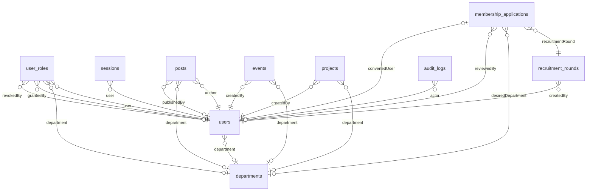

# Sơ đồ database (ERD)

> Sinh tự động từ `src/db/schema.prisma` bằng `pnpm --filter @apc/api db:erd`. Không sửa tay; sửa schema rồi chạy lại lệnh.

Ký hiệu: `PK` khóa chính, `FK` khóa ngoại, `UK` không được trùng. Đường nối: `||` bắt buộc đúng 1, `|o` 0 hoặc 1, `}o` 0 hoặc nhiều.

## Tổng quan

Chỉ có tên bảng và quan hệ, để nhìn nhanh bảng nào nối với bảng nào.

## Chi tiết từng bảng

```mermaid
erDiagram
  departments {
    String id PK
    String name
    String code UK
    String description "tùy chọn"
    DepartmentStatus status "ACTIVE / ARCHIVED"
    Int order
    DateTime createdAt
    DateTime updatedAt
  }
  users {
    String id PK
    String username UK "Tên đăng nhập (AUTH-02, BR-02)"
    String email UK
    String passwordHash "Băm Argon2id (SEC-02)"
    AccountStatus status "PENDING_ACTIVATION / ACTIVE / LOCKED / INACTIVE"
    Boolean mustChangePassword
    Boolean isTemporaryPassword
    DateTime temporaryPasswordExpiresAt "tùy chọn. BR-04: hết hạn sau 72h"
    DateTime passwordChangedAt "tùy chọn"
    Int failedLoginAttempts "SEC-05"
    DateTime lockoutUntil "tùy chọn"
    String fullName
    String studentId UK "tùy chọn. Optional: tài khoản bootstrap đầu tiên có thể chưa gắn MSSV"
    String faculty "tùy chọn"
    String major "tùy chọn"
    String cohort "tùy chọn"
    String avatarUrl "tùy chọn"
    String phoneNumber "tùy chọn"
    Json skills "tùy chọn"
    Json interestAreas "tùy chọn"
    String departmentId FK "tùy chọn. Ban đang hoạt động; khác phạm vi quản lý trong user_roles"
    MemberStatus memberStatus "ACTIVE / PAUSED / LEFT. MEM-11: độc lập AccountStatus, trừ LEFT kéo theo INACTIVE"
    DateTime createdAt
    DateTime updatedAt
  }
  user_roles {
    String id PK
    String userId FK
    Role role "MEMBER / DEPARTMENT_MANAGER / BOARD / TECH_ADMIN"
    String departmentId FK "tùy chọn. Bắt buộc khi role = DEPARTMENT_MANAGER (RP-02)"
    RoleAssignmentStatus status "PENDING / ACTIVE / EXPIRED / REVOKED. BOARD/TECH_ADMIN chỉ ACTIVE sau TOTP (RP-13)"
    DateTime startsAt
    DateTime expiresAt "tùy chọn. Bắt buộc với BOARD/TECH_ADMIN: không muộn hơn hết nhiệm kỳ (RP-03)"
    String reason "RP-11"
    String grantedById FK "tùy chọn. null khi tạo bằng bootstrap (RP-15)"
    String revokedById FK "tùy chọn"
    DateTime revokedAt "tùy chọn"
    DateTime createdAt
    DateTime updatedAt
  }
  sessions {
    String id PK
    String userId FK
    String tokenHash UK "SHA-256 của token trong cookie"
    Boolean twoFactorVerified "Phiên đã qua TOTP, mới dùng được quyền đặc quyền (FLOW-27)"
    DateTime createdAt
    DateTime lastActiveAt "Hết hạn sau 8 giờ không hoạt động (SEC-06)"
    DateTime revokedAt "tùy chọn. Đăng xuất, đổi mật khẩu, khóa tài khoản (AUTH-08)"
    String ipAddress "tùy chọn"
    String userAgent "tùy chọn"
  }
  posts {
    String id PK
    String title
    String slug UK
    String summary
    String content
    String thumbnailUrl "tùy chọn"
    String category
    ContentScope scope "PUBLIC / INTERNAL. CMS-05"
    ContentStatus status "DRAFT / PUBLISHED / ARCHIVED"
    String authorId FK
    String departmentId FK "tùy chọn"
    String publishedById FK "tùy chọn"
    DateTime publishedAt "tùy chọn"
    String metaTitle "tùy chọn. SEO-01"
    String metaDescription "tùy chọn"
    DateTime createdAt
    DateTime updatedAt
  }
  events {
    String id PK
    String title
    String slug UK
    String description
    String coverImageUrl "tùy chọn"
    String eventType "Loại/chuyên mục: Workshop, Training, Contest..."
    EventStatus status "DRAFT / PUBLISHED / CANCELLED / ENDED / ARCHIVED"
    String departmentId FK "tùy chọn"
    String contactPoint "tùy chọn"
    String createdById FK
    String location "tùy chọn"
    DateTime startAt
    DateTime endAt
    DateTime createdAt
    DateTime updatedAt
  }
  projects {
    String id PK
    String title
    String slug UK
    String description
    String thumbnailUrl "tùy chọn"
    Json technologies "tùy chọn. ['React', 'Node.js', 'PostgreSQL']"
    String projectUrl "tùy chọn"
    String sourceUrl "tùy chọn"
    ContentStatus status "DRAFT / PUBLISHED / ARCHIVED"
    String departmentId FK "tùy chọn"
    DateTime publishedAt "tùy chọn"
    String createdById FK
    DateTime createdAt
    DateTime updatedAt
  }
  recruitment_rounds {
    String id PK
    String title
    String slug UK
    String description
    RecruitmentRoundStatus status "DRAFT / OPEN / CLOSED / ARCHIVED"
    DateTime opensAt
    DateTime closesAt
    String createdById FK
    DateTime createdAt
    DateTime updatedAt
  }
  membership_applications {
    String id PK
    String profileCode UK "Mã tra cứu công khai CSPRNG (REC-06)"
    String recruitmentRoundId FK
    String applicantName
    String applicantEmail
    String studentId
    String faculty "tùy chọn"
    String major "tùy chọn"
    String cohort "tùy chọn"
    String desiredDepartmentId FK "tùy chọn"
    String skills "tùy chọn"
    String experience "tùy chọn"
    Json answers "tùy chọn. Câu trả lời, lưu theo id câu hỏi trong RecruitmentRound.questions"
    ApplicationStatus status "NEW / REVIEWING / INTERVIEW / ACCEPTED / REJECTED / WITHDRAWN"
    String internalNote "tùy chọn. BR-07: không hiển thị cho ứng viên"
    String reviewedById FK "tùy chọn"
    DateTime reviewedAt "tùy chọn"
    String convertedUserId UK, FK "tùy chọn"
    DateTime convertedAt "tùy chọn"
    DateTime submittedAt
    DateTime updatedAt
  }
  audit_logs {
    String id PK
    String actorId FK "tùy chọn"
    Role actorRole "tùy chọn. MEMBER / DEPARTMENT_MANAGER / BOARD / TECH_ADMIN"
    AuditAction action "CREATE / UPDATE / DELETE / LOGIN / LOGOUT / EXPORT / IMPORT / GRANT_ROLE / REVOKE_ROLE / STATUS_CHANGE"
    ResourceType resourceType "USER / POST / EVENT / PROJECT / MEMBERSHIP_APPLICATION / DEPARTMENT / RECRUITMENT_ROUND / SYSTEM"
    String resourceId "tùy chọn"
    String ipAddress "tùy chọn"
    String userAgent "tùy chọn"
    Boolean isSuccess
    String reason "tùy chọn"
    Json details "tùy chọn"
    DateTime createdAt
  }

  users }o--|o departments : "department"
  user_roles }o--|| users : "user"
  user_roles }o--|o departments : "department"
  user_roles }o--|o users : "grantedBy"
  user_roles }o--|o users : "revokedBy"
  sessions }o--|| users : "user"
  posts }o--|| users : "author"
  posts }o--|o departments : "department"
  posts }o--|o users : "publishedBy"
  events }o--|o departments : "department"
  events }o--|| users : "createdBy"
  projects }o--|o departments : "department"
  projects }o--|| users : "createdBy"
  recruitment_rounds }o--|| users : "createdBy"
  membership_applications }o--|| recruitment_rounds : "recruitmentRound"
  membership_applications }o--|o departments : "desiredDepartment"
  membership_applications }o--|o users : "reviewedBy"
  membership_applications |o--|o users : "convertedUser"
  audit_logs }o--|o users : "actor"
```

## Giá trị trạng thái (enum)

| Enum | Giá trị |
| --- | --- |
| `Role` | `MEMBER`, `DEPARTMENT_MANAGER`, `BOARD`, `TECH_ADMIN` |
| `AccountStatus` | `PENDING_ACTIVATION`, `ACTIVE`, `LOCKED`, `INACTIVE` |
| `MemberStatus` | `ACTIVE`, `PAUSED`, `LEFT` |
| `DepartmentStatus` | `ACTIVE`, `ARCHIVED` |
| `ContentStatus` | `DRAFT`, `PUBLISHED`, `ARCHIVED` |
| `ContentScope` | `PUBLIC`, `INTERNAL` |
| `ApplicationStatus` | `NEW`, `REVIEWING`, `INTERVIEW`, `ACCEPTED`, `REJECTED`, `WITHDRAWN` |
| `RoleAssignmentStatus` | `PENDING`, `ACTIVE`, `EXPIRED`, `REVOKED` |
| `EventStatus` | `DRAFT`, `PUBLISHED`, `CANCELLED`, `ENDED`, `ARCHIVED` |
| `RecruitmentRoundStatus` | `DRAFT`, `OPEN`, `CLOSED`, `ARCHIVED` |
| `AuditAction` | `CREATE`, `UPDATE`, `DELETE`, `LOGIN`, `LOGOUT`, `EXPORT`, `IMPORT`, `GRANT_ROLE`, `REVOKE_ROLE`, `STATUS_CHANGE` |
| `ResourceType` | `USER`, `POST`, `EVENT`, `PROJECT`, `MEMBERSHIP_APPLICATION`, `DEPARTMENT`, `RECRUITMENT_ROUND`, `SYSTEM` |
