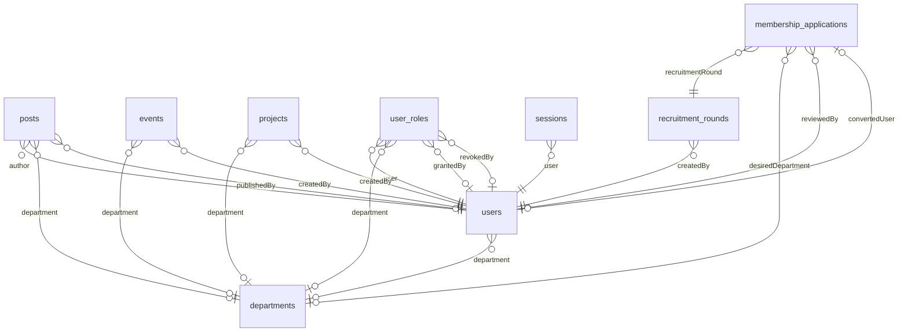

```mermaid
erDiagram

  "departments" {

    }
  

  "users" {

    }
  

  "posts" {

    }
  

  "events" {

    }
  

  "projects" {

    }
  

  "user_roles" {

    }
  

  "sessions" {

    }
  

  "recruitment_rounds" {

    }
  

  "membership_applications" {

    }
  
    "users" }o--|o "departments" : "department"
    "user_roles" }o--|| "users" : "user"
    "user_roles" }o--|o "departments" : "department"
    "user_roles" }o--|o "users" : "grantedBy"
    "user_roles" }o--|o "users" : "revokedBy"
    "sessions" }o--|| "users" : "user"
    "posts" }o--|| "users" : "author"
    "posts" }o--|o "departments" : "department"
    "posts" }o--|o "users" : "publishedBy"
    "events" }o--|o "departments" : "department"
    "events" }o--|| "users" : "createdBy"
    "projects" }o--|o "departments" : "department"
    "projects" }o--|| "users" : "createdBy"
    "recruitment_rounds" }o--|| "users" : "createdBy"
    "membership_applications" }o--|| "recruitment_rounds" : "recruitmentRound"
    "membership_applications" }o--|o "departments" : "desiredDepartment"
    "membership_applications" }o--|o "users" : "reviewedBy"
    "membership_applications" |o--|o "users" : "convertedUser"
```
