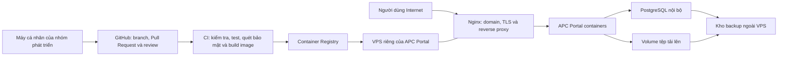

# APC Portal - Project Charter

| Thuộc tính | Giá trị |
| --- | --- |
| Phiên bản | 1.1 |
| Trạng thái | Bản thảo để APC rà soát |
| Ngày cập nhật | 27/08/2026 |
| Đơn vị sở hữu | Câu lạc bộ Lập trình ứng dụng (APC) |
| Đơn vị | Câu lạc bộ Lập trình ứng dụng (APC), Khoa Công Nghệ, UMT |
| Tên sản phẩm | APC Portal |

### Lịch sử phiên bản

| Phiên bản | Nội dung chính |
| --- | --- |
| 1.0 | Baseline hoàn chỉnh về bối cảnh, mục tiêu, phạm vi MVP, nguyên tắc vận hành và ràng buộc triển khai |
| 1.1 | Ghi nhận giai đoạn local-first; hạ tầng production chưa được chọn và cần quyết định riêng |

Tài liệu này xác lập định hướng sản phẩm, phạm vi MVP và các nguyên tắc triển khai của APC Portal.

> Trạng thái triển khai ngày 27/08/2026: dự án chỉ chạy local. Các mô tả VPS, staging và production bên dưới là mục tiêu dự kiến, không phải hạ tầng đã mua hoặc quyết định đã phê duyệt.

## 1. Bối cảnh

APC, tên tiếng Anh là Applied Programming Club, là Câu lạc bộ Lập trình ứng dụng trực thuộc Khoa Công Nghệ, Trường Đại học Quản lý và Công nghệ Thành phố Hồ Chí Minh (UMT).

APC tập trung vào các nhóm hoạt động chính sau:

- Xây dựng cộng đồng lập trình sinh viên tại UMT.
- Tổ chức APC Contest và hỗ trợ các kỳ thi lập trình.
- Triển khai, vận hành hệ thống UMT Online Judge (UMTOJ).
- Xây dựng, vận hành website và hạ tầng kỹ thuật cho các sự kiện như UMT TechGen.

Hoạt động của APC hiện được triển khai trên nhiều kênh riêng lẻ, gồm fanpage APC, email sinh viên, Google Forms, UMTOJ và website từng sự kiện. Thông tin, dữ liệu thành viên và hoạt động của câu lạc bộ chưa có một nơi tập trung duy nhất. APC Portal được xây dựng để giải quyết sự phân tán này.

## 2. Tuyên bố vấn đề

Sinh viên chưa có một địa chỉ duy nhất để tìm hiểu về APC, theo dõi sự kiện, đăng ký tham gia và truy cập các tài nguyên phù hợp. Thành viên và Ban Chủ nhiệm đang phải kết hợp nhiều công cụ để quản lý thông báo, đơn ứng tuyển, hồ sơ thành viên, lịch hoạt động và tài liệu nội bộ.

Sự phân tán này dẫn đến các vấn đề:

- Thông tin không đồng bộ hoặc khó tìm lại.
- Quy trình tuyển thành viên và đăng ký sự kiện tốn nhiều thao tác thủ công.
- Dữ liệu thành viên khó bàn giao giữa các nhiệm kỳ.
- Việc cập nhật nội dung phụ thuộc vào từng kênh và từng người quản lý.
- Sản phẩm, thành tích và năng lực kỹ thuật của APC chưa được trình bày tập trung.

## 3. Tầm nhìn sản phẩm

**APC Portal là cổng thông tin chính thức và không gian vận hành nội bộ tập trung của APC, giúp sinh viên tiếp cận câu lạc bộ, thành viên tham gia và phát triển, đồng thời giúp Ban Chủ nhiệm quản lý nội dung, sự kiện, tuyển thành viên và hồ sơ thành viên từ một nguồn dữ liệu thống nhất.**

Portal là nguồn thông tin chuẩn của câu lạc bộ. Fanpage, email và các kênh truyền thông khác tiếp tục được sử dụng để phân phối nội dung và dẫn người dùng về Portal.

## 4. Mục tiêu

1. Tạo một địa chỉ chính thức để giới thiệu APC, hoạt động, dự án, thành tích và thông tin liên hệ.
2. Tập trung hóa tin tức, lịch sự kiện, đăng ký hoạt động và tài liệu câu lạc bộ.
3. Hỗ trợ trọn vòng đời thành viên từ ứng tuyển, xét duyệt, hoạt động đến khi kết thúc tham gia.
4. Giảm phụ thuộc vào biểu mẫu và bảng tính rời rạc trong các quy trình thường xuyên.
5. Cho phép Ban Chủ nhiệm cập nhật nội dung và vận hành nghiệp vụ mà không cần developer can thiệp.
6. Tạo nền tảng có thể bàn giao, duy trì và mở rộng qua nhiều nhiệm kỳ sinh viên.

## 5. Nhóm người dùng

| Nhóm | Nhu cầu chính |
| --- | --- |
| Khách truy cập | Tìm hiểu APC, hoạt động, dự án, thành tích và kênh liên hệ |
| Sinh viên UMT | Theo dõi sự kiện, ứng tuyển và đăng ký tham gia hoạt động |
| Ứng viên | Gửi và theo dõi trạng thái đơn ứng tuyển |
| Thành viên APC | Quản lý hồ sơ, xem lịch, đăng ký hoạt động và truy cập tài liệu nội bộ |
| Ban Chủ nhiệm/Ban chuyên môn | Quản lý thành viên, hoạt động, tài liệu và thông báo |
| Quản trị viên kỹ thuật | Quản lý phân quyền, cấu hình hệ thống, audit và vận hành |

## 6. Phạm vi MVP

### 6.1. Khu vực công khai

- Trang chủ và nhận diện APC.
- Giới thiệu, sứ mệnh, cơ cấu và thông tin liên hệ.
- Tin tức và thông báo.
- Danh sách, chi tiết và lịch sự kiện.
- Dự án, sản phẩm và thành tích của câu lạc bộ.
- Trang tuyển thành viên và biểu mẫu ứng tuyển.
- Liên kết rõ ràng đến UMTOJ và các website sự kiện liên quan.

### 6.2. Khu vực thành viên

- Đăng nhập bằng tài khoản thành viên do Ban Chủ nhiệm cấp.
- Dashboard cá nhân.
- Hồ sơ thành viên gồm thông tin học tập, kỹ năng, mối quan tâm và vai trò.
- Lịch hoạt động và đăng ký tham gia.
- Tài liệu nội bộ được phân quyền.
- Lịch sử tham gia hoạt động cơ bản.

### 6.3. Khu vực quản trị

- Quản lý bài viết, thông báo và nội dung công khai.
- Quản lý thông tin giới thiệu, cơ cấu Ban chuyên môn, thông tin liên hệ và các liên kết chính thức.
- Quản lý sự kiện và danh sách đăng ký.
- Quản lý đợt tuyển thành viên, đơn ứng tuyển và trạng thái xử lý.
- Quản lý thành viên, vai trò và quyền truy cập.
- Nhập danh sách thành viên hiện hữu và xuất dữ liệu phục vụ bàn giao.
- Quản lý tài liệu nội bộ.
- Theo dõi trạng thái gửi email xác nhận ứng tuyển và đăng ký sự kiện.
- Lưu nhật ký các thao tác quản trị quan trọng.

## 7. Ngoài phạm vi MVP

- Xây dựng lại hoặc thay thế UMTOJ.
- Mạng xã hội nội bộ, news feed hoặc chat thời gian thực.
- Ứng dụng mobile native.
- Gamification, điểm thưởng hoặc bảng xếp hạng thành viên.
- Quản lý tài chính câu lạc bộ.
- Quản lý công việc, giao việc, deadline, tiến độ, project/task và source code.
- Single Sign-On sâu với UMTOJ và mọi website sự kiện.
- Nền tảng tổng quát để tổ chức mọi loại cuộc thi quy mô lớn.

## 8. Dữ liệu và quyền riêng tư

MVP chỉ thu thập dữ liệu cần thiết cho vận hành câu lạc bộ:

- Họ tên.
- Tên đăng nhập.
- Email liên hệ, ưu tiên email UMT.
- Mã số sinh viên.
- Khoa, ngành và niên khóa.
- Kỹ năng và lĩnh vực quan tâm.
- Trạng thái thành viên, ban chuyên môn và vai trò.
- Lịch sử tham gia hoạt động cơ bản.
- Số điện thoại, nếu thực sự cần, phải là trường tùy chọn.

Tài khoản thành viên do Ban Chủ nhiệm tạo và cấp cùng mật khẩu tạm thời. Thành viên phải đổi mật khẩu trong lần đăng nhập đầu tiên. Hệ thống chỉ lưu mật khẩu đã được băm bằng thuật toán bảo mật phù hợp và cho phép Ban Chủ nhiệm đặt lại mật khẩu khi cần. Dữ liệu phải có mục đích sử dụng, phân quyền, thời hạn lưu và quy trình chỉnh sửa/xóa phù hợp.

## 9. Tiêu chí thành công

- Ban Chủ nhiệm có thể tạo và công bố tin tức hoặc sự kiện trong không quá 10 phút mà không cần developer.
- Một đợt tuyển thành viên được thực hiện trọn vẹn trên Portal, từ nộp đơn đến xét duyệt.
- Ít nhất 80% thành viên đang hoạt động có hồ sơ trên hệ thống trong tháng đầu áp dụng.
- Ít nhất một hoạt động training, workshop hoặc contest nội bộ được quản lý qua Portal.
- Thành viên có thể tìm lịch, thông báo và tài liệu được phép truy cập từ một nơi.
- Backup dữ liệu Portal được khôi phục thành công trong một lần diễn tập trước khi đưa vào production.

## 10. Nguyên tắc và ràng buộc triển khai

- Team phát triển trên máy cá nhân; mỗi thành viên có môi trường local và database riêng.
- Mã nguồn được quản lý trên GitHub thông qua branch ngắn, Pull Request, review và CI.
- CI của Portal chạy trên GitHub-hosted runner hoặc runner chuyên dụng tách khỏi VPS production; VPS production không chạy source hoặc Pull Request.
- Production của APC Portal chạy trên một VPS riêng, độc lập với hạ tầng UMTOJ.
- VPS production có tối thiểu 2 vCPU, 2 GB RAM và ổ SSD; tài nguyên được theo dõi và điều chỉnh theo số liệu vận hành của Portal.
- Staging sử dụng cấu hình, secrets và dữ liệu tách biệt; môi trường được khởi tạo để kiểm thử bản phát hành và dừng sau khi hoàn tất.
- Portal có Docker Compose project, network, database, volume và secrets riêng.
- PostgreSQL không được công khai port ra Internet.
- Nginx trên VPS Portal quản lý cổng 80/443, domain, TLS và reverse proxy.
- Docker image được build trong CI; VPS chỉ pull và chạy image đã tạo.
- Backup hằng ngày phải bao gồm PostgreSQL và toàn bộ tệp người dùng tải lên, đồng thời được lưu ở một hệ thống khác VPS.
- Portal và UMTOJ vận hành trên hai hạ tầng độc lập; sự cố, triển khai hoặc bảo trì Portal không làm thay đổi trạng thái UMTOJ.
- Trước khi phát hành production, nhóm phải kiểm thử tải Portal với tối thiểu 20 người dùng đồng thời, xác nhận biên CPU, RAM, swap, PID, disk I/O và dung lượng lưu trữ, đồng thời diễn tập rollback và restore.
- Hệ điều hành, Docker và reverse proxy trên host phải còn nhận bản vá bảo mật; firewall và các cổng công khai phải được rà soát trước production.

### 10.1. Sơ đồ bối cảnh triển khai

## 11. Quản trị dự án

- **Product Owner:** đại diện Ban Chủ nhiệm được phân công, chịu trách nhiệm chốt yêu cầu nghiệp vụ và thứ tự ưu tiên của sản phẩm.
- **Nhóm phát triển:** 4 sinh viên, mỗi hạng mục có một người chịu trách nhiệm chính và ít nhất một người review.
- **Người phê duyệt nghiệp vụ:** Product Owner và đại diện Ban Chủ nhiệm.
- **Người phê duyệt kỹ thuật:** Tech Lead của nhóm phát triển.
- Thay đổi phạm vi phải được ghi nhận trong issue, tài liệu yêu cầu hoặc ADR tương ứng.

## 12. Hiệu lực và quản lý tài liệu

- Project Charter là cơ sở để xây dựng PRD, thiết kế giao diện, kiến trúc hệ thống và Product Backlog.
- Mọi thay đổi về mục tiêu hoặc phạm vi MVP phải được Product Owner và Tech Lead thống nhất, đồng thời ghi nhận trong tài liệu dự án, issue hoặc ADR tương ứng.
- Tài liệu được rà soát vào đầu và cuối mỗi nhiệm kỳ Ban Chủ nhiệm, hoặc khi định hướng hoạt động của câu lạc bộ thay đổi.
