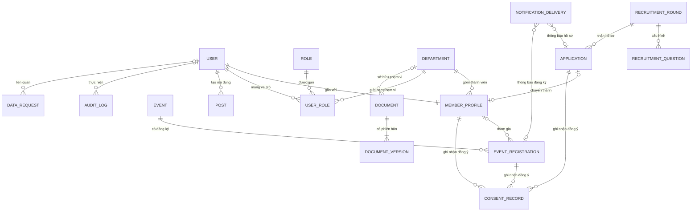
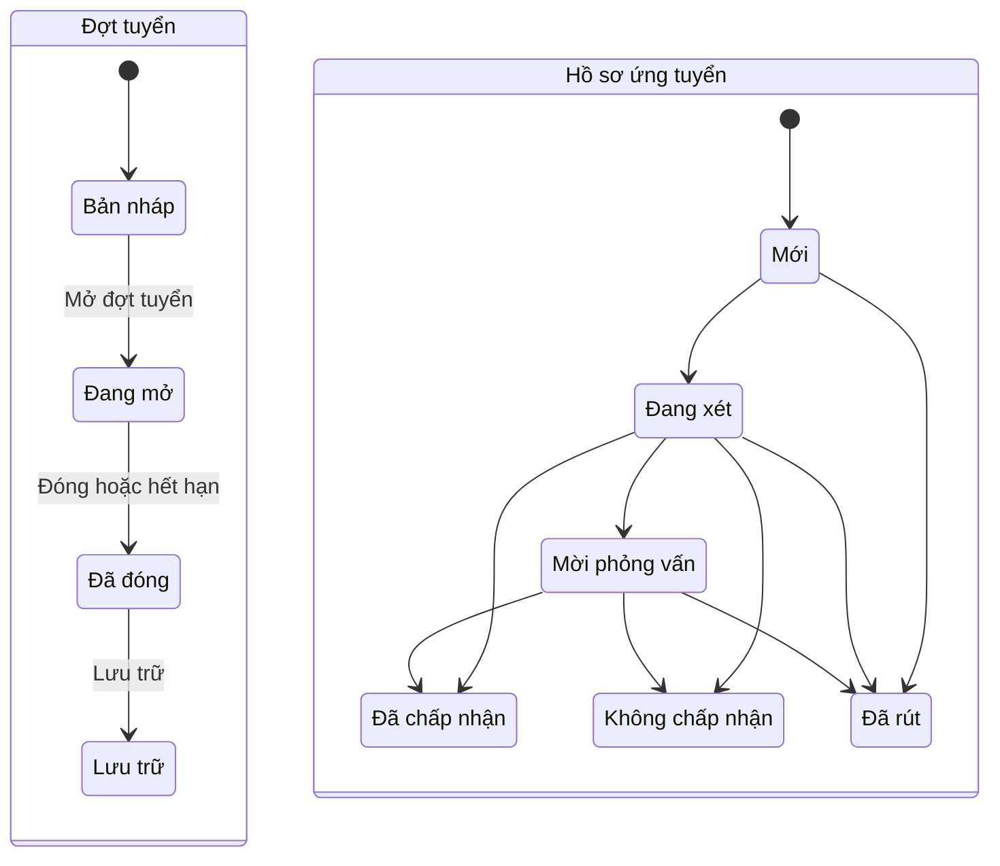
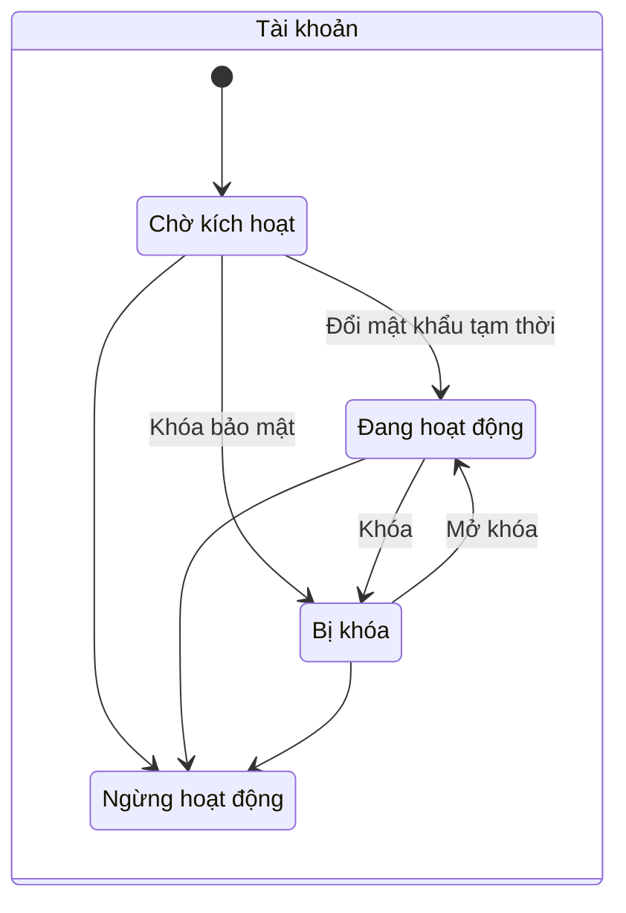
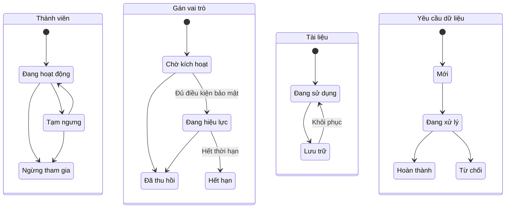
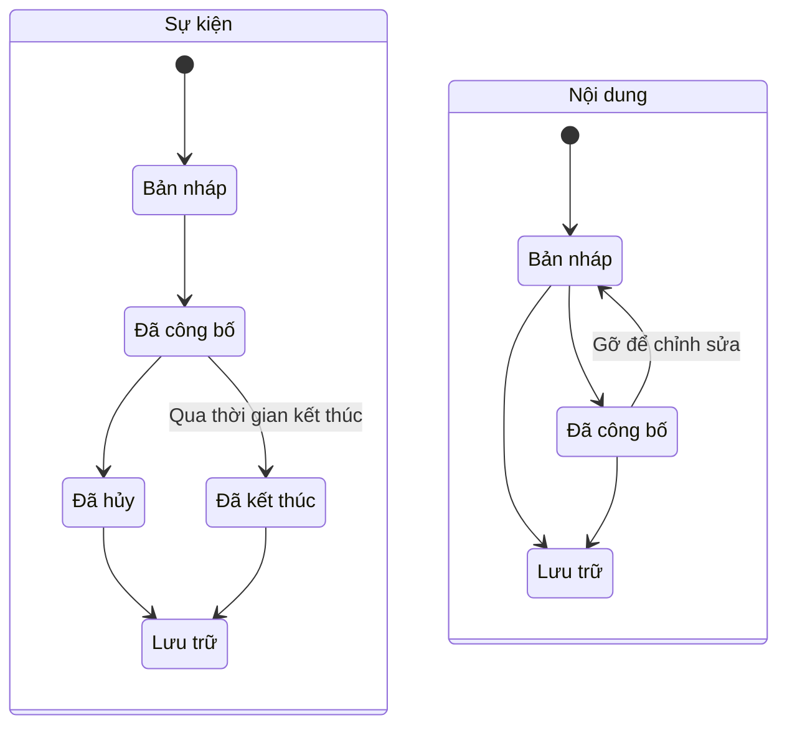

# APC Portal - Product Requirements Document

| Thuộc tính | Giá trị |
| --- | --- |
| Phiên bản | 1.2 |
| Trạng thái | Bản thảo để APC rà soát |
| Ngày cập nhật | 05/09/2026 |
| Sản phẩm | APC Portal |
| Đơn vị sở hữu | Câu lạc bộ Lập trình ứng dụng (APC) |
| Tài liệu nền tảng | [APC Portal - Project Charter](./00-project-charter.md) |

### Lịch sử phiên bản

| Phiên bản | Nội dung chính |
| --- | --- |
| 1.0 | Baseline PRD hoàn chỉnh gồm mục tiêu, 29 luồng, yêu cầu, dữ liệu, bảo mật, vận hành và tiêu chí nghiệm thu MVP |
| 1.1 | Liên kết baseline với giai đoạn local-first và tách cam kết production chưa được phê duyệt |
| 1.2 | Bỏ hạng mục Thành tích (PRT-02 và mục 7.7 đổi thành "Dự án và sản phẩm"); cập nhật PUB-05, ORG-04, BR-20, FLOW-18 và bảng thực thể |

> Trạng thái triển khai ngày 27/08/2026: nền tảng local và trang chủ đang được xây dựng. Mọi yêu cầu VPS/staging/production là release gate tương lai và chỉ có hiệu lực sau khi APC chọn hạ tầng.

## 1. Mục đích tài liệu

Tài liệu này đặc tả yêu cầu sản phẩm cho phiên bản MVP của APC Portal. Đây là cơ sở để thiết kế user flow, wireframe, giao diện, kiến trúc hệ thống, Product Backlog, test case và tiêu chí phát hành production.

Mỗi yêu cầu chức năng có một mã định danh cố định. Mã này được sử dụng xuyên suốt trong thiết kế, issue, Pull Request và kiểm thử để bảo đảm khả năng truy vết.

## 2. Tổng quan sản phẩm

APC Portal là cổng thông tin chính thức và hệ thống vận hành nội bộ của APC. Sản phẩm gồm ba khu vực:

1. **Khu vực công khai:** giới thiệu APC, tin tức, sự kiện, dự án và tuyển thành viên.
2. **Khu vực thành viên:** hồ sơ cá nhân, thông báo, lịch hoạt động, đăng ký sự kiện và tài liệu nội bộ.
3. **Khu vực quản trị:** quản lý nội dung, tuyển thành viên, sự kiện, thành viên, phân quyền và nhật ký hoạt động.

Portal là nguồn dữ liệu chính thức của câu lạc bộ. Fanpage, email và các kênh khác được dùng để phân phối thông tin và dẫn người dùng về Portal.

## 3. Mục tiêu MVP

1. Tập trung thông tin công khai của APC tại một địa chỉ duy nhất.
2. Thực hiện trọn vẹn một đợt tuyển thành viên từ nhận đơn đến cấp tài khoản.
3. Quản lý danh sách thành viên, ban chuyên môn, vai trò và trạng thái hoạt động.
4. Tạo, công bố, đăng ký và điểm danh cho các hoạt động của câu lạc bộ.
5. Cung cấp tài liệu nội bộ theo đúng quyền truy cập.
6. Cho phép Ban Chủ nhiệm vận hành các nghiệp vụ thường xuyên mà không cần developer can thiệp.
7. Vận hành Portal trên VPS riêng, độc lập với hạ tầng UMTOJ.
8. Quản lý thông tin tổ chức, cơ cấu Ban chuyên môn và dữ liệu bàn giao qua các nhiệm kỳ.

## 4. Chỉ số thành công

| Mã | Chỉ số |
| --- | --- |
| KPI-01 | Ban Chủ nhiệm tạo và công bố một bài viết hoặc sự kiện trong không quá 10 phút |
| KPI-02 | Một đợt tuyển thành viên được thực hiện hoàn toàn trên Portal |
| KPI-03 | Ít nhất 80% thành viên đang hoạt động hoàn thiện hồ sơ trong tháng đầu áp dụng |
| KPI-04 | Ít nhất một hoạt động nội bộ được mở đăng ký và điểm danh trên Portal |
| KPI-05 | Thành viên truy cập được lịch, thông báo và tài liệu từ một tài khoản duy nhất |
| KPI-06 | Dữ liệu được khôi phục thành công từ bản backup trước lần phát hành production đầu tiên |

## 5. Nhóm người dùng

| Nhóm | Mô tả | Quyền chính |
| --- | --- | --- |
| Khách truy cập | Người chưa đăng nhập | Xem nội dung công khai |
| Sinh viên UMT | Người quan tâm đến APC | Xem hoạt động, sự kiện và gửi đơn ứng tuyển |
| Ứng viên | Người đã gửi đơn | Tra cứu trạng thái đơn bằng email và mã hồ sơ |
| Thành viên | Thành viên APC được cấp tài khoản | Quản lý hồ sơ, đăng ký hoạt động và xem tài liệu được cấp quyền |
| Ban chuyên môn | Thành viên quản lý một mảng hoạt động | Quản lý dữ liệu thuộc ban của mình |
| Ban Chủ nhiệm | Đơn vị vận hành nghiệp vụ | Quản lý nội dung, tuyển thành viên, sự kiện, thành viên và quyền truy cập |
| Quản trị viên kỹ thuật | Người vận hành hệ thống | Quản lý cấu hình, phân quyền kỹ thuật, audit và triển khai |

Một người dùng có thể có nhiều vai trò nghiệp vụ, nhưng không được đồng thời mang `BOARD` và `TECH_ADMIN`. Quyền thực tế là tổng hợp các quyền hợp lệ được cấp cho tài khoản đang hoạt động.

## 6. Luồng nghiệp vụ

### 6.1. Danh mục luồng

| Mã | Nhóm | Luồng | Tác nhân chính | Kết quả |
| --- | --- | --- | --- | --- |
| FLOW-01 | Công khai | Truy cập trang chủ và điều hướng đến nội dung quan tâm | Khách truy cập | Người dùng đến đúng trang tin tức, sự kiện, dự án, tuyển thành viên hoặc UMTOJ |
| FLOW-02 | Công khai | Duyệt, tìm kiếm và xem chi tiết nội dung công khai | Khách truy cập | Nội dung đã công bố được tìm thấy và hiển thị đầy đủ |
| FLOW-03 | Tuyển thành viên | Xem đợt tuyển và điều kiện ứng tuyển | Sinh viên UMT | Sinh viên hiểu vị trí, thời hạn, yêu cầu và dữ liệu cần cung cấp |
| FLOW-04 | Tuyển thành viên | Gửi đơn ứng tuyển | Sinh viên UMT/Khách truy cập | Đơn hợp lệ được lưu, sinh mã hồ sơ, gửi xác nhận và người nộp trở thành ứng viên có thể tra cứu |
| FLOW-05 | Tuyển thành viên | Tra cứu trạng thái hoặc rút đơn | Ứng viên | Ứng viên xem được trạng thái công khai hoặc rút hồ sơ còn hiệu lực |
| FLOW-06 | Tuyển thành viên | Tạo, mở, đóng và lưu trữ đợt tuyển | Ban Chủ nhiệm | Đợt tuyển thay đổi đúng trạng thái và thời gian nhận đơn |
| FLOW-07 | Tuyển thành viên | Sàng lọc, phỏng vấn và cập nhật kết quả hồ sơ | Ban chuyên môn/Ban Chủ nhiệm | Hồ sơ có trạng thái, kết quả và ghi chú nội bộ đầy đủ |
| FLOW-08 | Tuyển thành viên | Chuyển ứng viên trúng tuyển thành thành viên | Ban Chủ nhiệm | Hồ sơ thành viên và tài khoản nội bộ được tạo từ đơn ứng tuyển |
| FLOW-09 | Xác thực | Đăng nhập lần đầu và đổi mật khẩu tạm thời | Người có tài khoản Chờ kích hoạt | Tài khoản được kích hoạt bằng mật khẩu mới của chính người dùng |
| FLOW-10 | Xác thực | Đăng nhập, duy trì phiên, đổi mật khẩu và đăng xuất | Người có tài khoản | Người dùng truy cập đúng khu vực và kết thúc phiên an toàn |
| FLOW-11 | Xác thực | Khóa, mở khóa hoặc đặt lại mật khẩu | Ban Chủ nhiệm/Quản trị viên kỹ thuật | Quyền truy cập tài khoản được kiểm soát và các phiên cũ bị vô hiệu hóa |
| FLOW-12 | Thành viên | Xem dashboard và cập nhật hồ sơ cá nhân | Thành viên | Thành viên xem thông tin liên quan và cập nhật các trường được phép |
| FLOW-13 | Thành viên | Quản lý hồ sơ, ban, vai trò và trạng thái thành viên | Ban chuyên môn/Ban Chủ nhiệm | Thông tin tổ chức và quyền của thành viên được cập nhật chính xác |
| FLOW-14 | Sự kiện | Xem, đăng ký hoặc hủy đăng ký sự kiện | Thành viên hoặc người tham gia hợp lệ | Danh sách đăng ký phản ánh đúng lựa chọn và điều kiện sự kiện |
| FLOW-15 | Sự kiện | Tạo, chỉnh sửa, công bố, hủy hoặc lưu trữ sự kiện | Người quản lý sự kiện | Sự kiện xuất hiện đúng phạm vi và trạng thái |
| FLOW-16 | Sự kiện | Xuất danh sách, điểm danh và ghi lịch sử tham gia | Ban quản lý sự kiện | Kết quả tham gia được lưu vào hồ sơ thành viên |
| FLOW-17 | Nội dung | Soạn, xem trước, công bố, gỡ và lưu trữ bài viết | Người quản lý nội dung | Nội dung xuất hiện hoặc được ẩn đúng trạng thái |
| FLOW-18 | Dự án | Tạo và công bố dự án hoặc sản phẩm | Ban chuyên môn/Ban Chủ nhiệm | Hồ sơ được chuẩn bị trong phạm vi ban và được Ban Chủ nhiệm công bố |
| FLOW-19 | Tài liệu | Tải lên, phân quyền, thay thế, tải xuống và lưu trữ tài liệu | Người quản lý tài liệu, thành viên | Tài liệu chỉ được truy cập bởi đúng đối tượng |
| FLOW-20 | Phân quyền | Gán hoặc thu hồi vai trò và quyền theo ban chuyên môn | Ban Chủ nhiệm/Quản trị viên kỹ thuật | Người dùng có đúng quyền cần thiết và không vượt phạm vi |
| FLOW-21 | Kiểm soát | Tra cứu audit log và điều tra thay đổi | Ban Chủ nhiệm/Quản trị viên kỹ thuật | Hành động quản trị được truy vết theo người, thời gian và đối tượng |
| FLOW-22 | Vận hành | Triển khai từ CI lên staging và production | Nhóm kỹ thuật | Phiên bản được triển khai bằng image cố định và vượt qua health check |
| FLOW-23 | Vận hành | Backup, restore và rollback khi có sự cố | Nhóm kỹ thuật | Dịch vụ và dữ liệu được khôi phục trong RPO/RTO đã quy định |
| FLOW-24 | Cấu hình | Quản lý thông tin câu lạc bộ và cơ cấu Ban chuyên môn | Ban Chủ nhiệm | Thông tin tổ chức và liên hệ hiển thị thống nhất trên Portal |
| FLOW-25 | Thành viên | Nhập và kích hoạt danh sách thành viên hiện hữu | Ban Chủ nhiệm | Thành viên hiện tại được tạo hồ sơ/tài khoản có kiểm soát |
| FLOW-26 | Thông báo | Gửi và theo dõi email giao dịch | Hệ thống, Ban chuyên môn/Ban Chủ nhiệm, Quản trị viên kỹ thuật | Email được gửi, retry và truy vết theo đúng phạm vi mà không làm sai dữ liệu nghiệp vụ |
| FLOW-27 | Bảo mật | Thiết lập và sử dụng xác thực hai bước cho tài khoản đặc quyền | Ban Chủ nhiệm, Quản trị viên kỹ thuật | Tài khoản đặc quyền chỉ hoạt động sau khi thiết lập TOTP |
| FLOW-28 | Dữ liệu | Xuất, chỉnh sửa, ẩn danh hoặc xóa dữ liệu cá nhân | Thành viên/Ban Chủ nhiệm/Quản trị viên kỹ thuật | Yêu cầu dữ liệu được tiếp nhận, quyết định và thực thi đúng quyền cùng chính sách lưu giữ |
| FLOW-29 | Vận hành | Theo dõi hệ thống và xử lý cảnh báo/sự cố | Quản trị viên kỹ thuật | Sự cố được phát hiện, giới hạn ảnh hưởng và ghi nhận đầy đủ |

Các luồng từ `FLOW-01` đến `FLOW-29` phải được mô tả chi tiết trong tài liệu User Flow. Mỗi luồng bao gồm điểm bắt đầu, điều kiện trước, luồng chính, nhánh thay thế, trạng thái lỗi, điểm kết thúc và yêu cầu liên quan.

### 6.2. Luồng xuyên suốt: Tuyển và kích hoạt thành viên

1. Ban Chủ nhiệm tạo đợt tuyển và công bố biểu mẫu.
2. Sinh viên đọc thông tin, điền đơn và đồng ý với mục đích sử dụng dữ liệu.
3. Hệ thống tiếp nhận đơn, sinh mã hồ sơ và gửi thông tin xác nhận.
4. Ban Chủ nhiệm sàng lọc, cập nhật trạng thái, ghi chú và kết quả phỏng vấn.
5. Ứng viên tra cứu trạng thái bằng email và mã hồ sơ.
6. Khi ứng viên được chấp nhận, Ban Chủ nhiệm tạo hồ sơ thành viên và cấp tài khoản nội bộ.
7. Thành viên đăng nhập bằng mật khẩu tạm thời và đổi mật khẩu ở lần đầu tiên.

### 6.3. Luồng xuyên suốt: Tổ chức sự kiện

1. Người có quyền tạo sự kiện, cấu hình thời gian, địa điểm, đối tượng và thời hạn đăng ký.
2. Sự kiện được công bố cho khu vực công khai hoặc khu vực thành viên.
3. Người dùng hợp lệ đăng ký hoặc hủy đăng ký trong thời hạn cho phép.
4. Ban quản lý sự kiện xem danh sách, đóng đăng ký và điểm danh.
5. Kết quả tham gia được ghi vào lịch sử hoạt động của thành viên.

### 6.4. Luồng xuyên suốt: Xuất bản nội dung

1. Người có quyền tạo bài viết ở trạng thái bản nháp.
2. Nội dung được xem trước và kiểm tra trước khi công bố.
3. Bài viết được xuất bản hoặc đưa về trạng thái lưu trữ.
4. Nội dung đã công bố xuất hiện đúng chuyên mục và đường dẫn công khai.

### 6.5. Luồng xuyên suốt: Quản lý vòng đời thành viên

1. Ban Chủ nhiệm tạo hoặc tiếp nhận hồ sơ từ kết quả tuyển thành viên.
2. Tài khoản được gán ban chuyên môn, vai trò và trạng thái.
3. Thành viên cập nhật các trường hồ sơ được phép chỉnh sửa.
4. Ban Chủ nhiệm điều chuyển ban, thay đổi vai trò hoặc khóa tài khoản.
5. Lịch sử thay đổi quan trọng được lưu trong audit log.

## 7. Yêu cầu chức năng

### 7.1. Khu vực công khai

| Mã | Yêu cầu | Mức ưu tiên |
| --- | --- | --- |
| PUB-01 | Hiển thị trang chủ với giới thiệu ngắn, hoạt động nổi bật, sự kiện sắp tới, tin mới và liên kết đến UMTOJ | Bắt buộc |
| PUB-02 | Hiển thị trang giới thiệu gồm sứ mệnh, cơ cấu, ban chuyên môn và thông tin liên hệ | Bắt buộc |
| PUB-03 | Hiển thị danh sách và chi tiết tin tức, thông báo theo trạng thái đã công bố | Bắt buộc |
| PUB-04 | Hiển thị danh sách, chi tiết và lịch sự kiện công khai | Bắt buộc |
| PUB-05 | Hiển thị dự án và sản phẩm của APC | Bắt buộc |
| PUB-06 | Hiển thị thông tin đợt tuyển đang mở và biểu mẫu ứng tuyển | Bắt buộc |
| PUB-07 | Cho phép tìm kiếm cơ bản theo tiêu đề trong tin tức, sự kiện và dự án | Bắt buộc |
| PUB-08 | Cung cấp trang lỗi 404 và trạng thái bảo trì rõ ràng | Bắt buộc |

### 7.2. Tuyển thành viên

| Mã | Yêu cầu | Mức ưu tiên |
| --- | --- | --- |
| REC-01 | Ban Chủ nhiệm tạo, chỉnh sửa, mở, đóng và lưu trữ đợt tuyển | Bắt buộc |
| REC-02 | Mỗi đợt tuyển có tiêu đề, mô tả, đối tượng, thời gian nhận đơn và các vị trí/ban tuyển dụng | Bắt buộc |
| REC-03 | Biểu mẫu thu thập họ tên, email, mã số sinh viên, khoa/ngành, niên khóa, ban mong muốn, kỹ năng, kinh nghiệm và câu trả lời nghiệp vụ | Bắt buộc |
| REC-04 | Ứng viên phải đồng ý với mục đích thu thập và xử lý dữ liệu trước khi nộp đơn | Bắt buộc |
| REC-05 | Hệ thống kiểm tra trường bắt buộc, định dạng dữ liệu và ngăn một email hoặc mã số sinh viên nộp nhiều đơn trong cùng đợt | Bắt buộc |
| REC-06 | Sau khi nộp thành công, hệ thống sinh mã hồ sơ duy nhất bằng bộ sinh ngẫu nhiên mật mã, không tuần tự/không thể dự đoán và gửi xác nhận đến email ứng viên | Bắt buộc |
| REC-07 | Ứng viên tra cứu trạng thái bằng email và mã hồ sơ mà không cần tài khoản thành viên | Bắt buộc |
| REC-08 | Trạng thái hồ sơ gồm: Mới, Đang xét, Mời phỏng vấn, Đã chấp nhận, Không chấp nhận và Đã rút | Bắt buộc |
| REC-09 | Người có quyền xét tuyển lọc hồ sơ theo đợt, trạng thái, ban đăng ký và từ khóa trong phạm vi của mình | Bắt buộc |
| REC-10 | Người có quyền xét tuyển ghi chú nội bộ; ghi chú không hiển thị cho ứng viên | Bắt buộc |
| REC-11 | Người có quyền xét tuyển xuất danh sách hồ sơ trong phạm vi của mình ra CSV | Bắt buộc |
| REC-12 | Hồ sơ được chấp nhận có thể chuyển thành hồ sơ thành viên mà không nhập lại dữ liệu | Bắt buộc |
| REC-13 | Ứng viên được rút hồ sơ trước khi có kết quả cuối cùng bằng email và mã hồ sơ | Bắt buộc |
| REC-14 | Ban Chủ nhiệm cấu hình câu hỏi bổ sung theo đợt tuyển với kiểu trả lời ngắn, trả lời dài, một lựa chọn hoặc nhiều lựa chọn | Bắt buộc |
| REC-15 | Sau khi đợt tuyển có hồ sơ, hệ thống không cho sửa kiểu hoặc xóa câu hỏi đã có câu trả lời; chỉ cho ẩn câu hỏi khỏi lượt nộp mới khi không làm sai dữ liệu cũ | Bắt buộc |
| REC-16 | Đợt tuyển có các trạng thái Bản nháp, Đang mở, Đã đóng và Lưu trữ; hệ thống tự đóng khi hết thời gian nhận đơn | Bắt buộc |

### 7.3. Tài khoản và xác thực

| Mã | Yêu cầu | Mức ưu tiên |
| --- | --- | --- |
| AUTH-01 | Hệ thống không cho phép người dùng tự đăng ký tài khoản thành viên | Bắt buộc |
| AUTH-02 | Ban Chủ nhiệm tạo tài khoản với tên đăng nhập duy nhất và gắn với một hồ sơ thành viên | Bắt buộc |
| AUTH-03 | Hệ thống sinh mật khẩu tạm thời và bắt buộc đổi mật khẩu trong lần đăng nhập đầu tiên | Bắt buộc |
| AUTH-04 | Thành viên đăng nhập bằng tên đăng nhập và mật khẩu | Bắt buộc |
| AUTH-05 | Thành viên đổi mật khẩu sau khi nhập đúng mật khẩu hiện tại | Bắt buộc |
| AUTH-06 | Ban Chủ nhiệm đặt lại mật khẩu và khóa hoặc mở khóa tài khoản | Bắt buộc |
| AUTH-07 | Tài khoản có các trạng thái: Chờ kích hoạt, Đang hoạt động, Bị khóa và Ngừng hoạt động | Bắt buộc |
| AUTH-08 | Người dùng đăng xuất khỏi phiên hiện tại; quản trị viên có thể vô hiệu hóa toàn bộ phiên của một tài khoản | Bắt buộc |
| AUTH-09 | Hệ thống không hiển thị hoặc gửi lại mật khẩu hiện tại dưới bất kỳ hình thức nào | Bắt buộc |
| AUTH-10 | MVP không có tự đăng ký hoặc tự đặt lại mật khẩu; thành viên liên hệ Ban Chủ nhiệm để được cấp lại mật khẩu tạm thời | Bắt buộc |
| AUTH-11 | Tài khoản `BOARD` và `TECH_ADMIN` phải thiết lập TOTP cùng mã khôi phục trước khi quyền đặc quyền có hiệu lực | Bắt buộc |
| AUTH-12 | Trước khi phát hành và trong suốt quá trình vận hành production phải duy trì tối thiểu hai tài khoản `BOARD` và hai tài khoản `TECH_ADMIN` đang hoạt động, do những người khác nhau nắm giữ; giai đoạn bootstrap trước production được phép tạm thời có một tài khoản mỗi vai trò | Bắt buộc |

### 7.4. Dashboard và hồ sơ thành viên

| Mã | Yêu cầu | Mức ưu tiên |
| --- | --- | --- |
| MEM-01 | Dashboard hiển thị thông báo mới, sự kiện sắp tới, đăng ký gần đây và tài liệu mới được cấp quyền | Bắt buộc |
| MEM-02 | Hồ sơ gồm họ tên, ảnh đại diện, email, mã số sinh viên, khoa/ngành, niên khóa, kỹ năng, lĩnh vực quan tâm, ban và vai trò | Bắt buộc |
| MEM-03 | Thành viên chỉnh sửa ảnh đại diện, email liên hệ, kỹ năng và lĩnh vực quan tâm | Bắt buộc |
| MEM-04 | Chỉ Ban Chủ nhiệm được sửa mã số sinh viên, ban, vai trò và trạng thái thành viên | Bắt buộc |
| MEM-05 | Thành viên xem lịch sử hoạt động và trạng thái tham gia của chính mình | Bắt buộc |
| MEM-06 | Danh sách thành viên nội bộ chỉ hiển thị thông tin phù hợp với quyền của người xem | Bắt buộc |
| MEM-07 | Danh sách quản trị hỗ trợ tìm kiếm, lọc theo ban/vai trò/trạng thái và phân trang | Bắt buộc |
| MEM-08 | Ban Chủ nhiệm nhập thành viên hiện hữu từ CSV bằng bước kiểm tra trước, báo lỗi theo dòng và chỉ ghi dữ liệu khi toàn bộ lô hợp lệ | Bắt buộc |
| MEM-09 | Ban Chủ nhiệm xuất danh sách thành viên theo phạm vi dữ liệu được phép; thao tác xuất được ghi audit log | Bắt buộc |
| MEM-10 | Danh bạ nội bộ mặc định chỉ hiển thị họ tên, ảnh đại diện, ban, vai trò, kỹ năng và lĩnh vực quan tâm; không hiển thị mã số sinh viên, email hoặc số điện thoại | Bắt buộc |
| MEM-11 | Trạng thái thành viên gồm Đang hoạt động, Tạm ngưng và Ngừng tham gia; trạng thái thành viên độc lập với trạng thái đăng nhập của tài khoản | Bắt buộc |
| MEM-12 | Thành viên xem, cấp hoặc thu hồi sự đồng ý công khai tên, hình ảnh hay thông tin cá nhân theo từng mục đích/đối tượng; người quản lý nội dung chỉ xem trạng thái hiệu lực và không được đồng ý thay thành viên | Bắt buộc |

### 7.5. Sự kiện và hoạt động

| Mã | Yêu cầu | Mức ưu tiên |
| --- | --- | --- |
| EVT-01 | Người có quyền tạo, chỉnh sửa, công bố, hủy và lưu trữ sự kiện | Bắt buộc |
| EVT-02 | Sự kiện có tiêu đề, mô tả, ảnh, loại, thời gian, địa điểm hoặc đường dẫn trực tuyến, ban quản lý, đầu mối liên hệ và trạng thái | Bắt buộc |
| EVT-03 | Sự kiện cấu hình được phạm vi công khai hoặc nội bộ, thời gian đăng ký, sức chứa và đối tượng tham gia | Bắt buộc |
| EVT-04 | Người dùng hợp lệ đăng ký và hủy đăng ký trong thời gian cho phép | Bắt buộc |
| EVT-05 | Hệ thống ngăn đăng ký trùng, đăng ký quá hạn hoặc vượt quá sức chứa | Bắt buộc |
| EVT-06 | Người có quyền quản lý sự kiện xem và xuất danh sách đăng ký ra CSV | Bắt buộc |
| EVT-07 | Người có quyền quản lý sự kiện ghi nhận Chưa điểm danh, Có mặt, Vắng có phép hoặc Vắng mặt | Bắt buộc |
| EVT-08 | Kết quả điểm danh được đồng bộ vào lịch sử hoạt động của thành viên | Bắt buộc |
| EVT-09 | Việc hủy sự kiện giữ lại dữ liệu đăng ký và hiển thị trạng thái hủy | Bắt buộc |
| EVT-10 | Sự kiện công khai có thể cho phép người ngoài APC đăng ký bằng họ tên, email và mã số sinh viên; hệ thống sinh mã đăng ký duy nhất bằng bộ sinh ngẫu nhiên mật mã, không tuần tự/không thể dự đoán | Bắt buộc |
| EVT-11 | Người đăng ký không có tài khoản được hủy đăng ký trong thời hạn bằng email và mã đăng ký | Bắt buộc |
| EVT-12 | Sự kiện có các trạng thái Bản nháp, Đã công bố, Đã hủy, Đã kết thúc và Lưu trữ | Bắt buộc |
| EVT-13 | Đăng ký có trạng thái Đã đăng ký hoặc Đã hủy; điểm danh gồm Chưa điểm danh, Có mặt, Vắng có phép và Vắng mặt | Bắt buộc |
| EVT-14 | Người đăng ký sự kiện công khai phải đồng ý với mục đích xử lý dữ liệu; hệ thống lưu phiên bản nội dung đồng ý và thời điểm | Bắt buộc |

### 7.6. Tin tức và thông báo

| Mã | Yêu cầu | Mức ưu tiên |
| --- | --- | --- |
| CMS-01 | Người có quyền tạo và chỉnh sửa bài viết với tiêu đề, tóm tắt, nội dung, ảnh đại diện, chuyên mục và tác giả | Bắt buộc |
| CMS-02 | Bài viết có các trạng thái Bản nháp, Đã công bố và Lưu trữ | Bắt buộc |
| CMS-03 | Người biên tập xem trước bài viết trước khi công bố | Bắt buộc |
| CMS-04 | Bài viết công khai có đường dẫn ổn định, tiêu đề trang và mô tả phục vụ chia sẻ, tìm kiếm | Bắt buộc |
| CMS-05 | Thông báo nội bộ chỉ hiển thị cho nhóm vai trò hoặc ban chuyên môn được chọn | Bắt buộc |
| CMS-06 | Thao tác công bố, gỡ hoặc lưu trữ nội dung được ghi vào audit log | Bắt buộc |

### 7.7. Dự án và sản phẩm

| Mã | Yêu cầu | Mức ưu tiên |
| --- | --- | --- |
| PRT-01 | Người có quyền tạo và chỉnh sửa thông tin dự án/sản phẩm trong phạm vi của mình với tên, mô tả, hình ảnh, thành viên tham gia, công nghệ và liên kết; Ban Chủ nhiệm công bố | Bắt buộc |
| PRT-03 | Dự án và sản phẩm có trạng thái Ẩn hoặc Công khai | Bắt buộc |
| PRT-04 | Chỉ công khai tên, hình ảnh hoặc thông tin cá nhân của thành viên khi có sự đồng ý được lưu lại | Bắt buộc |

### 7.8. Tài liệu nội bộ

| Mã | Yêu cầu | Mức ưu tiên |
| --- | --- | --- |
| DOC-01 | Người có quyền tải lên, cập nhật thông tin và lưu trữ tài liệu | Bắt buộc |
| DOC-02 | Tài liệu có tên, mô tả, chuyên mục, tệp, người tải lên và thời gian cập nhật | Bắt buộc |
| DOC-03 | Quyền xem/tải tài liệu được giới hạn theo vai trò hoặc ban chuyên môn | Bắt buộc |
| DOC-04 | Hệ thống không cho phép truy cập tệp bằng đường dẫn trực tiếp khi người dùng không có quyền | Bắt buộc |
| DOC-05 | Hệ thống chấp nhận PDF, hình ảnh và định dạng văn phòng; không chấp nhận tệp thực thi | Bắt buộc |
| DOC-06 | Mỗi tệp có dung lượng tối đa 20 MB trong MVP | Bắt buộc |
| DOC-07 | Thao tác tải lên, thay thế và xóa tài liệu được ghi vào audit log | Bắt buộc |
| DOC-08 | Khi thay thế tệp, hệ thống tạo phiên bản mới, giữ lịch sử phiên bản và cho phép người có quyền tải phiên bản trước | Bắt buộc |
| DOC-09 | Tài liệu có trạng thái Đang sử dụng và Lưu trữ, có thể được khôi phục; phiên bản tệp không có trạng thái công khai độc lập với tài liệu | Bắt buộc |

### 7.9. Phân quyền và quản trị

| Mã | Yêu cầu | Mức ưu tiên |
| --- | --- | --- |
| ADM-01 | Hệ thống áp dụng phân quyền theo vai trò và phạm vi ban chuyên môn | Bắt buộc |
| ADM-02 | Chỉ người có quyền quản lý tài khoản mới được tạo, khóa, đặt lại mật khẩu và thay đổi vai trò | Bắt buộc |
| ADM-03 | Giao diện quản trị chỉ hiển thị chức năng người dùng được phép thực hiện | Bắt buộc |
| ADM-04 | API kiểm tra quyền độc lập với việc ẩn/hiện chức năng trên giao diện | Bắt buộc |
| ADM-05 | Audit log lưu người thực hiện, hành động, đối tượng, thời gian và kết quả | Bắt buộc |
| ADM-06 | Audit log không thể bị chỉnh sửa hoặc xóa từ giao diện quản trị thông thường | Bắt buộc |
| ADM-07 | Quản trị viên tìm kiếm audit log theo người dùng, hành động, đối tượng và khoảng thời gian | Bắt buộc |
| ADM-08 | Bản ghi gán vai trò có các trạng thái Chờ kích hoạt, Đang hiệu lực, Hết hạn và Đã thu hồi; hệ thống cảnh báo `BOARD` và người giữ vai trò đặc quyền trước 30 ngày và 7 ngày khi quyền sắp hết hạn | Bắt buộc |

### 7.10. Thông tin tổ chức và cấu hình hiển thị

| Mã | Yêu cầu | Mức ưu tiên |
| --- | --- | --- |
| ORG-01 | Ban Chủ nhiệm quản lý tên, mô tả, sứ mệnh, thông tin liên hệ và liên kết chính thức của APC | Bắt buộc |
| ORG-02 | Ban Chủ nhiệm tạo, sửa, sắp xếp và lưu trữ Ban chuyên môn với tên, mô tả và đầu mối liên hệ | Bắt buộc |
| ORG-03 | Không được lưu trữ một Ban chuyên môn còn thành viên hoạt động; thành viên phải được chuyển ban hoặc cập nhật trạng thái trước | Bắt buộc |
| ORG-04 | Ban Chủ nhiệm chọn tin tức, sự kiện và dự án nổi bật trên trang chủ | Bắt buộc |
| ORG-05 | Thay đổi thông tin liên hệ, cơ cấu và nội dung nổi bật được ghi audit log | Bắt buộc |
| ORG-06 | Ban chuyên môn có trạng thái Đang hoạt động hoặc Lưu trữ; ban lưu trữ không nhận thành viên, sự kiện hoặc tài liệu mới | Bắt buộc |

### 7.11. Email giao dịch

| Mã | Yêu cầu | Mức ưu tiên |
| --- | --- | --- |
| NTF-01 | Hệ thống gửi email giao dịch cho xác nhận ứng tuyển, thay đổi trạng thái cần thông báo, đăng ký/hủy sự kiện, vai trò đặc quyền sắp hết hạn và cảnh báo vận hành | Bắt buộc |
| NTF-02 | Email được đưa vào hàng đợi, có trạng thái Chờ gửi, Đang gửi, Chờ thử lại, Đã gửi hoặc Gửi lỗi; việc thử lại có giới hạn và thời điểm chạy kế tiếp | Bắt buộc |
| NTF-03 | Lỗi gửi email không rollback giao dịch nghiệp vụ đã thành công; hệ thống hiển thị kết quả nghiệp vụ và ghi nhận email cần gửi lại | Bắt buộc |
| NTF-04 | Quản lý Ban chuyên môn xem trạng thái email nghiệp vụ trong phạm vi ban, Ban Chủ nhiệm xem toàn bộ; Quản trị viên kỹ thuật xem lỗi nhà cung cấp mà không đọc nội dung nhạy cảm không cần thiết | Bắt buộc |
| NTF-05 | Hệ thống không gửi mật khẩu tạm thời, mã khôi phục TOTP hoặc secrets vận hành qua email | Bắt buộc |

## 8. Quy tắc nghiệp vụ

| Mã | Quy tắc |
| --- | --- |
| BR-01 | Trong vận hành thông thường, chỉ người mang vai trò `BOARD` đại diện Ban Chủ nhiệm mới được tạo và cấp tài khoản thành viên; ngoại lệ duy nhất là lệnh bootstrap dùng một lần để tạo `BOARD` và `TECH_ADMIN` đầu tiên theo mục 11 |
| BR-02 | Mỗi hồ sơ thành viên chỉ gắn với một tài khoản; mỗi tên đăng nhập là duy nhất |
| BR-03 | Tài khoản bị khóa hoặc ngừng hoạt động không được tạo phiên đăng nhập mới |
| BR-04 | Mật khẩu tạm thời hết hiệu lực sau 72 giờ; Ban Chủ nhiệm cấp lại khi hết hạn |
| BR-05 | Mỗi email hoặc mã số sinh viên chỉ có một hồ sơ trong cùng một đợt tuyển |
| BR-06 | Chỉ hồ sơ ở trạng thái Đã chấp nhận mới được chuyển thành thành viên |
| BR-07 | Ghi chú xét tuyển là dữ liệu nội bộ và không hiển thị cho ứng viên |
| BR-08 | Chỉ sự kiện ở trạng thái Đã công bố và còn hạn mới nhận đăng ký |
| BR-09 | Chỉ người đăng ký sự kiện hoặc người quản lý sự kiện mới xem được thông tin đăng ký cá nhân |
| BR-10 | Thành viên không được tự thay đổi ban, vai trò, trạng thái hoặc lịch sử điểm danh |
| BR-11 | Nội dung ở trạng thái Bản nháp hoặc Lưu trữ không xuất hiện ở khu vực công khai |
| BR-12 | Tài liệu nội bộ luôn được kiểm tra quyền tại thời điểm tải xuống |
| BR-13 | Dữ liệu nghiệp vụ không bị xóa vật lý qua thao tác thông thường; hệ thống sử dụng lưu trữ hoặc vô hiệu hóa để bảo toàn lịch sử |
| BR-14 | Mọi thời gian được lưu theo UTC và hiển thị theo múi giờ Asia/Ho_Chi_Minh |
| BR-15 | Dự án và sản phẩm trên Portal chỉ là hồ sơ thông tin để giới thiệu; hệ thống không quản lý task, người được giao việc, deadline hoặc tiến độ |
| BR-16 | Mọi chuyển trạng thái phải đi theo sơ đồ trạng thái của thực thể; API từ chối bước chuyển không hợp lệ dù giao diện không hiển thị hành động đó |
| BR-17 | Email giao dịch là tác vụ hậu xử lý; trạng thái nghiệp vụ được quyết định bởi transaction chính, không phụ thuộc kết quả gửi email |
| BR-18 | Import thành viên phải dùng transaction toàn lô: một dòng lỗi làm toàn bộ lô không được ghi vào database |
| BR-19 | Vai trò đặc quyền chỉ có hiệu lực sau khi tài khoản hoàn tất TOTP; thu hồi vai trò phải vô hiệu hóa các phiên đặc quyền hiện có |
| BR-20 | Thông tin cá nhân trong dự án hoặc nội dung công khai phải có bản ghi đồng ý còn hiệu lực |
| BR-21 | Cùng một tài khoản không được đồng thời mang `BOARD` và `TECH_ADMIN` |

## 9. Mô hình dữ liệu nghiệp vụ

| Thực thể | Nội dung chính |
| --- | --- |
| User | Tên đăng nhập, mật khẩu đã băm, trạng thái, thời điểm đổi mật khẩu và phiên đăng nhập |
| MemberProfile | Thông tin cá nhân, học tập, kỹ năng, trạng thái thành viên và ảnh đại diện |
| Role/Permission/UserRole | Vai trò, quyền, phạm vi, thời hạn và trạng thái hiệu lực |
| Department | Ban chuyên môn, mô tả và đầu mối liên hệ |
| RecruitmentRound | Thông tin đợt tuyển, thời gian, vị trí và trạng thái |
| RecruitmentQuestion/Application | Câu hỏi theo đợt tuyển; dữ liệu ứng tuyển, mã hồ sơ, trạng thái, câu trả lời và ghi chú nội bộ |
| Event | Thông tin sự kiện, phạm vi, sức chứa, thời gian đăng ký và trạng thái |
| EventRegistration | Tài khoản hoặc thông tin người đăng ký, mã đăng ký, thời điểm, trạng thái đăng ký và điểm danh |
| Post | Tin tức, thông báo, chuyên mục, nội dung, tác giả và trạng thái |
| Project | Dự án, sản phẩm và dữ liệu trình bày công khai |
| Document/DocumentVersion | Metadata, quyền truy cập và lịch sử các phiên bản tệp |
| SiteSetting | Thông tin APC, liên hệ, liên kết chính thức và cấu hình nội dung nổi bật |
| ConsentRecord | Chủ thể, mục đích, phiên bản nội dung đồng ý, thời gian và trạng thái hiệu lực |
| NotificationDelivery | Loại email, người nhận, trạng thái gửi, số lần thử và lỗi đã làm sạch dữ liệu nhạy cảm |
| DataRequest | Yêu cầu xuất, chỉnh sửa, ẩn danh hoặc xóa dữ liệu cá nhân và lịch sử xử lý |
| AuditLog | Người thực hiện, hành động, đối tượng, thời gian, địa chỉ IP và kết quả |

Mô hình database chi tiết, khóa, chỉ mục và quan hệ được mô tả trong tài liệu thiết kế kỹ thuật sau khi PRD hoàn tất.

### 9.1. Sơ đồ dữ liệu nghiệp vụ mức khái niệm

### 9.2. Sơ đồ trạng thái chính

## 10. Yêu cầu phi chức năng

### 10.1. Bảo mật

| Mã | Yêu cầu |
| --- | --- |
| SEC-01 | Toàn bộ traffic production sử dụng HTTPS; HTTP tự động chuyển hướng sang HTTPS |
| SEC-02 | Mật khẩu được băm bằng Argon2id với cấu hình tối thiểu `m=19456 KiB, t=2, p=1`, có salt riêng; tham số phải được benchmark trên production và không ghi mật khẩu vào log |
| SEC-03 | Cookie phiên đăng nhập sử dụng Secure, HttpOnly và SameSite |
| SEC-04 | Hệ thống đáp ứng các kiểm soát áp dụng được của OWASP ASVS 5.0.0 Level 1, gồm chống CSRF, XSS, injection, upload nguy hiểm và truy cập trái phép |
| SEC-05 | Đăng nhập và biểu mẫu công khai được giới hạn theo định danh cùng địa chỉ nguồn; đăng nhập sai 5 lần liên tiếp áp dụng thời gian chờ 15 phút, còn ứng tuyển/đăng ký sự kiện dùng ngưỡng cấu hình và bước xác minh tăng cường khi bất thường; không khóa vĩnh viễn tài khoản hoặc làm lộ bản ghi đã tồn tại |
| SEC-06 | Phiên đăng nhập hết hạn sau 8 giờ không hoạt động; đổi hoặc đặt lại mật khẩu làm mất hiệu lực các phiên cũ |
| SEC-07 | Secrets chỉ được cung cấp qua biến môi trường hoặc secret store, không commit vào Git |
| SEC-08 | Thông báo lỗi đăng nhập và tra cứu hồ sơ không tiết lộ tài khoản hoặc email có tồn tại hay không |
| SEC-09 | Các thao tác quản trị quan trọng phải được ghi audit log; payload được tối thiểu hóa và redaction, không chứa mật khẩu, token, TOTP, mã khôi phục, mã hồ sơ/đăng ký hoặc toàn bộ nội dung biểu mẫu nhạy cảm |
| SEC-10 | Dependency và Docker image được quét lỗ hổng trong CI trước khi phát hành |
| SEC-11 | Mật khẩu người dùng dài tối thiểu 15 và tối đa 128 ký tự, cho phép khoảng trắng/Unicode, không bắt buộc quy tắc trộn ký tự, từ chối mật khẩu phổ biến hoặc đã lộ và không ép đổi định kỳ nếu không có mật khẩu tạm thời, đặt lại hoặc bằng chứng lộ lọt |
| SEC-12 | `BOARD` và `TECH_ADMIN` sử dụng TOTP; mã khôi phục có entropy cao, chỉ hiển thị một lần, được băm khi lưu và mỗi mã chỉ dùng một lần |
| SEC-13 | Production bật HSTS, Content-Security-Policy, chống clickjacking, `X-Content-Type-Options` và `Referrer-Policy` phù hợp |
| SEC-14 | Backup và dữ liệu truyền tới kho backup được mã hóa; khóa mã hóa được lưu tách khỏi file backup |
| SEC-15 | Tệp tải lên được đặt trong vùng cách ly, đổi tên lưu trữ, xác minh MIME/signature và quét mã độc trước khi khả dụng; tệp được phục vụ với header an toàn và không được thực thi trên server |
| SEC-16 | Secret TOTP được mã hóa khi lưu bằng khóa tách khỏi database; secret, mã TOTP và mã khôi phục không xuất hiện trong log hoặc backup không mã hóa; host đồng bộ thời gian tin cậy và cảnh báo khi clock drift vượt ngưỡng |

### 10.2. Hiệu năng và khả năng chịu tải

| Mã | Yêu cầu |
| --- | --- |
| PERF-01 | Trang công khai chính phản hồi trong 2,5 giây ở phân vị 95 với kết nối ổn định |
| PERF-02 | Thao tác nghiệp vụ thông thường phản hồi trong 3 giây ở phân vị 95 |
| PERF-03 | Hệ thống phục vụ tối thiểu 20 người dùng đồng thời mà không phát sinh lỗi do quá tải |
| PERF-04 | Danh sách quản trị sử dụng phân trang; API không trả toàn bộ tập dữ liệu không giới hạn |
| PERF-05 | Ảnh công khai được tối ưu kích thước và tải trì hoãn khi nằm ngoài vùng nhìn |
| PERF-06 | VPS production có tối thiểu 2 vCPU, 2 GB RAM và ổ SSD; container Portal có giới hạn tài nguyên và được theo dõi bằng metric |

### 10.3. Khả dụng và khôi phục

| Mã | Yêu cầu |
| --- | --- |
| OPS-01 | Production đạt mức sẵn sàng 99% mỗi tháng, không tính thời gian bảo trì đã thông báo |
| OPS-02 | PostgreSQL và toàn bộ tệp người dùng tải lên được backup hằng ngày, đồng bộ nhất quán và lưu ngoài VPS production |
| OPS-03 | Mục tiêu mất dữ liệu tối đa RPO là 24 giờ |
| OPS-04 | Mục tiêu khôi phục dịch vụ RTO là 4 giờ |
| OPS-05 | Quy trình restore được diễn tập thành công trước lần phát hành đầu tiên và ít nhất mỗi học kỳ |
| OPS-06 | Ứng dụng có health check và log tập trung theo từng container |
| OPS-07 | Mỗi lần triển khai có phiên bản image cố định và quy trình rollback về phiên bản liền trước |
| OPS-08 | Web, worker, database, backup và retention job có giới hạn tài nguyên; tác vụ nền nặng không được làm gián đoạn request nghiệp vụ của Portal |
| OPS-09 | Hệ thống cảnh báo khi health check lỗi, CPU/RAM/swap/PID/disk hoặc disk I/O vượt ngưỡng, đồng bộ thời gian lỗi, TLS sắp hết hạn, backup lỗi, hàng đợi worker tắc nghẽn hoặc tỷ lệ lỗi HTTP tăng bất thường |
| OPS-10 | Backup hằng ngày được giữ 30 ngày; một bản cuối tháng được giữ 12 tháng; việc xóa backup hết hạn được tự động hóa và ghi log |
| OPS-11 | Log ứng dụng có request/correlation ID, mức độ log và redaction; không chứa mật khẩu, token, mã hồ sơ, mã đăng ký hoặc dữ liệu biểu mẫu nhạy cảm |

### 10.4. Trải nghiệm và tương thích

| Mã | Yêu cầu |
| --- | --- |
| UX-01 | Giao diện hoạt động đầy đủ từ màn hình rộng 360 px trở lên |
| UX-02 | Luồng chính sử dụng được bằng bàn phím, có focus rõ ràng và nhãn cho trường nhập liệu |
| UX-03 | Toàn bộ trang và trạng thái tương tác thuộc MVP đáp ứng WCAG 2.2 Level AA |
| UX-04 | Nội dung và thông báo lỗi sử dụng tiếng Việt rõ ràng, chỉ ra cách khắc phục |
| UX-05 | Hỗ trợ hai phiên bản mới nhất của Chrome, Edge, Firefox và Safari |
| UX-06 | Không làm mất dữ liệu đã nhập khi biểu mẫu gặp lỗi kiểm tra hợp lệ |

### 10.5. Dữ liệu và quyền riêng tư

| Mã | Yêu cầu |
| --- | --- |
| DATA-01 | Chỉ thu thập dữ liệu phục vụ hoạt động và quản lý thành viên của APC |
| DATA-02 | Người dùng chỉ xem được dữ liệu cá nhân và dữ liệu thuộc phạm vi quyền của mình |
| DATA-03 | Dữ liệu cá nhân không xuất hiện trên trang công khai nếu chưa được phép công bố |
| DATA-04 | Audit log được giữ tối thiểu 12 tháng |
| DATA-05 | Hồ sơ ứng viên không trúng tuyển được lưu 12 tháng rồi ẩn danh hoặc xóa theo quy trình quản trị dữ liệu |
| DATA-06 | Hệ thống hỗ trợ xuất, chỉnh sửa hoặc xóa dữ liệu cá nhân theo quyết định của Ban Chủ nhiệm |
| DATA-07 | Mỗi lần đồng ý xử lý hoặc công khai dữ liệu lưu chủ thể, mục đích, phiên bản nội dung đồng ý, thời gian và trạng thái hiệu lực |
| DATA-08 | Tác vụ lưu giữ dữ liệu chạy định kỳ, chỉ xử lý bản ghi đã hết hạn theo chính sách và tạo audit log tổng hợp |
| DATA-09 | File xuất dữ liệu cá nhân có thời hạn tải ngắn, chỉ người yêu cầu có quyền truy cập và được xóa tự động sau 24 giờ |
| DATA-10 | Yêu cầu dữ liệu có các trạng thái Mới, Đang xử lý, Hoàn thành và Từ chối; mọi kết quả Từ chối phải có lý do |

#### Chính sách lưu giữ dữ liệu MVP

| Loại dữ liệu | Thời hạn và cách xử lý |
| --- | --- |
| Hồ sơ ứng viên không trúng tuyển hoặc đã rút | Giữ 12 tháng sau khi đợt tuyển đóng, sau đó ẩn danh câu trả lời và xóa thông tin liên hệ |
| Hồ sơ ứng viên được chấp nhận | Giữ liên kết với hồ sơ thành viên; câu trả lời tuyển dụng được ẩn danh sau 12 tháng kể từ ngày đợt tuyển đóng |
| Đăng ký sự kiện công khai | Giữ 12 tháng sau khi sự kiện kết thúc, sau đó xóa thông tin liên hệ và giữ số liệu tổng hợp |
| Thành viên ngừng hoạt động | Giữ định danh tối thiểu và lịch sử hoạt động phục vụ bàn giao; xóa email liên hệ, số điện thoại và dữ liệu tùy chọn sau 12 tháng |
| Trạng thái gửi email | Giữ 90 ngày; không lưu nội dung secrets hoặc mã xác thực dạng rõ trong log |
| Log ứng dụng thông thường | Giữ 30 ngày |
| Audit và security log | Giữ tối thiểu 12 tháng |
| Backup | Bản hằng ngày 30 ngày; bản cuối tháng 12 tháng |

Việc xóa hoặc ẩn danh dữ liệu được áp dụng ngay trên hệ thống đang hoạt động và các file export liên quan. Backup bất biến không bị chỉnh sửa từng bản; yêu cầu xóa được giữ trong sổ theo dõi kỹ thuật, backup hết hạn theo lịch trên, và sau khi restore hệ thống phải áp lại retention cùng các yêu cầu xóa còn hiệu lực trước khi mở lại dịch vụ.

### 10.6. SEO và chia sẻ nội dung

| Mã | Yêu cầu |
| --- | --- |
| SEO-01 | Trang công khai có title, description, canonical URL và metadata Open Graph phù hợp |
| SEO-02 | Hệ thống sinh sitemap và robots.txt; khu vực đăng nhập và quản trị không được lập chỉ mục |
| SEO-03 | Đường dẫn công khai dễ đọc, ổn định và không chứa dữ liệu nhạy cảm |

### 10.7. Chuẩn kỹ thuật áp dụng

- OWASP Application Security Verification Standard 5.0.0, Level 1: <https://owasp.org/www-project-application-security-verification-standard/>
- OWASP Password Storage Cheat Sheet: <https://cheatsheetseries.owasp.org/cheatsheets/Password_Storage_Cheat_Sheet.html>
- NIST SP 800-63B-4 cho yêu cầu mật khẩu và authenticator: <https://pages.nist.gov/800-63-4/sp800-63b.html>
- W3C Web Content Accessibility Guidelines 2.2, Level AA: <https://www.w3.org/TR/WCAG22/>

## 11. Yêu cầu triển khai

1. Mỗi thành viên phát triển và kiểm thử trên môi trường local độc lập.
2. Mã nguồn được quản lý trên GitHub; thay đổi đi qua Pull Request, review và CI.
3. CI chạy lint, type check, unit test, integration test, end-to-end test cho luồng trọng yếu, build và quét dependency/image.
4. Docker image được build trong CI trên GitHub-hosted runner hoặc runner chuyên dụng tách khỏi VPS production, rồi gắn tag theo commit hoặc release.
5. VPS chỉ pull và chạy image đã được tạo; không build source trực tiếp trên production.
6. VPS production chỉ lưu trữ các dịch vụ của APC Portal; Portal sử dụng Docker Compose project, network, PostgreSQL, volume và secrets riêng.
7. PostgreSQL chỉ truy cập qua Docker network nội bộ và không công khai port ra Internet.
8. Nginx trên VPS Portal quản lý domain, TLS và reverse proxy.
9. Staging sử dụng cấu hình, secrets và dữ liệu tách biệt, được khởi tạo để kiểm thử từng bản phát hành và dừng sau khi hoàn tất; dữ liệu là dữ liệu tổng hợp hoặc đã ẩn danh, không sao chép dữ liệu cá nhân production dạng rõ.
10. Migration database phải chạy có kiểm soát, có log và có kế hoạch rollback hoặc forward-fix.
11. Email giao dịch chạy qua hàng đợi bền vững; worker có giới hạn retry và không làm nghẽn request nghiệp vụ.
12. Monitoring, cảnh báo, backup và retention job chạy tách biệt với request web và có giới hạn tài nguyên.
13. Tài khoản `BOARD` đầu tiên và `TECH_ADMIN` đầu tiên được tạo cho hai hồ sơ thành viên đã xác định bằng lệnh bootstrap dùng một lần từ console VPS; mỗi tài khoản có vai trò nền `MEMBER` và đúng một vai trò đặc quyền tương ứng; sau khi cả hai thiết lập bảo mật thành công, cơ chế bootstrap bị vô hiệu hóa.
14. Runbook production bao gồm deploy, rollback, restore, thay secrets, xử lý đầy disk, lỗi email và mất quyền quản trị.
15. Trước khi bật production, nhóm kiểm thử tải Portal với tối thiểu 20 người dùng đồng thời, ghi nhận CPU, RAM, swap, PID, disk I/O, dung lượng lưu trữ và thời gian phản hồi; các ngưỡng cảnh báo được cấu hình từ kết quả kiểm thử.
16. Hệ điều hành, Docker và reverse proxy trên host phải còn trong vòng đời cập nhật bảo mật, đã cài bản vá phù hợp; firewall chỉ công khai cổng 80/443 và cổng quản trị được giới hạn theo danh sách địa chỉ cho phép; dịch vụ đồng bộ thời gian hoạt động ổn định.

## 12. Tiêu chí nghiệm thu MVP

### AC-01. Truy cập khu vực công khai

- Khách truy cập xem được giới thiệu, tin tức, sự kiện, dự án và thông tin tuyển thành viên trên desktop và mobile.
- Nội dung chưa công bố hoặc đã lưu trữ không xuất hiện công khai.

### AC-02. Tuyển thành viên trọn quy trình

- Ban Chủ nhiệm tạo và mở một đợt tuyển.
- Sinh viên gửi đơn hợp lệ và nhận mã hồ sơ.
- Ứng viên tra cứu được trạng thái bằng email và mã hồ sơ.
- Ban Chủ nhiệm xử lý hồ sơ qua đầy đủ trạng thái và chuyển hồ sơ trúng tuyển thành thành viên.

### AC-03. Cấp và sử dụng tài khoản

- Ban Chủ nhiệm tạo tài khoản từ hồ sơ thành viên.
- Thành viên đăng nhập bằng mật khẩu tạm thời và bắt buộc đổi mật khẩu.
- Tài khoản bị khóa không đăng nhập được.
- Đặt lại mật khẩu làm mất hiệu lực các phiên đăng nhập cũ.

### AC-04. Quản lý sự kiện

- Người có quyền tạo và công bố sự kiện.
- Thành viên đăng ký trong thời hạn và không thể đăng ký trùng.
- Người ngoài APC đăng ký sự kiện công khai và hủy bằng email cùng mã đăng ký.
- Đăng ký công khai không được gửi nếu chưa đồng ý xử lý dữ liệu; bản ghi đồng ý được lưu đúng phiên bản.
- Ban quản lý sự kiện xuất danh sách và điểm danh.
- Lịch sử tham gia xuất hiện đúng trong hồ sơ thành viên.

### AC-05. Nội dung và tài liệu

- Ban Chủ nhiệm công bố bài viết mà không cần developer.
- Thành viên tự cấp/thu hồi đồng ý công khai; nội dung thiếu sự đồng ý còn hiệu lực không hiển thị thông tin cá nhân liên quan.
- Thành viên chỉ xem và tải được tài liệu thuộc quyền của mình.
- Truy cập trực tiếp đến tệp không hợp lệ bị từ chối.
- Thay thế tài liệu tạo phiên bản mới; người có quyền xem và tải được phiên bản trước.

### AC-06. Phân quyền và audit

- Người dùng không thấy và không gọi được chức năng ngoài quyền hạn.
- Các thao tác tạo tài khoản, đổi vai trò, công bố nội dung, xử lý đơn và quản lý tài liệu được ghi audit log.

### AC-07. Production và khôi phục

- CI tạo được image và triển khai thành công lên staging rồi production.
- End-to-end test các luồng trọng yếu đạt trên staging với dữ liệu tổng hợp hoặc đã ẩn danh.
- Portal chạy trong giới hạn tài nguyên đã quy định trên VPS riêng.
- Báo cáo kiểm thử tải chứng minh Portal phục vụ tối thiểu 20 người dùng đồng thời; thao tác dừng, khởi động và rollback Portal được thử thành công.
- HTTPS, health check, log và backup hoạt động.
- Team khôi phục thành công database cùng tệp người dùng tải lên từ bản backup và ghi lại biên bản diễn tập.

### AC-08. Thông tin tổ chức và thành viên hiện hữu

- Ban Chủ nhiệm cập nhật được thông tin APC, liên hệ, liên kết, Ban chuyên môn và nội dung nổi bật mà không cần developer.
- Không thể lưu trữ Ban chuyên môn còn thành viên hoạt động.
- File CSV hợp lệ tạo được hồ sơ và tài khoản thành viên; một dòng lỗi làm toàn bộ lô không được ghi.
- Import và export thành viên được ghi audit log.

### AC-09. Email giao dịch

- Nộp đơn và đăng ký/hủy sự kiện tạo bản ghi email tương ứng trong hàng đợi.
- Lỗi nhà cung cấp không rollback dữ liệu nghiệp vụ và được retry theo giới hạn.
- Quản lý Ban chuyên môn xem được trạng thái gửi trong phạm vi ban, Ban Chủ nhiệm xem toàn bộ; log không chứa secrets hoặc dữ liệu nhạy cảm không cần thiết.
- Mật khẩu tạm thời và mã khôi phục TOTP không được gửi qua email.

### AC-10. Tài khoản đặc quyền

- Vai trò `BOARD` và `TECH_ADMIN` chưa có hiệu lực trước khi TOTP được thiết lập.
- Đăng nhập đặc quyền yêu cầu mật khẩu và mã TOTP hợp lệ.
- Mã khôi phục chỉ hiển thị một lần, chỉ dùng một lần và có thể được thay mới bằng quy trình có kiểm soát.
- Không thể tự nâng quyền hoặc khóa, thu hồi, ngừng hoạt động tài khoản đặc quyền nếu thao tác làm production còn ít hơn hai `BOARD` hoặc hai `TECH_ADMIN` đang hoạt động.
- Production luôn duy trì tối thiểu hai `BOARD` và hai `TECH_ADMIN` đang hoạt động để tránh deadlock khi khôi phục quyền.

### AC-11. Vòng đời dữ liệu

- Người có quyền tạo được file xuất dữ liệu cá nhân có thời hạn tải tối đa 24 giờ.
- Tác vụ retention ẩn danh hoặc xóa đúng bản ghi hết hạn và không tác động bản ghi chưa hết hạn.
- Việc chỉnh sửa, xuất, ẩn danh và xóa dữ liệu được ghi audit log.
- Dữ liệu công khai của thành viên bị ẩn khi bản ghi đồng ý không còn hiệu lực.

### AC-12. Monitoring và xử lý sự cố

- Health check, CPU, RAM, swap, PID, dung lượng/disk I/O, clock drift, TLS, lỗi HTTP, hàng đợi worker và backup có ngưỡng cảnh báo.
- Cảnh báo chứa đủ thông tin định vị dịch vụ nhưng không chứa dữ liệu nhạy cảm.
- Quản trị viên kỹ thuật thực hiện được runbook và ghi incident từ lúc phát hiện đến khi đóng.

## 13. Điều kiện phát hành production

MVP chỉ được phát hành production khi đáp ứng đầy đủ các điều kiện sau:

- Toàn bộ yêu cầu mức **Bắt buộc** đã hoàn thành hoặc có quyết định thay đổi phạm vi được ghi nhận.
- Các tiêu chí nghiệm thu từ `AC-01` đến `AC-12` đều đạt.
- Không còn lỗi mức nghiêm trọng hoặc lỗi làm gián đoạn luồng nghiệp vụ chính.
- Migration database đã được kiểm thử trên staging với dữ liệu mẫu tương đương.
- Backup, restore và rollback đã được diễn tập.
- Domain, TLS, monitoring, log và cảnh báo tài nguyên đã hoạt động.
- Baseline bảo mật host, firewall, vòng đời bản vá và báo cáo kiểm thử tải Portal đã được người phê duyệt kỹ thuật chấp nhận.
- Ngưỡng cảnh báo tài nguyên đã được cấu hình; runbook dừng, khởi động, rollback và restore Portal đã được diễn tập trên hạ tầng riêng.
- Tài khoản `BOARD` và `TECH_ADMIN` đã thiết lập TOTP và lưu mã khôi phục an toàn.
- Có tối thiểu hai `BOARD` và hai `TECH_ADMIN` do những người khác nhau nắm giữ.
- Email giao dịch đã được kiểm thử cả trường hợp gửi thành công, retry và lỗi vĩnh viễn.
- Retention job đã được chạy thử trên dữ liệu staging và có báo cáo dry-run.
- Tài khoản quản trị mặc định đã bị vô hiệu hóa hoặc thay toàn bộ thông tin xác thực.
- Tài liệu triển khai, vận hành và bàn giao đã được cập nhật.

## 14. Ngoài phạm vi MVP

- Xây dựng lại hoặc thay thế UMTOJ.
- Single Sign-On với UMTOJ hoặc hệ thống UMT.
- Cho phép thành viên tự đăng ký tài khoản.
- Mạng xã hội nội bộ, chat hoặc news feed thời gian thực.
- Ứng dụng mobile native.
- Gamification, điểm thưởng hoặc bảng xếp hạng.
- Quản lý tài chính câu lạc bộ.
- Quản lý công việc, giao việc, deadline, tiến độ, project/task hoặc source code.
- Hệ thống thi lập trình hoặc tổ chức cuộc thi quy mô lớn.
- Gửi thông báo đa kênh qua Zalo, SMS hoặc push notification.
- Email marketing, newsletter hàng loạt hoặc hệ thống chiến dịch truyền thông.
- Báo cáo phân tích nâng cao và kho dữ liệu lịch sử.

## 15. Ma trận truy vết cấp phân hệ

| Phân hệ | Yêu cầu | User Flow | Tiêu chí nghiệm thu |
| --- | --- | --- | --- |
| Chỉ số thành công | `KPI-01` đến `KPI-06` | Các phép đo được mô tả trong User Flow mục 15 | Báo cáo nghiệm thu MVP |
| Công khai và SEO | `PUB-01` đến `PUB-08`, `SEO-01` đến `SEO-03` | `FLOW-01`, `FLOW-02` | `AC-01` |
| Tuyển thành viên | `REC-01` đến `REC-16`, `BR-05` đến `BR-07` | `FLOW-03` đến `FLOW-08` | `AC-02` |
| Xác thực và tài khoản | `AUTH-01` đến `AUTH-12`, `BR-01` đến `BR-04`, `BR-19`, `SEC-01` đến `SEC-13`, `SEC-16` | `FLOW-08` đến `FLOW-11`, `FLOW-27` | `AC-03`, `AC-10` |
| Thành viên và tổ chức | `MEM-01` đến `MEM-12`, `ORG-01` đến `ORG-06`, `BR-10`, `BR-18` | `FLOW-12`, `FLOW-13`, `FLOW-24`, `FLOW-25`, `FLOW-28` | `AC-05`, `AC-08`, `AC-11` |
| Sự kiện | `EVT-01` đến `EVT-14`, `BR-08`, `BR-09` | `FLOW-14` đến `FLOW-16` | `AC-04` |
| Nội dung và giới thiệu | `CMS-01` đến `CMS-06`, `PRT-01` đến `PRT-04`, `BR-11`, `BR-15`, `BR-20` | `FLOW-17`, `FLOW-18` | `AC-01`, `AC-05` |
| Tài liệu | `DOC-01` đến `DOC-09`, `BR-12`, `BR-13` | `FLOW-19` | `AC-05` |
| Phân quyền và audit | `ADM-01` đến `ADM-08`, `BR-16`, `BR-19`, `BR-21` | `FLOW-20`, `FLOW-21` | `AC-06`, `AC-10` |
| Email giao dịch | `NTF-01` đến `NTF-05`, `BR-17` | `FLOW-26` | `AC-09` |
| Dữ liệu cá nhân | `DATA-01` đến `DATA-10`, `BR-20` | `FLOW-28` | `AC-11` |
| Vận hành | `PERF-01` đến `PERF-06`, `OPS-01` đến `OPS-11`, `SEC-14`, `SEC-15` | `FLOW-22`, `FLOW-23`, `FLOW-29` | `AC-07`, `AC-12` |
| Trải nghiệm | `UX-01` đến `UX-06` | Áp dụng cho `FLOW-01` đến `FLOW-29` | Tất cả tiêu chí nghiệm thu liên quan |
| Quy tắc xuyên suốt | `BR-14`, `BR-16` | Áp dụng cho `FLOW-01` đến `FLOW-29` | Tất cả tiêu chí nghiệm thu liên quan |

## 16. Quản lý thay đổi

- Product Owner chịu trách nhiệm chốt yêu cầu nghiệp vụ và thứ tự ưu tiên.
- Tech Lead chịu trách nhiệm đánh giá ảnh hưởng kỹ thuật, bảo mật và vận hành.
- Thay đổi yêu cầu phải ghi rõ lý do, phạm vi ảnh hưởng và tiêu chí nghiệm thu mới.
- Thay đổi kiến trúc quan trọng được ghi bằng Architecture Decision Record.
- Phiên bản PRD được cập nhật khi mục tiêu, phạm vi hoặc quy tắc nghiệp vụ thay đổi.
