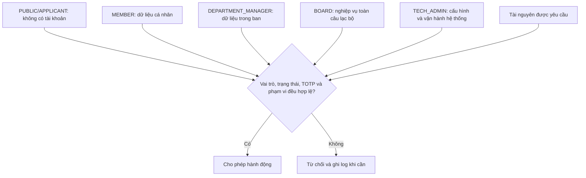
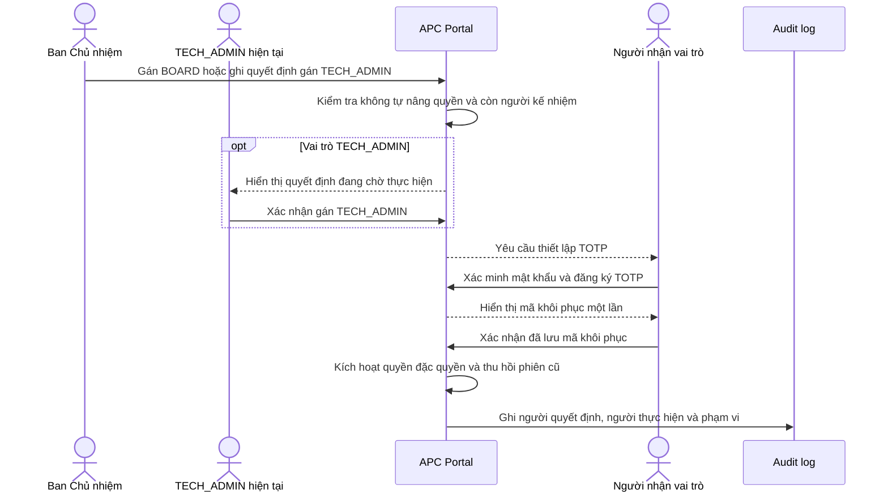

# APC Portal - Roles and Permissions

| Thuộc tính | Giá trị |
| --- | --- |
| Phiên bản | 1.2 |
| Trạng thái | Bản thảo để APC rà soát |
| Ngày cập nhật | 05/09/2026 |
| Sản phẩm | APC Portal |
| Đơn vị sở hữu | Câu lạc bộ Lập trình ứng dụng (APC) |
| Tài liệu liên quan | [Project Charter](./00-project-charter.md), [Product Requirements Document](./01-prd.md) |

### Lịch sử phiên bản

| Phiên bản | Nội dung chính |
| --- | --- |
| 1.0 | Baseline hoàn chỉnh về vai trò, phạm vi, ma trận quyền, TOTP, audit và vận hành |
| 1.1 | Làm rõ các quyền production chưa áp dụng trong giai đoạn local |
| 1.2 | Bỏ hạng mục Thành tích khỏi ma trận nội dung (mục 8.4) và danh mục hành động nhạy cảm |

> Các vai trò và ngưỡng tài khoản đặc quyền là đề xuất cần APC phê duyệt trước khi triển khai xác thực. Giai đoạn local hiện chưa tạo tài khoản thật hay cấp quyền production.

## 1. Mục đích

Tài liệu này xác định vai trò, phạm vi và quyền truy cập của APC Portal. Đây là cơ sở để:

- Thiết kế menu, dashboard và màn hình quản trị.
- Kiểm tra quyền tại API và tầng dữ liệu.
- Xây dựng test case phân quyền.
- Cấp, thay đổi và thu hồi quyền qua từng nhiệm kỳ.
- Truy vết trách nhiệm đối với các thao tác quản trị.

## 2. Nguyên tắc phân quyền

1. **Từ chối mặc định:** hành động không được cấp quyền rõ ràng phải bị từ chối.
2. **Quyền tối thiểu:** mỗi người chỉ có quyền cần thiết để quản lý và sử dụng thông tin.
3. **Kiểm tra phía server:** ẩn nút trên giao diện không thay thế việc kiểm tra quyền tại API.
4. **Giới hạn theo phạm vi:** quyền của Ban chuyên môn chỉ áp dụng với dữ liệu thuộc ban của mình.
5. **Tách nghiệp vụ và kỹ thuật:** Quản trị viên kỹ thuật không mặc định có quyền đọc dữ liệu tuyển dụng, hồ sơ cá nhân hoặc tài liệu nội bộ.
6. **Không tự nâng quyền:** người dùng không được tự cấp vai trò hoặc mở rộng phạm vi cho chính mình.
7. **Truy vết đầy đủ:** thao tác nhạy cảm phải được ghi audit log.
8. **Thu hồi kịp thời:** quyền quản trị phải được rà soát khi đổi vị trí, kết thúc nhiệm kỳ hoặc ngừng hoạt động.

## 3. Khái niệm

| Khái niệm | Ý nghĩa |
| --- | --- |
| Danh tính | Tài khoản nội bộ đại diện cho một thành viên APC |
| Vai trò | Tập quyền nền tảng gắn với trách nhiệm của người dùng |
| Quyền | Một hành động cụ thể trên một loại tài nguyên |
| Phạm vi | Giới hạn dữ liệu mà quyền được phép tác động |
| Audit log | Bản ghi bất biến về hành động, người thực hiện, đối tượng, thời gian và kết quả |

Ứng viên không có tài khoản thành viên và không có vai trò trong hệ thống. Quyền tra cứu hoặc rút đơn được xác minh bằng email và mã hồ sơ.

## 4. Danh mục vai trò

### 4.1. Ngữ cảnh không có tài khoản

| Mã | Nhóm | Mô tả |
| --- | --- | --- |
| PUBLIC | Khách truy cập/Sinh viên | Truy cập nội dung công khai và gửi đơn ứng tuyển |
| APPLICANT | Ứng viên | Truy cập đúng hồ sơ ứng tuyển bằng email và mã hồ sơ |

`PUBLIC` và `APPLICANT` là ngữ cảnh truy cập, không phải vai trò được lưu trong tài khoản.

### 4.2. Vai trò có tài khoản

| Mã | Vai trò | Mục đích | Phạm vi mặc định |
| --- | --- | --- | --- |
| MEMBER | Thành viên | Sử dụng Portal, quản lý hồ sơ cá nhân, đăng ký hoạt động và truy cập tài liệu được cấp quyền | Cá nhân |
| DEPARTMENT_MANAGER | Quản lý Ban chuyên môn | Quản lý thông tin thành viên, sự kiện, nội dung và tài liệu trong ban | Ban chuyên môn |
| BOARD | Ban Chủ nhiệm | Quản lý toàn bộ nghiệp vụ câu lạc bộ | Toàn câu lạc bộ |
| TECH_ADMIN | Quản trị viên kỹ thuật | Vận hành, bảo mật, cấu hình, triển khai và khôi phục hệ thống | Hệ thống |

Thành viên của một Ban chuyên môn vẫn mang vai trò `MEMBER`. Người quản lý thông tin của ban mang vai trò `DEPARTMENT_MANAGER`.

Vai trò `BOARD` và `TECH_ADMIN` là vai trò đặc quyền. Quyền đặc quyền chỉ có hiệu lực sau khi tài khoản thiết lập TOTP và lưu mã khôi phục theo quy trình bảo mật.

## 5. Phạm vi quyền

| Mã | Phạm vi | Diễn giải |
| --- | --- | --- |
| OWN | Cá nhân | Chỉ dữ liệu thuộc chính người dùng hoặc do người dùng tạo ở trạng thái được phép |
| DEPARTMENT | Ban chuyên môn | Dữ liệu thuộc một hoặc nhiều ban được chỉ định |
| CLUB | Toàn câu lạc bộ | Toàn bộ dữ liệu nghiệp vụ APC |
| SYSTEM | Hệ thống | Cấu hình, log kỹ thuật, triển khai, backup và hạ tầng |

Ví dụ, `DEPARTMENT_MANAGER` của Ban Học thuật có quyền xem dữ liệu thuộc ban đó nhưng không xem dữ liệu của ban khác.

### 5.1. Sơ đồ mô hình vai trò và phạm vi

## 6. Ranh giới quản lý thông tin

APC Portal dùng để lưu trữ, cập nhật, tra cứu và phân quyền thông tin của câu lạc bộ. Hệ thống không có chức năng tạo task, giao việc, đặt deadline, theo dõi tiến độ hoặc đánh giá mức độ hoàn thành công việc.

Thông tin ban quản lý sự kiện hoặc người tạo nội dung chỉ dùng để xác định đầu mối thông tin và quyền chỉnh sửa bản ghi, không phải cơ chế giao việc.

## 7. Ký hiệu ma trận

| Ký hiệu | Ý nghĩa |
| --- | --- |
| `✓` | Được phép |
| `OWN` | Chỉ dữ liệu của chính mình |
| `SCOPE` | Chỉ dữ liệu thuộc ban chuyên môn của người dùng |
| `ALL` | Toàn bộ dữ liệu nghiệp vụ câu lạc bộ |
| `DUAL` | Cần phối hợp giữa hai vai trò có thẩm quyền |
| `INCIDENT` | Chỉ được dùng khi xử lý sự cố đã ghi nhận và phải có audit log |
| `-` | Không được phép |

Quyền `SCOPE` chỉ có hiệu lực khi tài khoản mang vai trò `DEPARTMENT_MANAGER` và được gắn với ban chuyên môn tương ứng.

Mỗi cột vai trò thể hiện quyền mà chính vai trò đó đóng góp. Tài khoản có vai trò đặc quyền vẫn giữ vai trò nền `MEMBER` theo `RP-01`, nên có thể sử dụng quyền thành viên hợp lệ của chính mình; dấu `-` ở cột `TECH_ADMIN` khẳng định quyền kỹ thuật không được dùng để mở rộng quyền đọc hoặc sửa dữ liệu nghiệp vụ.

## 8. Ma trận quyền

### 8.1. Nội dung công khai và tuyển thành viên

| Hành động | PUBLIC | APPLICANT | MEMBER | DEPARTMENT_MANAGER | BOARD | TECH_ADMIN |
| --- | --- | --- | --- | --- | --- | --- |
| Xem nội dung đã công bố | ✓ | ✓ | ✓ | ✓ | ✓ | ✓ |
| Xem đợt tuyển đang mở | ✓ | ✓ | ✓ | ✓ | ✓ | ✓ |
| Gửi đơn ứng tuyển | ✓ | ✓ | - | - | - | - |
| Tra cứu trạng thái đơn | - | OWN | - | - | ALL | - |
| Rút đơn trước kết quả cuối | - | OWN | - | - | ALL | - |
| Tạo và cấu hình đợt tuyển | - | - | - | - | ALL | - |
| Cấu hình câu hỏi bổ sung của đợt tuyển | - | - | - | - | ALL | - |
| Mở, đóng hoặc lưu trữ đợt tuyển | - | - | - | - | ALL | - |
| Xem hồ sơ ứng tuyển | - | OWN | - | SCOPE | ALL | - |
| Đánh giá và ghi chú hồ sơ | - | - | - | SCOPE | ALL | - |
| Chuyển trạng thái trung gian | - | - | - | SCOPE | ALL | - |
| Chốt chấp nhận hoặc không chấp nhận | - | - | - | - | ALL | - |
| Xuất danh sách ứng viên | - | - | - | SCOPE | ALL | - |
| Chuyển ứng viên thành thành viên | - | - | - | - | ALL | - |

### 8.2. Tài khoản và hồ sơ thành viên

| Hành động | PUBLIC | APPLICANT | MEMBER | DEPARTMENT_MANAGER | BOARD | TECH_ADMIN |
| --- | --- | --- | --- | --- | --- | --- |
| Đăng nhập bằng tài khoản nội bộ | - | - | ✓ | ✓ | ✓ | ✓ |
| Xem dashboard cá nhân | - | - | OWN | OWN | OWN | OWN |
| Xem hồ sơ cá nhân | - | - | OWN | OWN | OWN | OWN |
| Sửa trường hồ sơ cá nhân được phép | - | - | OWN | OWN | OWN | OWN |
| Cấp hoặc thu hồi đồng ý công khai của chính mình | - | - | OWN | OWN | OWN | OWN |
| Xem danh bạ thành viên cơ bản | - | - | ✓ | ✓ | ✓ | - |
| Xem hồ sơ quản lý của thành viên | - | - | - | SCOPE | ALL | - |
| Sửa ban và trạng thái thành viên | - | - | - | - | ALL | - |
| Tạo tài khoản thành viên | - | - | - | - | ALL | - |
| Cấp lại mật khẩu tạm thời | - | - | - | - | ALL | - |
| Khóa tài khoản | - | - | - | - | ALL | INCIDENT |
| Mở khóa tài khoản | - | - | - | - | ALL | - |
| Thu hồi toàn bộ phiên đăng nhập | - | - | - | - | ALL | ALL |
| Ngừng hoạt động tài khoản | - | - | - | - | ALL | - |
| Xem trạng thái kỹ thuật của tài khoản | - | - | - | - | - | ALL |
| Nhập thành viên hiện hữu từ CSV | - | - | - | - | ALL | - |
| Xuất danh sách thành viên | - | - | - | - | ALL | - |
| Thiết lập TOTP cho chính mình | - | - | - | - | OWN | OWN |
| Đặt lại TOTP của tài khoản đặc quyền | - | - | - | - | DUAL | DUAL |

`TECH_ADMIN` chỉ khóa tài khoản trong phạm vi xử lý sự cố bảo mật. Việc mở khóa hoặc thay đổi trạng thái nghiệp vụ do `BOARD` quyết định.

### 8.3. Sự kiện và điểm danh

| Hành động | PUBLIC | APPLICANT | MEMBER | DEPARTMENT_MANAGER | BOARD | TECH_ADMIN |
| --- | --- | --- | --- | --- | --- | --- |
| Xem sự kiện công khai | ✓ | ✓ | ✓ | ✓ | ✓ | ✓ |
| Xem sự kiện nội bộ được cấp quyền | - | - | ✓ | ✓ | ✓ | - |
| Đăng ký hoặc hủy đăng ký | Theo điều kiện sự kiện | Theo điều kiện sự kiện | OWN | OWN | OWN | - |
| Xem lịch sử tham gia cá nhân | - | - | OWN | OWN | OWN | - |
| Tạo sự kiện ở trạng thái bản nháp | - | - | - | SCOPE | ALL | - |
| Sửa sự kiện | - | - | - | SCOPE | ALL | - |
| Công bố sự kiện nội bộ trong ban | - | - | - | SCOPE | ALL | - |
| Công bố sự kiện toàn câu lạc bộ hoặc công khai | - | - | - | - | ALL | - |
| Hủy hoặc lưu trữ sự kiện | - | - | - | SCOPE | ALL | - |
| Xem và xuất danh sách đăng ký | - | - | - | SCOPE | ALL | - |
| Điểm danh | - | - | - | SCOPE | ALL | - |
| Sửa kết quả điểm danh đã chốt | - | - | - | - | ALL | - |

### 8.4. Tin tức, thông báo và dự án

| Hành động | PUBLIC | APPLICANT | MEMBER | DEPARTMENT_MANAGER | BOARD | TECH_ADMIN |
| --- | --- | --- | --- | --- | --- | --- |
| Xem bài viết công khai | ✓ | ✓ | ✓ | ✓ | ✓ | ✓ |
| Xem thông báo nội bộ được cấp quyền | - | - | ✓ | ✓ | ✓ | - |
| Tạo và sửa bản nháp trong ban | - | - | - | SCOPE | ALL | - |
| Xem trước bản nháp trong ban | - | - | - | SCOPE | ALL | - |
| Công bố thông báo nội bộ trong ban | - | - | - | SCOPE | ALL | - |
| Công bố nội dung công khai | - | - | - | - | ALL | - |
| Gỡ hoặc lưu trữ nội dung công khai | - | - | - | - | ALL | - |
| Tạo và sửa thông tin dự án/sản phẩm | - | - | - | SCOPE | ALL | - |
| Công bố dự án/sản phẩm | - | - | - | - | ALL | - |

Thông tin dự án và sản phẩm chỉ phục vụ giới thiệu, không bao gồm quản lý công việc hoặc tiến độ dự án.

### 8.5. Tài liệu nội bộ

| Hành động | PUBLIC | APPLICANT | MEMBER | DEPARTMENT_MANAGER | BOARD | TECH_ADMIN |
| --- | --- | --- | --- | --- | --- | --- |
| Xem hoặc tải tài liệu được cấp quyền | - | - | OWN | SCOPE | ALL | - |
| Tải tài liệu mới lên | - | - | - | SCOPE | ALL | - |
| Thay thế tệp hoặc sửa metadata | - | - | - | SCOPE | ALL | - |
| Xem và khôi phục phiên bản tệp trước | - | - | - | SCOPE | ALL | - |
| Phân quyền tài liệu trong ban | - | - | - | SCOPE | ALL | - |
| Phân quyền tài liệu toàn câu lạc bộ | - | - | - | - | ALL | - |
| Lưu trữ tài liệu | - | - | - | SCOPE | ALL | - |
| Khôi phục tài liệu đã lưu trữ | - | - | - | SCOPE | ALL | - |
| Xóa vật lý tệp | - | - | - | - | DUAL | DUAL |
| Xem metadata lưu trữ để xử lý sự cố | - | - | - | - | - | INCIDENT |

Xóa vật lý tệp yêu cầu quyết định của `BOARD` và thao tác kỹ thuật của `TECH_ADMIN`.

### 8.6. Vai trò, audit và vận hành

| Hành động | MEMBER | DEPARTMENT_MANAGER | BOARD | TECH_ADMIN |
| --- | --- | --- | --- | --- |
| Xem vai trò và phạm vi của chính mình | OWN | OWN | OWN | OWN |
| Gán hoặc thay đổi phạm vi ban chuyên môn | - | - | ALL | - |
| Gán hoặc thu hồi `DEPARTMENT_MANAGER` | - | - | ALL | - |
| Gán hoặc thu hồi `BOARD` | - | - | ALL | - |
| Gán hoặc thu hồi `TECH_ADMIN` | - | - | DUAL | DUAL |
| Tự thay đổi vai trò của chính mình | - | - | - | - |
| Xem audit log nghiệp vụ | - | - | ALL | INCIDENT |
| Xem log bảo mật và vận hành | - | - | INCIDENT | ALL |
| Thay đổi cấu hình nghiệp vụ | - | - | ALL | - |
| Thay đổi cấu hình kỹ thuật | - | - | - | ALL |
| Triển khai staging/production | - | - | - | ALL |
| Chạy backup, restore hoặc rollback | - | - | - | ALL |
| Xem dashboard monitoring và cảnh báo | - | - | ✓ | ALL |
| Xác nhận, cập nhật và đóng incident | - | - | - | ALL |
| Truy cập database production trực tiếp | - | - | - | Theo quy trình sự cố |

Việc gán hoặc thu hồi `TECH_ADMIN` cần quyết định của `BOARD` và được một `TECH_ADMIN` đang hoạt động thực hiện. Tất cả thao tác phải được ghi audit log.

### 8.7. Thông tin tổ chức, email và dữ liệu cá nhân

| Hành động | MEMBER | DEPARTMENT_MANAGER | BOARD | TECH_ADMIN |
| --- | --- | --- | --- | --- |
| Xem thông tin tổ chức đã công bố | ✓ | ✓ | ✓ | ✓ |
| Sửa thông tin APC, liên hệ và liên kết chính thức | - | - | ALL | - |
| Tạo, sửa, sắp xếp hoặc lưu trữ Ban chuyên môn | - | - | ALL | - |
| Chọn nội dung nổi bật trên trang chủ | - | - | ALL | - |
| Xem trạng thái hiệu lực của đồng ý cho nội dung đang quản lý | - | SCOPE | ALL | - |
| Xem trạng thái email nghiệp vụ | - | SCOPE | ALL | INCIDENT |
| Gửi lại email nghiệp vụ thất bại | - | - | ALL | INCIDENT |
| Sửa cấu hình SMTP/nhà cung cấp email | - | - | - | ALL |
| Tạo yêu cầu xuất/chỉnh sửa dữ liệu của chính mình | OWN | OWN | OWN | OWN |
| Xử lý yêu cầu dữ liệu cá nhân | - | - | ALL | - |
| Chạy dry-run retention | - | - | ALL | ALL |
| Thực thi retention hoặc xóa file xuất hết hạn | - | - | DUAL | DUAL |

`TECH_ADMIN` chỉ xem metadata giao nhận và lỗi kỹ thuật của email; nội dung nghiệp vụ và dữ liệu cá nhân người nhận chỉ hiển thị khi cần thiết để xử lý sự cố đã được ghi nhận.

## 9. Quy tắc cấp và thay đổi quyền

| Mã | Quy tắc |
| --- | --- |
| RP-01 | Tài khoản mới luôn bắt đầu với vai trò `MEMBER` |
| RP-02 | Vai trò quản lý phải gắn với phạm vi và ngày bắt đầu |
| RP-03 | Vai trò đặc quyền có ngày hết hạn không muộn hơn ngày kết thúc nhiệm kỳ hiện tại; hệ thống cảnh báo `BOARD` và người giữ vai trò trước 30 ngày và 7 ngày |
| RP-04 | Chỉ `BOARD` được gán hoặc thu hồi vai trò nghiệp vụ và phạm vi ban chuyên môn |
| RP-05 | Không ai được tự thay đổi vai trò hoặc phạm vi của chính mình |
| RP-06 | Sau khi production được phát hành, không được khóa, thu hồi hoặc ngừng hoạt động tài khoản nếu thao tác làm số `BOARD` đang hoạt động thấp hơn hai; giai đoạn bootstrap trước production được áp dụng ngoại lệ theo `RP-15` |
| RP-07 | Sau khi production được phát hành, không được khóa, thu hồi hoặc ngừng hoạt động tài khoản nếu thao tác làm số `TECH_ADMIN` đang hoạt động thấp hơn hai; giai đoạn bootstrap trước production được áp dụng ngoại lệ theo `RP-15` |
| RP-08 | Khi đổi ban, toàn bộ quyền theo ban cũ bị thu hồi trước khi quyền ban mới có hiệu lực |
| RP-09 | Khi thành viên ngừng hoạt động, hệ thống thu hồi phiên và quyền quản trị ngay lập tức |
| RP-10 | Quyền đặc quyền được rà soát đầu mỗi học kỳ, khi nhận cảnh báo sắp hết hạn và khi bàn giao nhiệm kỳ; người kế nhiệm phải được kích hoạt trước ngày hết hạn nếu production sẽ thiếu ngưỡng tối thiểu |
| RP-11 | Mọi thay đổi vai trò phải có lý do và người thực hiện trong audit log |
| RP-12 | Dữ liệu lịch sử vẫn giữ thông tin người từng thực hiện hành động sau khi tài khoản ngừng hoạt động |
| RP-13 | `BOARD` hoặc `TECH_ADMIN` chưa thiết lập TOTP chỉ có quyền hoàn tất thiết lập bảo mật và đăng xuất |
| RP-14 | Khôi phục TOTP cho tài khoản đặc quyền cần hai người: một `BOARD` xác nhận danh tính và một `TECH_ADMIN` thực hiện; không người nào được tự khôi phục cho mình |
| RP-15 | Tài khoản `BOARD` đầu tiên và `TECH_ADMIN` đầu tiên được tạo cho hai hồ sơ thành viên đã xác định trong cùng quy trình bootstrap dùng một lần; mỗi tài khoản có vai trò nền `MEMBER` và đúng một vai trò đặc quyền tương ứng, bắt buộc đổi mật khẩu và thiết lập TOTP trước mọi thao tác production |
| RP-16 | Import thành viên không được gán sẵn vai trò đặc quyền; mọi tài khoản nhập vào bắt đầu với `MEMBER` |
| RP-17 | File export chứa dữ liệu cá nhân chỉ được tải bởi người tạo trong 24 giờ và phải bị xóa tự động sau thời hạn |
| RP-18 | Production duy trì tối thiểu hai `BOARD` và hai `TECH_ADMIN` đang hoạt động, do những người khác nhau nắm giữ |
| RP-19 | Cùng một tài khoản không được đồng thời mang `BOARD` và `TECH_ADMIN` để duy trì tách biệt nghiệp vụ/kỹ thuật |

## 10. Vòng đời tài khoản

| Giai đoạn | Người thực hiện | Hành động hệ thống |
| --- | --- | --- |
| Tạo tài khoản | BOARD | Tạo từ hồ sơ thành viên, gán `MEMBER`, sinh mật khẩu tạm thời |
| Kích hoạt | Thành viên | Đăng nhập và đổi mật khẩu tạm thời trong 72 giờ |
| Hoạt động | Thành viên/BOARD | Sử dụng quyền hiện có; cập nhật vai trò khi trách nhiệm quản lý thông tin thay đổi |
| Kích hoạt đặc quyền | BOARD/TECH_ADMIN | Thiết lập TOTP, lưu mã khôi phục và đăng nhập lại trước khi vai trò đặc quyền có hiệu lực |
| Khóa bảo mật | BOARD hoặc TECH_ADMIN | Chặn đăng nhập mới và thu hồi toàn bộ phiên |
| Mở khóa | BOARD | Mở lại tài khoản và cấp mật khẩu tạm thời khi cần |
| Ngừng hoạt động | BOARD | Thu hồi phiên và quyền đặc quyền; giữ hồ sơ lịch sử |
| Bàn giao | BOARD và TECH_ADMIN | Cấp quyền cho người kế nhiệm trước khi thu hồi người cũ |

### 10.1. Sơ đồ kích hoạt quyền đặc quyền

## 11. Hành động bắt buộc ghi audit log

| Nhóm | Hành động |
| --- | --- |
| Tài khoản | Tạo, khóa, mở khóa, đặt lại mật khẩu, ngừng hoạt động, thu hồi phiên |
| Phân quyền | Gán/thu hồi vai trò và thay đổi phạm vi ban chuyên môn |
| Tuyển thành viên | Tạo đợt, thay đổi trạng thái hồ sơ, chốt kết quả, chuyển thành thành viên, xuất dữ liệu |
| Thành viên | Import/export, thay đổi ban, vai trò, trạng thái và dữ liệu quản lý |
| Sự kiện | Công bố, hủy, xuất danh sách, điểm danh và sửa điểm danh đã chốt |
| Nội dung | Công bố, gỡ, lưu trữ bài viết và dự án |
| Tài liệu | Tải lên, thay thế, phân quyền, lưu trữ và xóa vật lý |
| Tổ chức | Thay đổi thông tin APC, cơ cấu Ban chuyên môn và nội dung nổi bật |
| Email | Gửi lại email, đổi cấu hình nhà cung cấp và thay đổi trạng thái giao nhận thủ công |
| Dữ liệu cá nhân | Tạo/xử lý yêu cầu, xuất, chỉnh sửa, ẩn danh, xóa và chạy retention |
| Hệ thống | Đổi cấu hình, deploy, migration, backup, restore, rollback, incident và truy cập database production |

Audit log chứa tối thiểu: người thực hiện, vai trò, hành động, loại và mã đối tượng, thời gian, địa chỉ IP, kết quả và lý do khi thao tác thất bại hoặc nhạy cảm.

Khi cần ghi thay đổi trước/sau, audit log chỉ lưu tên trường và giá trị đã tối thiểu hóa hoặc redaction phù hợp. Mật khẩu, mật khẩu tạm thời, session/token, secret/mã TOTP, mã khôi phục, mã hồ sơ/đăng ký và toàn bộ nội dung biểu mẫu nhạy cảm không được ghi vào audit log.

## 12. Quy tắc kiểm tra quyền trong hệ thống

1. Mỗi API xác định danh tính, trạng thái tài khoản, TOTP đối với quyền đặc quyền, vai trò và phạm vi trước khi xử lý.
2. Truy vấn dữ liệu phải áp dụng phạm vi ngay tại server; không tải toàn bộ dữ liệu rồi lọc ở frontend.
3. Tệp nội bộ chỉ được trả qua endpoint có kiểm tra quyền hoặc URL ký có thời hạn ngắn.
4. Khi người dùng không có quyền biết tài nguyên tồn tại, API trả về `404`; các trường hợp còn lại trả về `403`.
5. Tài khoản bị khóa hoặc ngừng hoạt động bị từ chối ngay cả khi phiên cũ chưa hết hạn.
6. Thay đổi vai trò, mật khẩu hoặc trạng thái tài khoản làm mới hoặc vô hiệu hóa quyền trong phiên hiện tại.
7. Giao diện chỉ hiển thị menu và hành động phù hợp, nhưng backend vẫn kiểm tra lại mọi request.
8. Mỗi quyền quan trọng phải có kiểm thử cho trường hợp được phép, bị từ chối và vượt phạm vi.
9. Job nền và CLI production sử dụng service identity riêng, quyền tối thiểu và audit log; không dùng tài khoản cá nhân để chạy tự động.
10. File import/export và URL tạm thời phải kiểm tra quyền cả lúc tạo lẫn lúc tải xuống.

## 13. Tiêu chí nghiệm thu phân quyền

### AC-RBAC-01. Thành viên thông thường

- Chỉ xem và sửa các trường hồ sơ cá nhân được phép.
- Chỉ xem tài liệu, thông báo và sự kiện thuộc phạm vi được cấp.
- Không truy cập được API quản trị bằng cách nhập URL trực tiếp.

### AC-RBAC-02. Quản lý Ban chuyên môn

- Chỉ xem và quản lý dữ liệu thuộc ban chuyên môn của mình.
- Không xem được hồ sơ tuyển dụng, tài liệu hoặc thành viên của ban khác.
- Không chốt kết quả tuyển thành viên, cấp tài khoản hoặc công bố nội dung công khai.

### AC-RBAC-03. Ban Chủ nhiệm

- Quản lý được toàn bộ nghiệp vụ câu lạc bộ.
- Cấp, khóa, mở khóa và ngừng hoạt động tài khoản thành viên.
- Giao và thu hồi vai trò nghiệp vụ mà không thể tự nâng quyền cho chính mình.

### AC-RBAC-04. Quản trị viên kỹ thuật

- Triển khai, xem log kỹ thuật, thu hồi phiên, backup và restore hệ thống.
- Không mặc định đọc được hồ sơ ứng viên, hồ sơ quản lý thành viên hoặc nội dung tài liệu nội bộ.
- Mọi truy cập khẩn cấp vào database production được ghi nhận theo quy trình sự cố.

### AC-RBAC-05. Kiểm tra vượt phạm vi

- Thay đổi mã tài nguyên trên URL hoặc request không cho phép truy cập dữ liệu ngoài phạm vi.
- Tệp nội bộ không thể tải xuống bằng URL cũ sau khi quyền bị thu hồi.
- Quyền mới hoặc quyền bị thu hồi có hiệu lực ngay sau khi phiên được làm mới hoặc vô hiệu hóa.

### AC-RBAC-06. Quyền đặc quyền và TOTP

- `BOARD` hoặc `TECH_ADMIN` chưa thiết lập TOTP không gọi được API đặc quyền.
- Người dùng không tự nâng quyền, tự đặt lại TOTP hoặc tự mở rộng phạm vi.
- Khôi phục TOTP đặc quyền cần đủ hai vai trò theo `RP-14` và tạo audit log.
- Tài khoản đặc quyền không thể bị khóa, thu hồi hoặc ngừng hoạt động nếu thao tác làm production còn ít hơn hai tài khoản đang hoạt động ở vai trò tương ứng.
- Release production bị chặn nếu có ít hơn hai `BOARD` hoặc hai `TECH_ADMIN` đang hoạt động.
- Hệ thống gửi cảnh báo trước 30 ngày và 7 ngày cho vai trò đặc quyền sắp hết hạn; danh sách cảnh báo chỉ hết khi đã có người kế nhiệm hợp lệ hoặc ngày hết hạn được cập nhật đúng quy trình.
- Hệ thống từ chối gán `BOARD` và `TECH_ADMIN` cho cùng một tài khoản.

### AC-RBAC-07. Import, export và dữ liệu cá nhân

- Chỉ `BOARD` nhập hoặc xuất danh sách thành viên.
- File export không tải được bởi người khác hoặc sau 24 giờ.
- Chỉ `BOARD` quyết định xử lý dữ liệu cá nhân; `TECH_ADMIN` chỉ thực thi bước kỹ thuật cần phối hợp.
- Import không thể tạo sẵn `BOARD`, `DEPARTMENT_MANAGER` hoặc `TECH_ADMIN`.

### AC-RBAC-08. Thông tin tổ chức và email

- Chỉ `BOARD` thay đổi thông tin APC, cơ cấu ban và nội dung nổi bật.
- `DEPARTMENT_MANAGER` chỉ xem trạng thái email thuộc dữ liệu trong ban.
- `TECH_ADMIN` xem lỗi giao nhận và cấu hình nhà cung cấp nhưng không mặc định đọc nội dung nghiệp vụ.
- Gửi lại email và thay đổi cấu hình đều được ghi audit log.

### AC-RBAC-09. Bootstrap và service identity

- Bootstrap chỉ tạo được một `BOARD` đầu tiên và một `TECH_ADMIN` đầu tiên cho hai hồ sơ thành viên đã xác định; ngoài vai trò nền `MEMBER`, mỗi tài khoản chỉ mang đúng vai trò đặc quyền tương ứng và bootstrap không chạy lại sau khi hoàn tất.
- Hai tài khoản bootstrap bắt buộc đổi mật khẩu, thiết lập TOTP và vô hiệu hóa thông tin khởi tạo.
- Job nền có service identity riêng, không mang quyền nghiệp vụ ngoài yêu cầu xử lý.

## 14. Ánh xạ với PRD

| Nhóm quyền | Yêu cầu và luồng liên quan |
| --- | --- |
| Tuyển thành viên | `REC-01` đến `REC-16`, `FLOW-03` đến `FLOW-08` |
| Tài khoản và thành viên | `AUTH-01` đến `AUTH-12`, `MEM-01` đến `MEM-12`, `FLOW-09` đến `FLOW-13`, `FLOW-25`, `FLOW-27`, `FLOW-28` |
| Sự kiện | `EVT-01` đến `EVT-14`, `FLOW-14` đến `FLOW-16` |
| Nội dung và dự án | `CMS-01` đến `CMS-06`, `PRT-01` đến `PRT-04`, `FLOW-17` và `FLOW-18` |
| Tài liệu | `DOC-01` đến `DOC-09`, `FLOW-19` |
| Phân quyền và audit | `ADM-01` đến `ADM-08`, `FLOW-20` và `FLOW-21` |
| Thông tin tổ chức | `ORG-01` đến `ORG-06`, `FLOW-24` |
| Email giao dịch | `NTF-01` đến `NTF-05`, `FLOW-26` |
| Dữ liệu cá nhân | `DATA-01` đến `DATA-10`, `FLOW-28` |
| Vận hành | `SEC-01` đến `SEC-16`, `OPS-01` đến `OPS-11`, `FLOW-22`, `FLOW-23` và `FLOW-29` |

## 15. Quản lý tài liệu

- Product Owner sở hữu quyết định về vai trò và quyền nghiệp vụ.
- Tech Lead sở hữu cách triển khai và kiểm thử cơ chế phân quyền.
- Thay đổi quyền phải cập nhật đồng thời tài liệu này, test case và cấu hình seed/migration liên quan.
- Ma trận được rà soát đầu mỗi học kỳ, khi đổi nhiệm kỳ và trước mỗi lần phát hành lớn.
