# APC Portal - User Flows

| Thuộc tính | Giá trị |
| --- | --- |
| Phiên bản | 1.1 |
| Trạng thái | Bản thảo để APC rà soát |
| Ngày cập nhật | 27/08/2026 |
| Sản phẩm | APC Portal |
| Đơn vị sở hữu | Câu lạc bộ Lập trình ứng dụng (APC) |
| Tài liệu liên quan | [Project Charter](./00-project-charter.md), [PRD](./01-prd.md), [Roles and Permissions](./02-roles-permissions.md) |

### Lịch sử phiên bản

| Phiên bản | Nội dung chính |
| --- | --- |
| 1.0 | Baseline hoàn chỉnh gồm `FLOW-01` đến `FLOW-29`, nhánh lỗi, truy vết và sơ đồ tổ chức/vận hành |
| 1.1 | Ghi nhận trang chủ là luồng được khởi tạo đầu tiên và các luồng production chưa triển khai |

> Hiện chỉ `FLOW-01` có giao diện baseline theo bản thiết kế đã duyệt. Các luồng còn lại là đặc tả để rà soát, không phải chức năng đã hoàn thành.

## 1. Mục đích

Tài liệu này mô tả chi tiết 29 luồng người dùng của APC Portal. Mỗi luồng là cơ sở để xây dựng sitemap, wireframe, prototype, API contract, test case và tiêu chí nghiệm thu.

Portal chỉ quản lý thông tin. Các luồng dưới đây không bao gồm tạo task, giao việc, deadline, tiến độ hoặc đánh giá mức độ hoàn thành công việc.

## 2. Quy ước

### 2.1. Tác nhân

| Tác nhân | Mô tả |
| --- | --- |
| PUBLIC | Khách truy cập hoặc sinh viên chưa đăng nhập |
| APPLICANT | Ứng viên xác minh hồ sơ bằng email và mã hồ sơ |
| MEMBER | Thành viên có tài khoản nội bộ |
| DEPARTMENT_MANAGER | Người quản lý thông tin trong Ban chuyên môn |
| BOARD | Ban Chủ nhiệm quản lý nghiệp vụ toàn câu lạc bộ |
| TECH_ADMIN | Quản trị viên kỹ thuật vận hành hệ thống |
| SYSTEM | Portal, CI/CD hoặc tác vụ tự động |

### 2.2. Thành phần của một luồng

| Thành phần | Ý nghĩa |
| --- | --- |
| Điểm bắt đầu | Hành động hoặc sự kiện kích hoạt luồng |
| Điều kiện trước | Trạng thái phải đúng trước khi thực hiện |
| Luồng chính | Chuỗi hành động dẫn đến kết quả thành công |
| Nhánh thay thế | Cách xử lý hợp lệ khác với luồng chính |
| Trạng thái lỗi | Lỗi phải hiển thị và cách hệ thống bảo toàn dữ liệu |
| Kết quả | Trạng thái dữ liệu sau khi luồng kết thúc |
| Truy vết | Mã yêu cầu trong PRD và tài liệu phân quyền |

## 3. Bản đồ luồng tổng thể

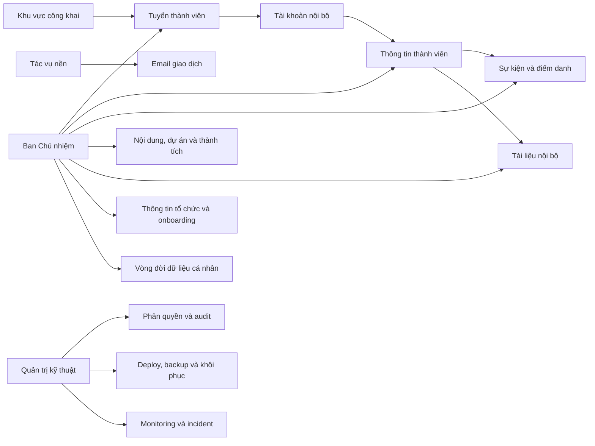

### 3.1. Sơ đồ bao phủ 29 luồng

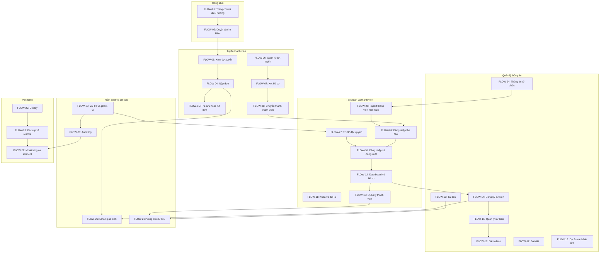

## 4. Khu vực công khai

### FLOW-01. Truy cập trang chủ và điều hướng

| Thuộc tính | Nội dung |
| --- | --- |
| Tác nhân | PUBLIC |
| Điểm bắt đầu | Người dùng mở domain của APC Portal |
| Điều kiện trước | Portal hoạt động và có ít nhất cấu hình nhận diện cơ bản |
| Kết quả | Người dùng đến trang nội dung hoặc hệ thống liên quan |
| Truy vết | `PUB-01`, `PUB-02`, `PUB-03`, `PUB-04`, `PUB-05`, `PUB-06`, `PUB-08` |

**Luồng chính**

1. Hệ thống tải trang chủ và metadata công khai.
2. Trang chủ hiển thị giới thiệu APC, tin mới, sự kiện sắp tới, dự án nổi bật và trạng thái tuyển thành viên.
3. Người dùng chọn một mục trong điều hướng hoặc khối nội dung.
4. Hệ thống mở đúng trang danh sách, chi tiết hoặc liên kết UMTOJ.

**Nhánh thay thế và lỗi**

- Khi chưa có nội dung nổi bật, hệ thống ẩn khối tương ứng mà không để khoảng trống lỗi.
- Liên kết ngoài Portal được đánh dấu và mở bằng cơ chế an toàn.
- Đường dẫn không tồn tại hiển thị trang 404 cùng lối quay về trang chủ.
- Khi Portal bảo trì, hệ thống hiển thị trang bảo trì và không lộ thông tin kỹ thuật.

### FLOW-02. Duyệt, tìm kiếm và xem nội dung công khai

| Thuộc tính | Nội dung |
| --- | --- |
| Tác nhân | PUBLIC |
| Điểm bắt đầu | Người dùng mở danh sách tin tức, sự kiện, dự án hoặc thành tích |
| Điều kiện trước | Nội dung có trạng thái Công khai/Đã công bố |
| Kết quả | Người dùng xem được nội dung phù hợp hoặc trạng thái không có kết quả |
| Truy vết | `PUB-03`, `PUB-04`, `PUB-05`, `PUB-07`, `CMS-04`, `SEO-01`, `SEO-03` |

**Luồng chính**

1. Hệ thống hiển thị danh sách đã phân trang theo loại nội dung.
2. Người dùng nhập từ khóa hoặc chọn bộ lọc được hỗ trợ.
3. Hệ thống trả kết quả theo tiêu đề và điều kiện lọc.
4. Người dùng chọn một kết quả.
5. Hệ thống mở trang chi tiết bằng đường dẫn ổn định và hiển thị metadata chia sẻ.

**Nhánh thay thế và lỗi**

- Từ khóa trống trả về danh sách mặc định.
- Không có kết quả hiển thị trạng thái rỗng và nút xóa bộ lọc.
- Nội dung vừa bị gỡ hoặc lưu trữ trả về 404 và không hiển thị dữ liệu cũ.
- Lỗi tải danh sách không làm thay đổi URL hoặc bộ lọc người dùng đã nhập.

## 5. Tuyển thành viên

### FLOW-03. Xem đợt tuyển và điều kiện ứng tuyển

| Thuộc tính | Nội dung |
| --- | --- |
| Tác nhân | PUBLIC |
| Điểm bắt đầu | Sinh viên mở trang Tuyển thành viên |
| Điều kiện trước | Có đợt tuyển ở trạng thái Đang mở hoặc thông tin tuyển gần nhất |
| Kết quả | Sinh viên hiểu thời hạn, vị trí, điều kiện và dữ liệu phải cung cấp |
| Truy vết | `PUB-06`, `REC-01`, `REC-02`, `REC-03`, `REC-04` |

**Luồng chính**

1. Hệ thống hiển thị đợt tuyển đang mở.
2. Sinh viên xem mô tả, ban tuyển, điều kiện, thời gian và quy định dữ liệu.
3. Sinh viên chọn ban quan tâm và đọc yêu cầu tương ứng.
4. Sinh viên chọn Bắt đầu ứng tuyển.
5. Hệ thống mở biểu mẫu đúng đợt tuyển.

**Nhánh thay thế và lỗi**

- Chưa đến thời gian nhận đơn: hiển thị thời điểm mở và không cho gửi đơn.
- Đã hết hạn: hiển thị trạng thái Đã đóng và ẩn nút bắt đầu.
- Không có đợt tuyển: hiển thị thông tin giới thiệu và kênh liên hệ APC.

### FLOW-04. Gửi đơn ứng tuyển

| Thuộc tính | Nội dung |
| --- | --- |
| Tác nhân | PUBLIC |
| Điểm bắt đầu | Sinh viên mở biểu mẫu của đợt tuyển đang nhận đơn |
| Điều kiện trước | Đợt tuyển đang mở; sinh viên chưa có đơn trong cùng đợt |
| Kết quả | Hồ sơ được lưu, có mã hồ sơ duy nhất và thông báo xác nhận |
| Truy vết | `REC-03` đến `REC-06`, `REC-14`, `REC-15`, `DATA-01`, `DATA-07`, `SEC-05`, `SEC-08` |

**Luồng chính**

1. Sinh viên nhập thông tin cá nhân, học tập, ban mong muốn, kỹ năng và trả lời các câu hỏi cố định/bổ sung của đợt tuyển.
2. Sinh viên đọc và đồng ý với mục đích sử dụng dữ liệu.
3. Người dùng chọn Nộp đơn.
4. Hệ thống kiểm tra trường bắt buộc, định dạng và giới hạn nội dung.
5. Hệ thống kiểm tra trùng email hoặc mã số sinh viên trong đợt tuyển.
6. Hệ thống lưu hồ sơ ở trạng thái Mới, lưu phiên bản nội dung đồng ý và sinh mã hồ sơ không thể đoán tuần tự.
7. Hệ thống hiển thị mã hồ sơ một lần và đưa email xác nhận vào hàng đợi.

**Nhánh thay thế và lỗi**

- Dữ liệu không hợp lệ: đánh dấu đúng trường lỗi và giữ lại dữ liệu đã nhập.
- Chưa đồng ý xử lý dữ liệu: không cho nộp đơn.
- Phát hiện trùng: không tạo hồ sơ mới và hướng dẫn dùng chức năng tra cứu.
- Vượt ngưỡng gửi biểu mẫu hoặc có dấu hiệu tự động hóa: yêu cầu xác minh tăng cường hoặc trả `429` mà không làm mất dữ liệu người dùng đã nhập.
- Email xác nhận gửi thất bại: hồ sơ vẫn được lưu; màn hình vẫn hiển thị mã và hệ thống ghi nhận để gửi lại.
- Lỗi server trước khi lưu: không sinh mã hồ sơ và cho phép gửi lại an toàn.
- Gửi lặp request: idempotency key ngăn tạo hai hồ sơ.

### FLOW-05. Tra cứu trạng thái hoặc rút đơn

| Thuộc tính | Nội dung |
| --- | --- |
| Tác nhân | APPLICANT |
| Điểm bắt đầu | Ứng viên mở trang Tra cứu hồ sơ |
| Điều kiện trước | Ứng viên có email và mã hồ sơ hợp lệ |
| Kết quả | Trạng thái được hiển thị hoặc hồ sơ được chuyển sang Đã rút |
| Truy vết | `REC-07`, `REC-08`, `REC-13`, `SEC-05`, `SEC-08` |

**Luồng chính**

1. Ứng viên nhập email và mã hồ sơ.
2. Hệ thống giới hạn tần suất và xác minh cặp thông tin.
3. Hệ thống hiển thị mã hồ sơ, đợt tuyển, ban đăng ký, trạng thái công khai và thời điểm cập nhật.
4. Nếu hồ sơ chưa có kết quả cuối, hệ thống hiển thị tùy chọn Rút đơn.
5. Ứng viên xác nhận rút đơn.
6. Hệ thống chuyển trạng thái sang Đã rút và không cho tiếp tục xét tuyển.

**Nhánh thay thế và lỗi**

- Email hoặc mã không đúng: hiển thị thông báo chung, không tiết lộ trường nào sai.
- Vượt giới hạn thử: tạm khóa yêu cầu trong 15 phút.
- Hồ sơ đã có kết quả cuối: chỉ cho xem, không cho rút.
- Hồ sơ đã rút: hiển thị trạng thái hiện tại và không lặp thao tác.

### FLOW-06. Quản lý đợt tuyển

| Thuộc tính | Nội dung |
| --- | --- |
| Tác nhân | BOARD |
| Điểm bắt đầu | Ban Chủ nhiệm mở quản trị Tuyển thành viên |
| Điều kiện trước | Tài khoản hoạt động và có quyền quản lý tuyển thành viên |
| Kết quả | Đợt tuyển được tạo hoặc chuyển đúng trạng thái |
| Truy vết | `REC-01`, `REC-02`, `REC-14` đến `REC-16`, `ADM-03`, `ADM-05` |

**Luồng chính**

1. Ban Chủ nhiệm tạo đợt tuyển ở trạng thái Bản nháp.
2. Người dùng nhập tiêu đề, mô tả, ban tuyển, điều kiện, thời gian và cấu hình câu hỏi bổ sung của biểu mẫu.
3. Hệ thống kiểm tra thời gian và trường bắt buộc.
4. Ban Chủ nhiệm xem trước trang tuyển.
5. Ban Chủ nhiệm mở đợt tuyển.
6. Hệ thống công bố trang và chỉ nhận đơn trong khoảng thời gian hợp lệ.
7. Khi kết thúc, Ban Chủ nhiệm đóng rồi lưu trữ đợt tuyển.

**Nhánh thay thế và lỗi**

- Thời gian kết thúc trước thời gian bắt đầu: từ chối lưu.
- Đợt tuyển đã có hồ sơ: không cho đổi kiểu hoặc xóa câu hỏi đã có câu trả lời; dữ liệu đã nộp luôn giữ nguyên cấu trúc lịch sử.
- Đóng sớm: yêu cầu xác nhận và dừng nhận hồ sơ mới ngay lập tức.
- Lưu trữ không xóa hồ sơ hoặc lịch sử xử lý.

### FLOW-07. Sàng lọc và cập nhật kết quả hồ sơ

| Thuộc tính | Nội dung |
| --- | --- |
| Tác nhân | DEPARTMENT_MANAGER, BOARD |
| Điểm bắt đầu | Người có quyền mở danh sách hồ sơ của đợt tuyển |
| Điều kiện trước | Đợt tuyển tồn tại; tài khoản có quyền trong phạm vi dữ liệu |
| Kết quả | Hồ sơ có trạng thái, đánh giá và lịch sử xử lý đầy đủ |
| Truy vết | `REC-08`, `REC-09`, `REC-10`, `REC-11`, `ADM-01`, `ADM-05` |

**Luồng chính**

1. Người dùng lọc hồ sơ theo đợt, trạng thái, ban hoặc từ khóa.
2. Hệ thống chỉ trả hồ sơ trong phạm vi quyền.
3. Người dùng mở hồ sơ, xem dữ liệu và ghi chú nội bộ.
4. `DEPARTMENT_MANAGER` cập nhật trạng thái trung gian trong ban của mình.
5. `BOARD` xem tổng hợp và chốt Đã chấp nhận hoặc Không chấp nhận.
6. Hệ thống lưu người thay đổi, thời gian, trạng thái cũ/mới và lý do.

**Nhánh thay thế và lỗi**

- Người quản lý ban truy cập hồ sơ ban khác: trả 404.
- Trạng thái chuyển không hợp lệ: từ chối và giữ trạng thái cũ.
- Hai người cập nhật đồng thời: phát hiện version conflict và yêu cầu tải dữ liệu mới.
- Xuất CSV chỉ chứa dữ liệu trong phạm vi quyền và được ghi audit log.

### FLOW-08. Chuyển ứng viên thành thành viên

| Thuộc tính | Nội dung |
| --- | --- |
| Tác nhân | BOARD |
| Điểm bắt đầu | Ban Chủ nhiệm chọn hồ sơ ở trạng thái Đã chấp nhận |
| Điều kiện trước | Hồ sơ chưa được chuyển; email và mã số sinh viên chưa gắn với thành viên khác |
| Kết quả | Hồ sơ thành viên và tài khoản `MEMBER` được tạo |
| Truy vết | `REC-12`, `AUTH-01` đến `AUTH-03`, `BR-01`, `BR-02`, `BR-06` |

**Luồng chính**

1. Ban Chủ nhiệm kiểm tra dữ liệu ứng viên và chọn ban chuyên môn.
2. Hệ thống đề xuất tên đăng nhập duy nhất.
3. Ban Chủ nhiệm xác nhận tạo thành viên.
4. Hệ thống tạo `MemberProfile`, tài khoản trạng thái Chờ kích hoạt và vai trò `MEMBER`.
5. Hệ thống sinh mật khẩu tạm thời có hạn 72 giờ.
6. Thông tin cấp tài khoản được hiển thị theo cơ chế an toàn, không gửi qua email và không lưu dạng rõ trong log.
7. Hệ thống đánh dấu hồ sơ đã chuyển và ghi audit log.

**Nhánh thay thế và lỗi**

- Trùng thành viên: dừng tạo và mở hồ sơ đã tồn tại cho Ban Chủ nhiệm xử lý.
- Tên đăng nhập trùng: yêu cầu chọn tên khác.
- Transaction lỗi: không tạo dở một trong hai bản ghi.
- Thực hiện lại trên hồ sơ đã chuyển: trả về thành viên đã tạo, không sinh tài khoản thứ hai.

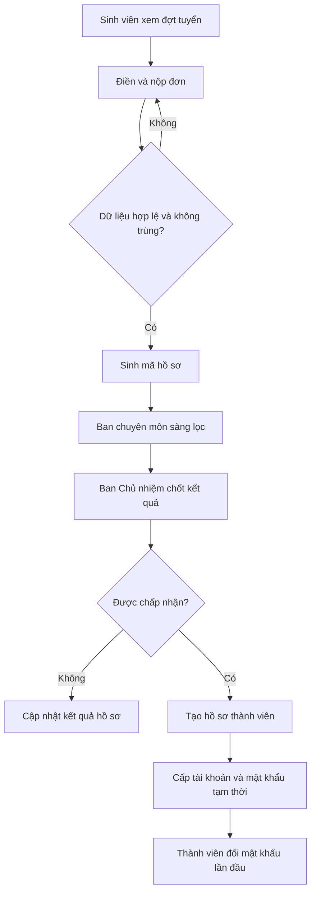

## 6. Xác thực và tài khoản

### FLOW-09. Đăng nhập lần đầu và đổi mật khẩu tạm thời

| Thuộc tính | Nội dung |
| --- | --- |
| Tác nhân | MEMBER, DEPARTMENT_MANAGER, BOARD, TECH_ADMIN |
| Điểm bắt đầu | Thành viên mở trang đăng nhập với thông tin do Ban Chủ nhiệm cấp |
| Điều kiện trước | Tài khoản Chờ kích hoạt; mật khẩu tạm thời còn hạn |
| Kết quả | Tài khoản Đang hoạt động và chỉ mật khẩu mới còn hiệu lực |
| Truy vết | `AUTH-03` đến `AUTH-05`, `AUTH-10`, `BR-04`, `SEC-02`, `SEC-06`, `SEC-11` |

**Luồng chính**

1. Thành viên nhập tên đăng nhập và mật khẩu tạm thời.
2. Hệ thống xác thực và chỉ cho truy cập màn hình Đổi mật khẩu.
3. Thành viên nhập mật khẩu mới và xác nhận.
4. Hệ thống kiểm tra mật khẩu dài 15 đến 128 ký tự, không nằm trong blocklist và khác mật khẩu tạm thời.
5. Hệ thống lưu hash mới, vô hiệu hóa mật khẩu tạm thời và kích hoạt tài khoản.
6. Hệ thống tạo phiên mới và mở dashboard.

**Nhánh thay thế và lỗi**

- Mật khẩu tạm thời hết hạn: từ chối đăng nhập và hướng dẫn liên hệ Ban Chủ nhiệm.
- Mật khẩu mới không đạt yêu cầu: giữ ở màn hình đổi mật khẩu và hiển thị điều kiện chưa đạt.
- Người dùng thoát trước khi hoàn tất: tài khoản vẫn ở trạng thái Chờ kích hoạt.
- Vượt số lần sai: áp dụng giới hạn đăng nhập.

### FLOW-10. Đăng nhập, đổi mật khẩu và đăng xuất

| Thuộc tính | Nội dung |
| --- | --- |
| Tác nhân | MEMBER, DEPARTMENT_MANAGER, BOARD, TECH_ADMIN |
| Điểm bắt đầu | Người dùng mở trang đăng nhập hoặc cài đặt bảo mật |
| Điều kiện trước | Tài khoản Đang hoạt động và không bị khóa |
| Kết quả | Phiên hợp lệ được tạo/cập nhật hoặc kết thúc an toàn |
| Truy vết | `AUTH-04`, `AUTH-05`, `AUTH-08`, `SEC-03`, `SEC-05`, `SEC-06` |

**Luồng chính: đăng nhập**

1. Người dùng nhập tên đăng nhập và mật khẩu.
2. Hệ thống xác thực, kiểm tra trạng thái tài khoản và giới hạn đăng nhập.
3. Nếu tài khoản có quyền đặc quyền, hệ thống yêu cầu TOTP hoặc mã khôi phục dùng một lần.
4. Hệ thống tạo cookie phiên an toàn.
5. Hệ thống điều hướng đến dashboard phù hợp với vai trò.

**Luồng chính: đổi mật khẩu**

1. Người dùng nhập mật khẩu hiện tại, mật khẩu mới và xác nhận.
2. Hệ thống xác thực mật khẩu hiện tại và chính sách mật khẩu mới.
3. Hệ thống cập nhật hash và thu hồi các phiên khác.

**Luồng chính: đăng xuất**

1. Người dùng chọn Đăng xuất.
2. Hệ thống vô hiệu hóa phiên hiện tại, xóa cookie và về trang công khai.

**Nhánh thay thế và lỗi**

- Thông tin đăng nhập sai: hiển thị thông báo chung.
- Tài khoản bị khóa/ngừng hoạt động: không tạo phiên.
- Phiên hết hạn: lưu URL an toàn, chuyển tới đăng nhập rồi quay lại sau khi xác thực.
- Đổi mật khẩu thất bại: mật khẩu cũ vẫn còn hiệu lực.

### FLOW-11. Khóa, mở khóa hoặc đặt lại mật khẩu

| Thuộc tính | Nội dung |
| --- | --- |
| Tác nhân | BOARD; TECH_ADMIN trong sự cố bảo mật |
| Điểm bắt đầu | Người có quyền mở hồ sơ tài khoản |
| Điều kiện trước | Tài khoản mục tiêu tồn tại; tác nhân có quyền hợp lệ |
| Kết quả | Tài khoản đổi trạng thái hoặc nhận mật khẩu tạm thời mới |
| Truy vết | `AUTH-06`, `AUTH-07`, `AUTH-08`, `AUTH-09`, `SEC-06`, `RP-06`, `RP-07` |

**Luồng chính**

1. Ban Chủ nhiệm tìm tài khoản và xem trạng thái hiện tại.
2. Người dùng chọn Khóa, Mở khóa hoặc Đặt lại mật khẩu.
3. Hệ thống yêu cầu xác nhận và lý do.
4. Với Khóa: hệ thống chặn đăng nhập và thu hồi mọi phiên.
5. Với Mở khóa: hệ thống cho phép đăng nhập lại nhưng không khôi phục phiên cũ.
6. Với Đặt lại: hệ thống sinh mật khẩu tạm thời 72 giờ, chỉ hiển thị một lần cho `BOARD` qua màn hình xác nhận an toàn, không gửi qua email và thu hồi mọi phiên.
7. Hệ thống ghi audit log.

**Nhánh thay thế và lỗi**

- `TECH_ADMIN` chỉ được khóa trong sự cố, không tự mở khóa hoặc thay đổi trạng thái nghiệp vụ.
- Sau khi production được phát hành, không được khóa tài khoản nếu thao tác làm số `BOARD` hoặc `TECH_ADMIN` đang hoạt động thấp hơn hai ở vai trò tương ứng.
- Không hiển thị mật khẩu hiện tại.
- Thao tác lỗi không thay đổi một phần trạng thái tài khoản.

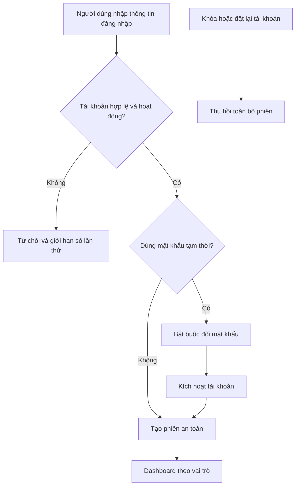

## 7. Thành viên

### FLOW-12. Xem dashboard và cập nhật hồ sơ cá nhân

| Thuộc tính | Nội dung |
| --- | --- |
| Tác nhân | MEMBER, DEPARTMENT_MANAGER, BOARD, TECH_ADMIN |
| Điểm bắt đầu | Thành viên đăng nhập hoặc mở Hồ sơ cá nhân |
| Điều kiện trước | Phiên hợp lệ; tài khoản Đang hoạt động |
| Kết quả | Dashboard hiển thị đúng dữ liệu và trường cá nhân được cập nhật |
| Truy vết | `MEM-01` đến `MEM-03`, `MEM-05`, `MEM-10`, `MEM-12`, `DATA-02`, `DATA-07`, `SEC-15` |

**Luồng chính**

1. Hệ thống tải thông báo, sự kiện, đăng ký và tài liệu trong phạm vi quyền.
2. Thành viên mở Hồ sơ cá nhân.
3. Hệ thống phân biệt trường được sửa và trường chỉ đọc.
4. Thành viên cập nhật ảnh đại diện, email liên hệ, kỹ năng hoặc lĩnh vực quan tâm.
5. Hệ thống kiểm tra dữ liệu; ảnh đại diện được xác minh MIME/signature và quét mã độc trong vùng cách ly trước khi thay ảnh hiện tại; sau đó hệ thống lưu thay đổi và hiển thị kết quả.
6. Thành viên mở lịch sử hoạt động để xem đăng ký và điểm danh của mình.
7. Thành viên mở Quyền riêng tư để xem từng mục đích/đối tượng công khai, cấp hoặc thu hồi đồng ý; hệ thống lưu phiên bản nội dung, thời gian và trạng thái hiệu lực.

**Nhánh thay thế và lỗi**

- Thành viên cố sửa mã số sinh viên, ban, vai trò hoặc trạng thái: API từ chối.
- Ảnh sai định dạng/kích thước, chưa quét xong hoặc bị phát hiện nguy hiểm: không thay ảnh hiện tại và hiển thị trạng thái phù hợp.
- Lưu xung đột: yêu cầu tải dữ liệu mới trước khi ghi đè.
- Một nguồn dashboard lỗi: các khối còn lại vẫn hiển thị và khối lỗi có trạng thái thử lại.
- Thu hồi đồng ý: thông tin cá nhân liên quan bị ẩn ở lần đọc tiếp theo và cache công khai được xóa; lịch sử quyết định vẫn được giữ theo chính sách.

### FLOW-13. Quản lý hồ sơ và trạng thái thành viên

| Thuộc tính | Nội dung |
| --- | --- |
| Tác nhân | DEPARTMENT_MANAGER, BOARD |
| Điểm bắt đầu | Người quản lý mở danh sách thành viên |
| Điều kiện trước | Phiên hợp lệ; có quyền trong phạm vi dữ liệu |
| Kết quả | Thông tin thành viên, ban, vai trò hoặc trạng thái được cập nhật đúng quyền |
| Truy vết | `MEM-04`, `MEM-06`, `MEM-07`, `MEM-09`, `MEM-11`, `AUTH-02`, `AUTH-07`, `ADM-01`, `ADM-05` |

**Luồng chính**

1. Hệ thống hiển thị danh sách theo phạm vi quyền và có phân trang.
2. Người dùng lọc theo ban, vai trò, trạng thái hoặc từ khóa.
3. `DEPARTMENT_MANAGER` xem dữ liệu quản lý của thành viên trong ban.
4. `BOARD` cập nhật ban, vai trò nghiệp vụ hoặc trạng thái thành viên.
5. Hệ thống kiểm tra quy tắc bàn giao và quyền tối thiểu.
6. Hệ thống lưu thay đổi, cập nhật quyền hiệu lực và ghi audit log.

**Nhánh thay thế và lỗi**

- Quản lý ban mở thành viên ngoài ban: trả 404.
- Không cho thành viên tự sửa vai trò hoặc trạng thái.
- Sau khi production được phát hành, không cho ngừng hoạt động tài khoản nếu thao tác làm số `BOARD` hoặc `TECH_ADMIN` đang hoạt động thấp hơn hai ở vai trò tương ứng.
- Khi thành viên ngừng hoạt động, hệ thống thu hồi phiên và quyền quản trị nhưng giữ lịch sử.

## 8. Sự kiện

### FLOW-14. Xem, đăng ký hoặc hủy đăng ký sự kiện

| Thuộc tính | Nội dung |
| --- | --- |
| Tác nhân | PUBLIC hoặc người có tài khoản hợp lệ |
| Điểm bắt đầu | Người dùng mở chi tiết sự kiện đã công bố |
| Điều kiện trước | Sự kiện còn tồn tại và người dùng thuộc đối tượng được xem |
| Kết quả | Đăng ký được tạo/hủy hoặc người dùng nhận thông báo điều kiện không đáp ứng |
| Truy vết | `EVT-03` đến `EVT-05`, `EVT-10` đến `EVT-14`, `BR-08`, `BR-09`, `DATA-07`, `SEC-05` |

**Luồng chính: sự kiện nội bộ**

1. Thành viên đăng nhập và mở sự kiện.
2. Hệ thống kiểm tra đối tượng, thời gian đăng ký, sức chứa và đăng ký trùng.
3. Thành viên chọn Đăng ký.
4. Hệ thống tạo đăng ký gắn với tài khoản và hiển thị xác nhận.
5. Trong thời hạn cho phép, thành viên có thể chọn Hủy đăng ký.

**Luồng chính: sự kiện công khai cho phép đăng ký ngoài APC**

1. Người tham gia nhập họ tên, email và mã số sinh viên.
2. Người tham gia đọc và đồng ý với mục đích xử lý dữ liệu của sự kiện.
3. Hệ thống kiểm tra điều kiện, chống trùng, lưu đăng ký và bản ghi đồng ý.
4. Hệ thống sinh mã đăng ký ngẫu nhiên không thể dự đoán và đưa email xác nhận vào hàng đợi.
5. Người tham gia dùng email và mã đăng ký để hủy trong thời hạn cho phép.

**Nhánh thay thế và lỗi**

- Chưa mở đăng ký, đã hết hạn, hết chỗ hoặc sai đối tượng: không tạo đăng ký và nêu rõ lý do.
- Chưa đồng ý xử lý dữ liệu ở đăng ký công khai: không tạo đăng ký.
- Đăng ký trùng: hiển thị trạng thái hiện có thay vì tạo bản ghi mới.
- Vượt ngưỡng gửi công khai hoặc có dấu hiệu tự động hóa: yêu cầu xác minh tăng cường hoặc trả `429` mà không tiết lộ đăng ký có tồn tại hay không.
- Hủy sau thời hạn: từ chối và giữ đăng ký.
- Sự kiện bị hủy: không nhận đăng ký mới; dữ liệu cũ vẫn được giữ.

### FLOW-15. Quản lý thông tin sự kiện

| Thuộc tính | Nội dung |
| --- | --- |
| Tác nhân | DEPARTMENT_MANAGER, BOARD |
| Điểm bắt đầu | Người có quyền mở quản trị Sự kiện |
| Điều kiện trước | Phiên hợp lệ và có phạm vi quản lý sự kiện |
| Kết quả | Sự kiện được tạo hoặc chuyển đúng trạng thái và phạm vi hiển thị |
| Truy vết | `EVT-01` đến `EVT-03`, `EVT-09`, `EVT-12`, `ADM-01`, `ADM-05` |

**Luồng chính**

1. Người dùng tạo sự kiện ở trạng thái Bản nháp.
2. Người dùng nhập nội dung, thời gian, địa điểm, ban quản lý, đầu mối liên hệ, đối tượng, sức chứa và thời gian đăng ký.
3. Hệ thống kiểm tra tính hợp lệ và xung đột thời gian.
4. Người dùng xem trước sự kiện.
5. `DEPARTMENT_MANAGER` công bố sự kiện nội bộ trong ban; `BOARD` công bố sự kiện toàn câu lạc bộ hoặc công khai.
6. Hệ thống hiển thị sự kiện đúng phạm vi.

**Nhánh thay thế và lỗi**

- Thay đổi điều kiện sau khi đã có đăng ký: hiển thị số người bị ảnh hưởng và yêu cầu xác nhận.
- Hủy sự kiện: yêu cầu lý do, giữ đăng ký và hiển thị trạng thái Đã hủy.
- Lưu trữ chỉ thực hiện sau khi sự kiện kết thúc hoặc hủy.
- Quản lý ban không thể công bố sự kiện ngoài phạm vi ban.

### FLOW-16. Xuất danh sách, điểm danh và ghi lịch sử

| Thuộc tính | Nội dung |
| --- | --- |
| Tác nhân | DEPARTMENT_MANAGER, BOARD |
| Điểm bắt đầu | Ban quản lý mở danh sách đăng ký của sự kiện |
| Điều kiện trước | Có quyền với sự kiện; sự kiện có người đăng ký |
| Kết quả | Kết quả điểm danh được lưu và đồng bộ vào lịch sử thành viên |
| Truy vết | `EVT-06` đến `EVT-08`, `EVT-13`, `ADM-05` |

**Luồng chính**

1. Hệ thống hiển thị danh sách đăng ký trong phạm vi quyền.
2. Người dùng tìm kiếm, lọc hoặc xuất CSV; thao tác xuất được ghi audit.
3. Trong thời gian điểm danh, người dùng đặt `Chưa điểm danh`, `Có mặt`, `Vắng có phép` hoặc `Vắng mặt` cho từng người.
4. Người dùng xác nhận chốt điểm danh.
5. Hệ thống lưu kết quả và cập nhật lịch sử hoạt động cho thành viên có tài khoản.

**Nhánh thay thế và lỗi**

- Người chưa được đánh dấu giữ trạng thái Chưa điểm danh.
- Chỉ `BOARD` sửa kết quả sau khi đã chốt; thay đổi phải có lý do.
- Mất kết nối khi đang nhập: dữ liệu đã lưu không bị mất và giao diện chỉ gửi phần thay đổi.
- Người đăng ký công khai không tạo hồ sơ thành viên; kết quả chỉ lưu trong sự kiện.

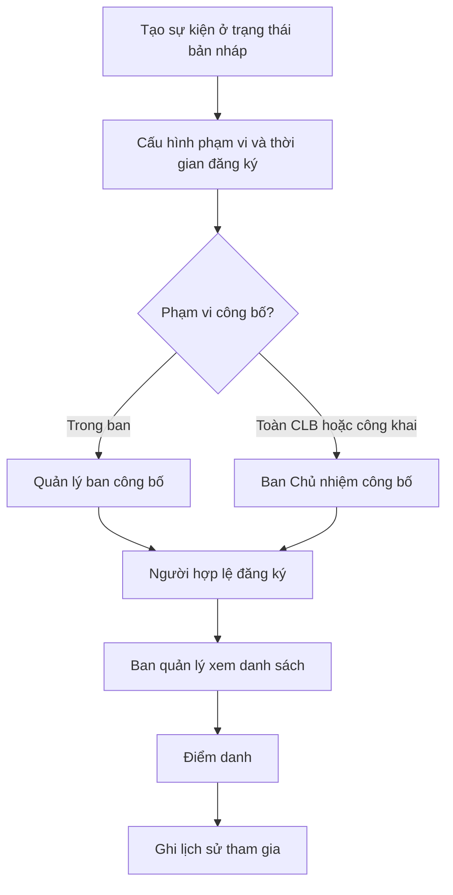

## 9. Nội dung, dự án và thành tích

### FLOW-17. Soạn và công bố bài viết

| Thuộc tính | Nội dung |
| --- | --- |
| Tác nhân | DEPARTMENT_MANAGER, BOARD |
| Điểm bắt đầu | Người có quyền chọn Tạo bài viết/Thông báo |
| Điều kiện trước | Phiên hợp lệ và có phạm vi quản lý nội dung |
| Kết quả | Nội dung ở trạng thái Bản nháp, Đã công bố hoặc Lưu trữ |
| Truy vết | `CMS-01` đến `CMS-06`, `BR-20`, `DATA-03`, `DATA-07` |

**Luồng chính**

1. Người dùng tạo bản nháp và nhập tiêu đề, tóm tắt, nội dung, ảnh, chuyên mục.
2. Hệ thống tự tạo slug và kiểm tra tính duy nhất.
3. Nếu nội dung có thông tin cá nhân, hệ thống kiểm tra bản ghi đồng ý còn hiệu lực cho phạm vi công khai dự kiến.
4. Người dùng lưu và xem trước nội dung.
5. `DEPARTMENT_MANAGER` công bố thông báo nội bộ trong ban.
6. `BOARD` công bố nội dung công khai hoặc toàn câu lạc bộ.
7. Hệ thống ghi tác giả tạo nội dung, người công bố và thời gian.

**Nhánh thay thế và lỗi**

- Thiếu trường bắt buộc hoặc ảnh không hợp lệ: không công bố.
- Slug trùng: hệ thống tạo biến thể hợp lệ hoặc yêu cầu chỉnh sửa.
- Thiếu hoặc đã thu hồi đồng ý công khai: không cho công bố phần thông tin cá nhân liên quan.
- Gỡ nội dung: chuyển về Bản nháp hoặc Lưu trữ, không xóa lịch sử.
- Người không đúng phạm vi gọi API công bố: trả 403.

### FLOW-18. Quản lý thông tin dự án, sản phẩm và thành tích

| Thuộc tính | Nội dung |
| --- | --- |
| Tác nhân | DEPARTMENT_MANAGER, BOARD |
| Điểm bắt đầu | Người có quyền mở quản trị Dự án/Thành tích |
| Điều kiện trước | Phiên hợp lệ và có dữ liệu giới thiệu cần cập nhật |
| Kết quả | Hồ sơ giới thiệu được lưu hoặc công bố |
| Truy vết | `PRT-01` đến `PRT-04`, `BR-15`, `BR-20`, `DATA-03`, `DATA-07` |

**Luồng chính**

1. Người dùng chọn loại Dự án/Sản phẩm hoặc Thành tích.
2. Người dùng nhập tên, mô tả, hình ảnh, công nghệ, thành viên hiển thị, liên kết và kiểm tra trạng thái đồng ý công khai của thành viên.
3. Hệ thống kiểm tra dữ liệu và lưu ở trạng thái Ẩn.
4. Người dùng xem trước trang giới thiệu.
5. `BOARD` công bố hồ sơ.

**Nhánh thay thế và lỗi**

- Liên kết ngoài không hợp lệ: từ chối lưu hoặc yêu cầu sửa.
- Thành viên không đồng ý hiển thị công khai: không đưa thông tin cá nhân vào trang.
- Hồ sơ bị ẩn vẫn được giữ trong quản trị.
- Hồ sơ không có task, người nhận việc, deadline hoặc phần trăm tiến độ.

## 10. Tài liệu nội bộ

### FLOW-19. Quản lý và truy cập tài liệu

| Thuộc tính | Nội dung |
| --- | --- |
| Tác nhân | MEMBER, DEPARTMENT_MANAGER, BOARD; TECH_ADMIN khi xóa vật lý |
| Điểm bắt đầu | Thành viên mở thư viện hoặc người quản lý chọn Tải tài liệu |
| Điều kiện trước | Phiên hợp lệ; tài khoản có quyền với tài liệu hoặc phạm vi quản lý |
| Kết quả | Tệp được lưu, thay thế, tải xuống hoặc lưu trữ đúng quyền |
| Truy vết | `DOC-01` đến `DOC-09`, `BR-12`, `SEC-04`, `SEC-15` |

**Luồng chính: tải lên và phân quyền**

1. Người quản lý chọn tệp và nhập tên, mô tả, chuyên mục; hệ thống đưa bản tải lên vào vùng cách ly.
2. Hệ thống kiểm tra định dạng, dung lượng, tên tệp, MIME/signature và kết quả quét mã độc.
3. Người quản lý chọn phạm vi ban; `BOARD` có thể chọn toàn câu lạc bộ.
4. Hệ thống lưu tệp ngoài thư mục public và tạo metadata.
5. Hệ thống ghi audit log.

**Luồng chính: xem hoặc tải xuống**

1. Thành viên mở thư viện.
2. API chỉ trả danh sách tài liệu được cấp quyền.
3. Thành viên chọn tệp.
4. Hệ thống kiểm tra lại quyền tại thời điểm tải và trả nội dung qua endpoint bảo vệ.

**Nhánh thay thế và lỗi**

- Tệp vượt 20 MB, sai định dạng, là tệp thực thi, chưa quét xong hoặc bị phát hiện nguy hiểm: không cho tải xuống; tệp bị từ chối hoặc xóa khỏi vùng cách ly theo chính sách.
- Thay thế tệp: tạo phiên bản mới, giữ phiên bản cũ và cho phép người có quyền tải lại phiên bản trước.
- Quyền bị thu hồi: URL cũ không còn tải được.
- Lưu trữ ẩn tệp khỏi danh sách nhưng giữ dữ liệu; người có quyền quản lý cùng phạm vi có thể khôi phục tài liệu.
- Xóa vật lý cần quyết định của `BOARD` và thao tác của `TECH_ADMIN`.

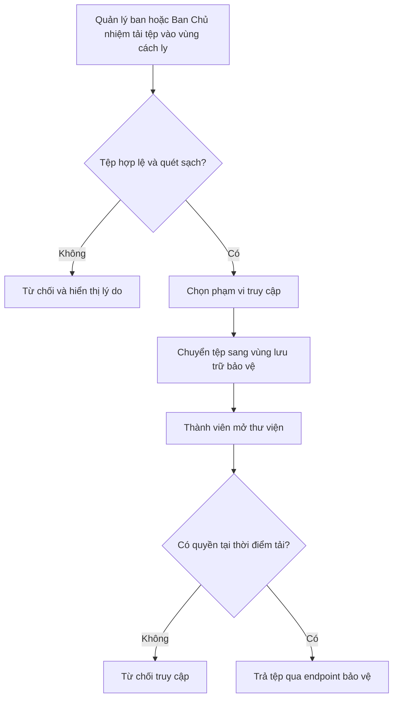

## 11. Phân quyền và kiểm soát

### FLOW-20. Gán hoặc thu hồi vai trò và phạm vi ban

| Thuộc tính | Nội dung |
| --- | --- |
| Tác nhân | BOARD; BOARD và TECH_ADMIN đối với vai trò kỹ thuật |
| Điểm bắt đầu | Ban Chủ nhiệm mở phần Vai trò của thành viên |
| Điều kiện trước | Tài khoản mục tiêu hoạt động; tác nhân không sửa quyền của chính mình |
| Kết quả | Vai trò và phạm vi mới có hiệu lực, quyền cũ bị thu hồi |
| Truy vết | `ADM-01`, `ADM-02`, `ADM-04`, `ADM-08`, `BR-21`, `RP-01` đến `RP-16`, `RP-18`, `RP-19` |

**Luồng chính**

1. Ban Chủ nhiệm chọn thành viên và xem vai trò/phạm vi hiện tại.
2. Người dùng chọn `MEMBER`, `DEPARTMENT_MANAGER` hoặc `BOARD` và phạm vi ban phù hợp.
3. Hệ thống kiểm tra người dùng không tự nâng quyền, không đồng thời mang `BOARD` và `TECH_ADMIN`, không làm thiếu số người kế nhiệm tối thiểu và ngày hết hạn hợp lệ.
4. Với `BOARD`, hệ thống kiểm tra tài khoản đã thiết lập TOTP; nếu chưa, vai trò ở trạng thái Chờ kích hoạt đặc quyền.
5. Hệ thống yêu cầu lý do thay đổi.
6. Hệ thống lưu vai trò, thu hồi phiên cần thiết và ghi audit log.
7. Quyền mới được áp dụng từ lần kiểm tra quyền tiếp theo sau khi mọi điều kiện bảo mật đạt.

**Nhánh vai trò TECH_ADMIN**

1. `BOARD` ghi nhận quyết định cấp hoặc thu hồi.
2. Một `TECH_ADMIN` đang hoạt động thực hiện thay đổi.
3. Hệ thống kiểm tra thao tác không làm số `TECH_ADMIN` đang hoạt động thấp hơn ngưỡng tối thiểu bắt buộc của môi trường.
4. Hệ thống ghi cả người quyết định và người thực hiện.

**Nhánh thay thế và lỗi**

- Không có phạm vi ban cho `DEPARTMENT_MANAGER`: không cho lưu.
- Đổi ban: thu hồi phạm vi cũ trước khi cấp phạm vi mới trong cùng transaction.
- Vai trò đặc quyền còn 30 ngày hoặc 7 ngày sẽ hết hạn: cảnh báo `BOARD` và người giữ vai trò; yêu cầu kích hoạt người kế nhiệm trước khi production thiếu ngưỡng tối thiểu.
- Người không có quyền gọi API: trả 403 và ghi security log.

### FLOW-21. Tra cứu audit log

| Thuộc tính | Nội dung |
| --- | --- |
| Tác nhân | BOARD, TECH_ADMIN |
| Điểm bắt đầu | Người có quyền mở Audit log |
| Điều kiện trước | Phiên hợp lệ; có quyền với loại log cần xem |
| Kết quả | Hành động được truy vết mà không làm thay đổi log |
| Truy vết | `ADM-05`, `ADM-06`, `ADM-07`, `DATA-04` |

**Luồng chính**

1. Người dùng chọn khoảng thời gian và bộ lọc người dùng, hành động, đối tượng hoặc kết quả.
2. Hệ thống áp dụng phạm vi: `BOARD` xem nghiệp vụ; `TECH_ADMIN` xem bảo mật và vận hành.
3. Hệ thống trả danh sách phân trang.
4. Người dùng mở chi tiết để xem thời gian, IP, vai trò, thay đổi và kết quả.
5. Hệ thống chỉ cho đọc; giao diện không có chức năng sửa hoặc xóa.

**Nhánh thay thế và lỗi**

- Không có kết quả: hiển thị trạng thái rỗng và giữ bộ lọc.
- Bộ lọc quá rộng: yêu cầu thu hẹp khoảng thời gian.
- Truy cập loại log ngoài quyền: trả 403.
- Audit log được giữ tối thiểu 12 tháng.

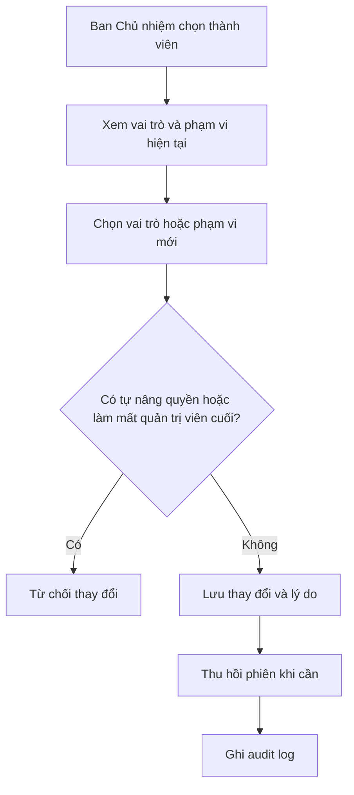

## 12. Vận hành

### FLOW-22. Triển khai staging và production

| Thuộc tính | Nội dung |
| --- | --- |
| Tác nhân | TECH_ADMIN, SYSTEM |
| Điểm bắt đầu | Thay đổi được merge hoặc release được tạo trên GitHub |
| Điều kiện trước | Pull Request đã review; CI và cấu hình môi trường tồn tại; release gate của môi trường đích đã đạt |
| Kết quả | Phiên bản cố định chạy ổn định hoặc hệ thống quay về phiên bản trước |
| Truy vết | `SEC-07`, `SEC-10`, `PERF-06`, `OPS-06` đến `OPS-09`, yêu cầu triển khai PRD mục 11 |

**Luồng chính**

1. CI chạy trên GitHub-hosted runner hoặc runner chuyên dụng tách khỏi VPS production để thực hiện lint, type check, unit test, integration test, end-to-end test cho luồng trọng yếu và build.
2. CI quét dependency và Docker image.
3. Khi tất cả bước đạt, CI đẩy image có tag cố định lên registry.
4. `TECH_ADMIN` khởi tạo staging cho bản phát hành và triển khai đúng image.
5. Team chạy migration, health check, end-to-end test và smoke test trên staging bằng dữ liệu tổng hợp hoặc đã ẩn danh.
6. Trước lần phát hành production đầu tiên, `TECH_ADMIN` xác nhận báo cáo kiểm thử tải Portal, baseline bảo mật host, firewall, ngưỡng cảnh báo và kết quả diễn tập rollback/restore trên VPS riêng.
7. Sau khi nghiệp vụ và release gate đạt, `TECH_ADMIN` triển khai cùng image lên production.
8. Production chạy migration có kiểm soát, khởi động container và health check.
9. Hệ thống ghi phiên bản, người triển khai và kết quả; staging được dừng sau khi hoàn tất xác minh bản phát hành.

**Nhánh thay thế và lỗi**

- Bất kỳ bước CI nào lỗi: không tạo release production.
- Staging lỗi: giữ production hiện tại và thu thập log.
- Phát hiện dữ liệu cá nhân production chưa ẩn danh trong staging: dừng kiểm thử, xóa bản sao và mở incident dữ liệu.
- Health check production lỗi: dừng rollout và rollback image.
- Migration không thể rollback: áp dụng forward-fix theo kế hoạch đã chuẩn bị.
- Host hết vòng đời bản vá, firewall chưa rà soát, kiểm thử tải chưa đạt hoặc diễn tập rollback/restore thất bại: không phát hành production cho đến khi toàn bộ release gate đạt.

### FLOW-23. Backup, restore và rollback

| Thuộc tính | Nội dung |
| --- | --- |
| Tác nhân | TECH_ADMIN, SYSTEM |
| Điểm bắt đầu | Lịch backup hoặc sự cố production |
| Điều kiện trước | Kho backup ngoài VPS khả dụng; runbook và quyền truy cập hợp lệ |
| Kết quả | Backup được xác minh hoặc dịch vụ được khôi phục trong RPO/RTO |
| Truy vết | `OPS-02`, `OPS-03`, `OPS-04`, `OPS-05`, `OPS-07`, `OPS-08` |

**Luồng chính: backup**

1. Tác vụ hằng ngày tạo snapshot PostgreSQL và tệp người dùng tải lên theo cùng mốc thời gian logic.
2. Hệ thống mã hóa backup, gắn thời gian, phiên bản schema và manifest danh sách tệp.
3. Backup được chuyển sang hệ thống ngoài VPS.
4. Hệ thống kiểm tra checksum database, manifest tệp và ghi kết quả.
5. Backup lỗi tạo cảnh báo cho `TECH_ADMIN`; retention giữ bản ngày 30 ngày và bản tháng 12 tháng.

**Luồng chính: restore**

1. `TECH_ADMIN` xác định thời điểm sự cố và bản backup phù hợp.
2. Hệ thống được đưa vào chế độ bảo trì khi cần.
3. `TECH_ADMIN` tạo database mới hoặc môi trường phục hồi tách biệt.
4. Database và tệp tải lên được restore rồi chạy kiểm tra toàn vẹn/tham chiếu chéo.
5. Hệ thống áp lại retention và các yêu cầu xóa/ẩn danh còn hiệu lực đối với dữ liệu được phục hồi.
6. Ứng dụng kết nối tới dữ liệu đã khôi phục và chạy smoke test.
7. Dịch vụ được mở lại; sự cố, dữ liệu mất và thời gian khôi phục được ghi nhận.

**Luồng chính: rollback ứng dụng**

1. `TECH_ADMIN` chọn image production ổn định liền trước.
2. Hệ thống kiểm tra tương thích schema.
3. Container được chuyển về image cũ và chạy health check.
4. Nếu schema không tương thích, thực hiện forward-fix hoặc restore theo runbook.

**Nhánh thay thế và lỗi**

- Backup checksum sai: đánh dấu không hợp lệ và giữ bản hợp lệ gần nhất.
- Restore thử nghiệm lỗi: không tác động database production hiện tại.
- Không đạt RTO/RPO: ghi incident và hành động khắc phục.
- Việc diễn tập restore được thực hiện trước production đầu tiên và ít nhất mỗi học kỳ.

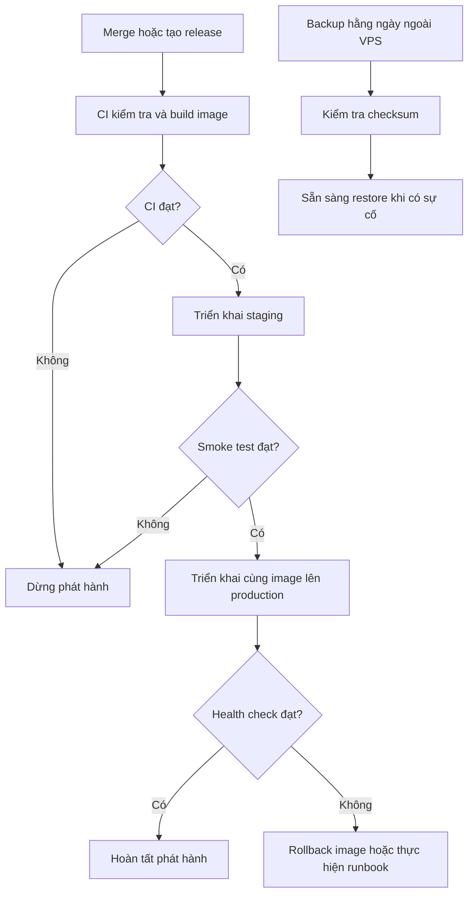

## 13. Cấu hình, onboarding và tác vụ xuyên suốt

### FLOW-24. Quản lý thông tin câu lạc bộ và Ban chuyên môn

| Thuộc tính | Nội dung |
| --- | --- |
| Tác nhân | BOARD |
| Điểm bắt đầu | Ban Chủ nhiệm mở Cấu hình thông tin APC |
| Điều kiện trước | Tài khoản đặc quyền hợp lệ; Portal đã có cấu hình mặc định |
| Kết quả | Thông tin tổ chức, liên hệ, liên kết và nội dung nổi bật được cập nhật đồng bộ |
| Truy vết | `ORG-01` đến `ORG-06`, `PUB-01`, `PUB-02`, `ADM-05` |

**Luồng chính: thông tin chung**

1. Ban Chủ nhiệm mở trang cấu hình và xem dữ liệu đang công bố.
2. Người dùng sửa tên hiển thị, mô tả, sứ mệnh, email liên hệ và các liên kết chính thức.
3. Người dùng chọn tin tức, sự kiện, dự án và thành tích nổi bật.
4. Hệ thống kiểm tra URL, dữ liệu bắt buộc và quyền công khai của nội dung được chọn.
5. Ban Chủ nhiệm xem trước và lưu.
6. Hệ thống xóa cache liên quan, cập nhật trang công khai và ghi audit log.

**Luồng chính: Ban chuyên môn**

1. Ban Chủ nhiệm tạo hoặc mở một Ban chuyên môn.
2. Người dùng cập nhật tên, mô tả, đầu mối liên hệ và thứ tự hiển thị.
3. Hệ thống kiểm tra tên duy nhất trong các ban đang hoạt động.
4. Ban Chủ nhiệm lưu thay đổi hoặc lưu trữ ban không còn sử dụng.

**Nhánh thay thế và lỗi**

- Không cho lưu trữ ban còn thành viên hoạt động; hệ thống hiển thị danh sách cần chuyển hoặc cập nhật trạng thái.
- Nội dung nổi bật đã bị ẩn/lưu trữ không thể chọn.
- URL liên kết không an toàn hoặc sai định dạng bị từ chối.
- Lỗi lưu không làm thay đổi một phần cấu hình công khai.

### FLOW-25. Nhập và kích hoạt thành viên hiện hữu

| Thuộc tính | Nội dung |
| --- | --- |
| Tác nhân | BOARD |
| Điểm bắt đầu | Ban Chủ nhiệm chọn Nhập thành viên từ CSV |
| Điều kiện trước | File theo template; các Ban chuyên môn đã tồn tại |
| Kết quả | Toàn bộ lô hợp lệ được tạo hồ sơ/tài khoản `MEMBER`, hoặc không bản ghi nào được tạo |
| Truy vết | `MEM-07`, `MEM-08`, `MEM-09`, `AUTH-02`, `AUTH-03`, `BR-18`, `RP-16` |

**Luồng chính**

1. Ban Chủ nhiệm tải template CSV có header và hướng dẫn định dạng.
2. Người dùng tải file đã điền lên Portal.
3. Hệ thống kiểm tra encoding, header, số dòng, trường bắt buộc, email, mã số sinh viên, tên đăng nhập và Ban chuyên môn.
4. Hệ thống kiểm tra trùng trong file và trùng với dữ liệu hiện có.
5. Hệ thống hiển thị dry-run gồm số dòng hợp lệ, cảnh báo và lỗi theo dòng/cột.
6. Khi toàn bộ lô hợp lệ, Ban Chủ nhiệm xác nhận import.
7. Trong một transaction, hệ thống tạo `MemberProfile`, tài khoản Chờ kích hoạt và vai trò `MEMBER` cho từng dòng.
8. Ban Chủ nhiệm cấp mật khẩu tạm thời riêng cho từng thành viên qua luồng quản lý tài khoản; hệ thống không tạo file chứa hàng loạt mật khẩu dạng rõ.
9. Hệ thống ghi mã lô, file hash, người import, số bản ghi và kết quả vào audit log.

**Nhánh thay thế và lỗi**

- Có ít nhất một lỗi: nút Import bị vô hiệu hóa; người dùng tải file lỗi để sửa nhưng không dữ liệu nào được ghi.
- File quá lớn hoặc sai định dạng: từ chối trước khi parse đầy đủ.
- Request import được gửi lại: mã lô/idempotency key ngăn tạo trùng.
- Lỗi transaction: rollback toàn bộ lô.
- Export thành viên tạo file bảo vệ, chỉ người tạo tải được và tự xóa sau 24 giờ.

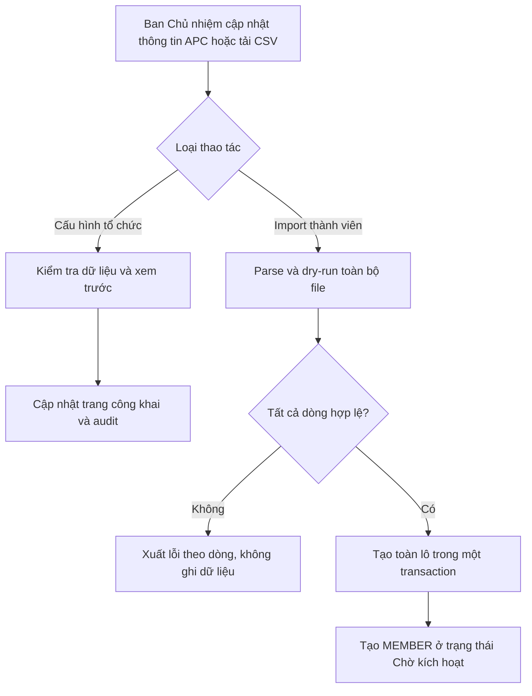

### FLOW-26. Gửi và theo dõi email giao dịch

| Thuộc tính | Nội dung |
| --- | --- |
| Tác nhân | SYSTEM, DEPARTMENT_MANAGER, BOARD, TECH_ADMIN |
| Điểm bắt đầu | Giao dịch nghiệp vụ phát sinh sự kiện cần gửi email |
| Điều kiện trước | Transaction nghiệp vụ đã commit; template và nhà cung cấp email được cấu hình |
| Kết quả | Email được gửi/truy vết hoặc chuyển Gửi lỗi mà không thay đổi kết quả nghiệp vụ |
| Truy vết | `NTF-01` đến `NTF-05`, `BR-17`, `OPS-11` |

**Luồng chính**

1. Transaction nghiệp vụ ghi một outbox event cùng dữ liệu tham chiếu tối thiểu.
2. Worker đọc event, tạo `NotificationDelivery` ở trạng thái Chờ gửi và render template.
3. Worker nhận quyền xử lý bản ghi, chuyển sang Đang gửi và gửi email qua nhà cung cấp với idempotency key.
4. Khi nhà cung cấp chấp nhận, hệ thống chuyển trạng thái Đã gửi và lưu message ID đã làm sạch.
5. Quản lý Ban chuyên môn xem trạng thái email trong phạm vi ban, Ban Chủ nhiệm xem toàn bộ; Quản trị viên kỹ thuật xem chỉ số và lỗi giao nhận.

**Nhánh retry và lỗi**

- Lỗi tạm thời: chuyển Chờ thử lại, tăng số lần thử, lưu thời điểm chạy kế tiếp và retry theo exponential backoff.
- Lỗi vĩnh viễn hoặc vượt giới hạn: chuyển Gửi lỗi, dừng retry và hiển thị tùy chọn gửi lại cho người có quyền.
- Worker xử lý lặp: idempotency key ngăn gửi trùng.
- Thiếu template/cấu hình: không làm rollback hồ sơ hoặc đăng ký đã thành công; tạo cảnh báo vận hành.
- Log không chứa mật khẩu, mã TOTP, mã khôi phục hoặc nội dung biểu mẫu nhạy cảm.

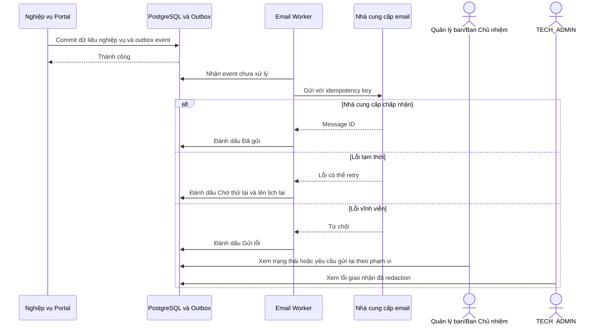

### FLOW-27. Thiết lập và sử dụng TOTP cho tài khoản đặc quyền

| Thuộc tính | Nội dung |
| --- | --- |
| Tác nhân | BOARD, TECH_ADMIN |
| Điểm bắt đầu | Người dùng được gán vai trò đặc quyền hoặc đăng nhập bằng vai trò đã kích hoạt |
| Điều kiện trước | Mật khẩu đã được đổi; tài khoản hoạt động; phiên xác thực gần đây |
| Kết quả | TOTP được thiết lập và quyền đặc quyền có hiệu lực, hoặc đăng nhập bị từ chối |
| Truy vết | `AUTH-11`, `AUTH-12`, `SEC-12`, `SEC-16`, `BR-19`, `RP-13` đến `RP-15`, `RP-18`, `RP-19` |

**Luồng chính: thiết lập**

1. Hệ thống giữ vai trò đặc quyền ở trạng thái Chờ kích hoạt và chỉ cho mở màn hình bảo mật.
2. Người dùng xác minh lại mật khẩu.
3. Hệ thống sinh secret TOTP, hiển thị QR và khóa nhập tay qua kênh HTTPS.
4. Người dùng nhập mã TOTP hiện tại để chứng minh đã đăng ký authenticator.
5. Hệ thống sinh bộ mã khôi phục có entropy cao và chỉ hiển thị một lần.
6. Người dùng xác nhận đã lưu mã; hệ thống lưu secret được bảo vệ và hash các mã khôi phục.
7. Hệ thống kích hoạt quyền đặc quyền, thu hồi phiên cũ và yêu cầu đăng nhập lại.

**Luồng chính: đăng nhập đặc quyền**

1. Người dùng nhập tên đăng nhập và mật khẩu đúng.
2. Hệ thống yêu cầu mã TOTP.
3. Mã hợp lệ tạo phiên có claim đặc quyền; mã đã dùng hoặc ngoài cửa sổ cho phép bị từ chối.

**Nhánh khôi phục và bootstrap**

- Mã khôi phục hợp lệ chỉ dùng một lần và bắt buộc tạo lại bộ mã sau đăng nhập.
- Mất TOTP/mã khôi phục: một `BOARD` xác nhận danh tính và một `TECH_ADMIN` thực hiện reset; không ai tự reset cho mình.
- `BOARD` đầu tiên và `TECH_ADMIN` đầu tiên được tạo cho hai hồ sơ thành viên đã xác định bằng bootstrap dùng một lần từ console VPS; mỗi tài khoản có vai trò nền `MEMBER` và đúng một vai trò đặc quyền tương ứng; cả hai phải đổi mật khẩu và thiết lập TOTP trước khi bootstrap bị vô hiệu hóa.
- Trước production, Ban Chủ nhiệm và nhóm kỹ thuật bổ sung người kế nhiệm để đạt tối thiểu hai `BOARD` và hai `TECH_ADMIN` đang hoạt động.
- Một tài khoản không thể đồng thời mang `BOARD` và `TECH_ADMIN`; yêu cầu vi phạm bị từ chối trước khi thay đổi quyền.
- Không thể thiết lập TOTP nếu phiên xác thực quá cũ hoặc kết nối không dùng HTTPS.
- Đồng hồ server lệch quá ngưỡng: tạm từ chối xác thực TOTP, tạo cảnh báo vận hành và không tự mở rộng cửa sổ chấp nhận mã.

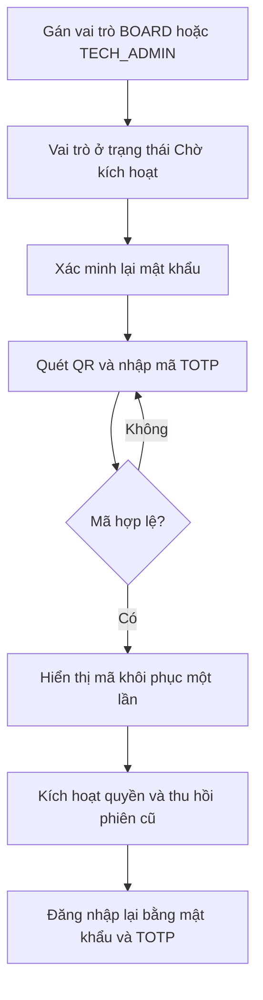

### FLOW-28. Xử lý vòng đời dữ liệu cá nhân

| Thuộc tính | Nội dung |
| --- | --- |
| Tác nhân | MEMBER, BOARD, TECH_ADMIN, SYSTEM |
| Điểm bắt đầu | Thành viên gửi yêu cầu hoặc retention job phát hiện dữ liệu hết hạn |
| Điều kiện trước | Danh tính/quyền hợp lệ; bản ghi thuộc chính sách lưu giữ đã định nghĩa |
| Kết quả | Dữ liệu được xuất, chỉnh sửa, ẩn danh hoặc xóa có kiểm soát và có audit |
| Truy vết | `DATA-01` đến `DATA-10`, `MEM-12`, `BR-13`, `BR-20`, `RP-17` |

**Luồng chính: yêu cầu của thành viên**

1. Thành viên chọn Xuất dữ liệu hoặc Yêu cầu chỉnh sửa/xóa và nhập lý do.
2. Hệ thống ghi `DataRequest`, phạm vi dữ liệu và thời gian.
3. Ban Chủ nhiệm xác minh danh tính, quyền lợi và dữ liệu cần giữ cho lịch sử/audit.
4. Với xuất dữ liệu, hệ thống tạo file bảo vệ và URL chỉ người yêu cầu dùng được trong 24 giờ.
5. Với chỉnh sửa, Ban Chủ nhiệm cập nhật nguồn dữ liệu đúng và ghi trước/sau trong audit phù hợp.
6. Với ẩn danh/xóa, hệ thống lập kế hoạch xử lý, bảo toàn khóa tham chiếu cần thiết và thực thi có kiểm soát.
7. Người yêu cầu xem trạng thái và kết quả xử lý.

**Luồng chính: retention định kỳ**

1. Job tạo dry-run danh sách ứng viên, đăng ký công khai, dữ liệu liên hệ, log và backup đã hết hạn.
2. Hệ thống loại trừ legal hold, incident đang mở hoặc bản ghi chưa đủ điều kiện.
3. `BOARD` xem tổng hợp dữ liệu nghiệp vụ; `TECH_ADMIN` xem tác động kỹ thuật.
4. Hai vai trò xác nhận thực thi đối với thao tác xóa.
5. Job ẩn danh/xóa theo lô nhỏ, ghi số lượng thành công/thất bại và audit tổng hợp.

**Nhánh thay thế và lỗi**

- File export hết hạn hoặc người khác truy cập: trả 404 và không tiết lộ nội dung.
- Dữ liệu đang cần cho audit hoặc sự cố: hoãn xử lý và ghi lý do.
- Dữ liệu còn trong backup bất biến không bị sửa từng bản; hệ thống giữ dấu vết yêu cầu xóa để áp lại sau restore và để backup tự hết hạn theo chính sách.
- Job lỗi giữa chừng: mỗi lô có checkpoint/idempotency, chạy lại không xử lý trùng.
- Thu hồi đồng ý công khai làm ẩn thông tin ở lần đọc tiếp theo và xóa cache liên quan.

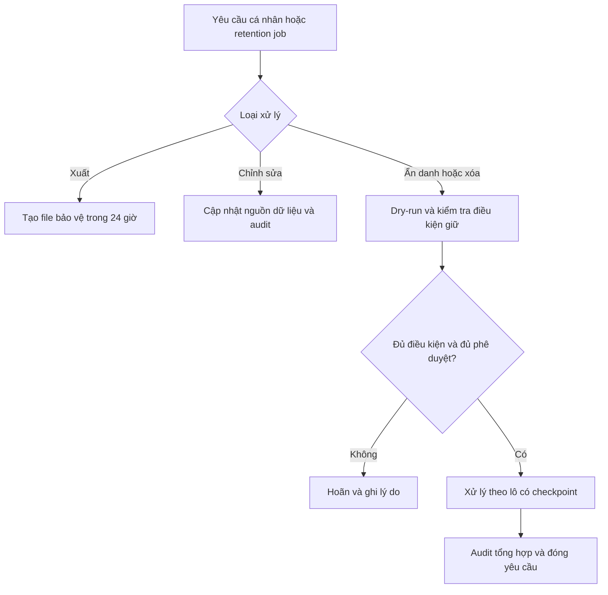

### FLOW-29. Theo dõi hệ thống và xử lý cảnh báo/sự cố

| Thuộc tính | Nội dung |
| --- | --- |
| Tác nhân | SYSTEM, TECH_ADMIN, BOARD khi ảnh hưởng nghiệp vụ |
| Điểm bắt đầu | Monitoring phát hiện vượt ngưỡng hoặc người dùng báo lỗi |
| Điều kiện trước | Health check, metric, log, cảnh báo và runbook đã cấu hình |
| Kết quả | Ảnh hưởng được giới hạn, dịch vụ được khôi phục và incident được ghi nhận |
| Truy vết | `OPS-01`, `OPS-06` đến `OPS-11`, `PERF-06`, `SEC-09`, `SEC-14` |

**Luồng chính**

1. Hệ thống thu health check, CPU, RAM, swap, PID, dung lượng/disk I/O, clock drift, tỷ lệ lỗi HTTP, thời hạn TLS, trạng thái worker, độ dài hàng đợi và trạng thái backup.
2. Khi vượt ngưỡng đủ thời gian, hệ thống tạo cảnh báo có severity, correlation ID và dịch vụ liên quan.
3. `TECH_ADMIN` xác nhận cảnh báo, mở incident và đánh giá ảnh hưởng tới Portal cùng các dịch vụ phụ thuộc.
4. Người xử lý thực hiện runbook: giảm tải, tắt staging, dừng worker, rollback, mở rộng disk hoặc restore tùy nguyên nhân.
5. Nếu ảnh hưởng người dùng, `BOARD` cập nhật thông báo bảo trì/trạng thái dịch vụ.
6. Sau khôi phục, hệ thống xác minh health check và nghiệp vụ chính.
7. `TECH_ADMIN` ghi timeline, nguyên nhân, dữ liệu ảnh hưởng và hành động ngăn tái diễn rồi đóng incident.

**Nhánh thay thế và lỗi**

- Cảnh báo trùng được gom theo fingerprint để tránh spam.
- Monitoring mất dữ liệu cũng tạo cảnh báo riêng từ cơ chế độc lập.
- Disk gần đầy ưu tiên dừng log tăng nhanh/staging; không tự xóa database hoặc backup chưa hết hạn.
- Khi tài nguyên VPS vượt ngưỡng an toàn, Portal chuyển sang chế độ bảo trì theo runbook để bảo vệ tính toàn vẹn dữ liệu.
- Incident record chỉ là nhật ký vận hành, không phải module giao việc hoặc theo dõi task.

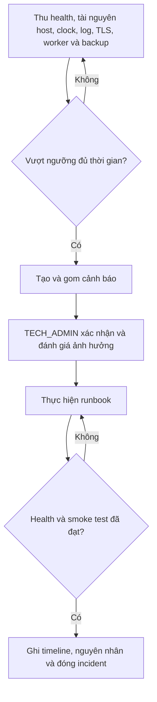

## 14. Trạng thái lỗi dùng chung

| Mã | Trường hợp | Hành vi hệ thống |
| --- | --- | --- |
| ERR-401 | Chưa đăng nhập hoặc phiên hết hạn | Chuyển đến đăng nhập; không thực hiện thay đổi dữ liệu |
| ERR-403 | Đã đăng nhập nhưng thiếu quyền | Từ chối hành động và giữ nguyên dữ liệu |
| ERR-404 | Tài nguyên không tồn tại hoặc người dùng không được biết tài nguyên tồn tại | Hiển thị trang/bản tin không tìm thấy |
| ERR-409 | Dữ liệu đã thay đổi bởi người khác | Không ghi đè; yêu cầu tải phiên bản mới |
| ERR-422 | Dữ liệu đầu vào không hợp lệ | Hiển thị lỗi tại trường và giữ dữ liệu đã nhập |
| ERR-429 | Vượt giới hạn yêu cầu | Hiển thị thời gian chờ và không xử lý thêm |
| ERR-500 | Lỗi hệ thống | Hiển thị mã tham chiếu, ghi log và không lộ stack trace |
| ERR-503 | Bảo trì hoặc phụ thuộc không khả dụng | Hiển thị trạng thái dịch vụ và hướng thử lại |

## 15. Truy vết yêu cầu xuyên suốt

| Nhóm yêu cầu | Luồng/điểm kiểm tra áp dụng |
| --- | --- |
| `KPI-01` | Đo thời gian hoàn thành `FLOW-15` và `FLOW-17` từ tạo bản nháp đến công bố |
| `KPI-02` | Chuỗi `FLOW-03` đến `FLOW-09` hoàn thành mà không cần Google Form/Sheet ngoài Portal |
| `KPI-03` | `FLOW-12`, `FLOW-13`, `FLOW-25`; báo cáo tỷ lệ hồ sơ hoàn thiện theo thành viên hoạt động |
| `KPI-04` | Chuỗi `FLOW-14` đến `FLOW-16` với ít nhất một hoạt động nội bộ |
| `KPI-05` | `FLOW-10`, `FLOW-12`, `FLOW-14`, `FLOW-19` từ cùng một tài khoản |
| `KPI-06` | `FLOW-23` với database và tệp tải lên được restore rồi kiểm tra toàn vẹn |
| `BR-01` đến `BR-04` | `FLOW-08` đến `FLOW-11`, `FLOW-25` |
| `BR-05` đến `BR-07` | `FLOW-04` đến `FLOW-08` |
| `BR-08`, `BR-09` | `FLOW-14` đến `FLOW-16` |
| `BR-10` | `FLOW-12`, `FLOW-13`, `FLOW-20` |
| `BR-11`, `BR-15`, `BR-20` | `FLOW-17`, `FLOW-18`, `FLOW-24`, `FLOW-28` |
| `BR-12`, `BR-13` | `FLOW-19`, `FLOW-28` |
| `BR-14` | Tất cả timestamp trong `FLOW-01` đến `FLOW-29` |
| `BR-16` đến `BR-19` | Các chuyển trạng thái; `FLOW-20`, `FLOW-25`, `FLOW-26`, `FLOW-27` |
| `BR-21` | `FLOW-20`, `FLOW-27` |
| `SEC-01` đến `SEC-16` | `FLOW-04`, `FLOW-05`, `FLOW-09` đến `FLOW-12`, `FLOW-19`, `FLOW-22`, `FLOW-23`, `FLOW-27`, `FLOW-29` |
| `PERF-01` đến `PERF-05` | Test tải và đo Web/API trên `FLOW-01`, `FLOW-02`, `FLOW-07`, `FLOW-12`, `FLOW-14`, `FLOW-19` |
| `PERF-06` | `FLOW-22`, `FLOW-29`; theo dõi giới hạn tài nguyên container trên VPS riêng |
| `OPS-01` đến `OPS-11` | `FLOW-22`, `FLOW-23`, `FLOW-26`, `FLOW-29` |
| `UX-01` đến `UX-06` | Mọi màn hình/trạng thái có giao diện trong `FLOW-01` đến `FLOW-29` |
| `DATA-01` đến `DATA-10` | `FLOW-04`, `FLOW-05`, `FLOW-12`, `FLOW-18`, `FLOW-25`, `FLOW-26`, `FLOW-28` |
| `SEO-01` đến `SEO-03` | `FLOW-01`, `FLOW-02`, `FLOW-17`, `FLOW-18`, `FLOW-24` |

## 16. Quy tắc thiết kế từ User Flow

1. Mỗi bước người dùng phải ánh xạ tới một màn hình, modal, trạng thái hoặc phản hồi rõ ràng.
2. Mọi biểu mẫu phải có trạng thái ban đầu, đang nhập, đang gửi, thành công, lỗi trường và lỗi hệ thống.
3. Hành động không thể hoàn tác phải có xác nhận và nêu rõ ảnh hưởng.
4. Giao diện không hiển thị nút ngoài quyền, nhưng API vẫn kiểm tra lại quyền.
5. Danh sách quản trị phải có tìm kiếm, bộ lọc, phân trang, trạng thái rỗng và trạng thái lỗi.
6. Không thiết kế màn hình task, giao việc, deadline hoặc tiến độ.
7. Wireframe phải bao phủ luồng chính và ít nhất một nhánh lỗi của từng `FLOW` có giao diện người dùng; luồng nền phải có màn hình trạng thái hoặc runbook tương ứng.

## 17. Điều kiện chuyển sang sitemap và wireframe

- `FLOW-01` đến `FLOW-29` có tác nhân, điều kiện, luồng chính, lỗi và kết quả rõ ràng.
- Vai trò và phạm vi trong User Flow khớp tài liệu Roles and Permissions.
- Mỗi hành động chính truy vết được về PRD.
- Các điểm thu thập dữ liệu cá nhân và kiểm tra quyền đã được thể hiện.
- Các luồng không đưa quản lý công việc vào phạm vi Portal.
- Product Owner ghi nhận phiên bản User Flow được dùng làm đầu vào thiết kế.

## 18. Quản lý tài liệu

- Product Owner sở hữu luồng nghiệp vụ.
- Tech Lead sở hữu luồng xác thực, phân quyền và vận hành.
- Thay đổi PRD hoặc ma trận quyền phải được phản ánh trong tài liệu này.
- Khi một luồng thay đổi, sitemap, wireframe và test case liên quan phải cập nhật cùng mã `FLOW`.
