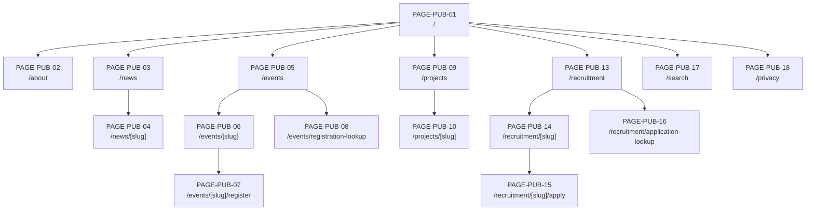
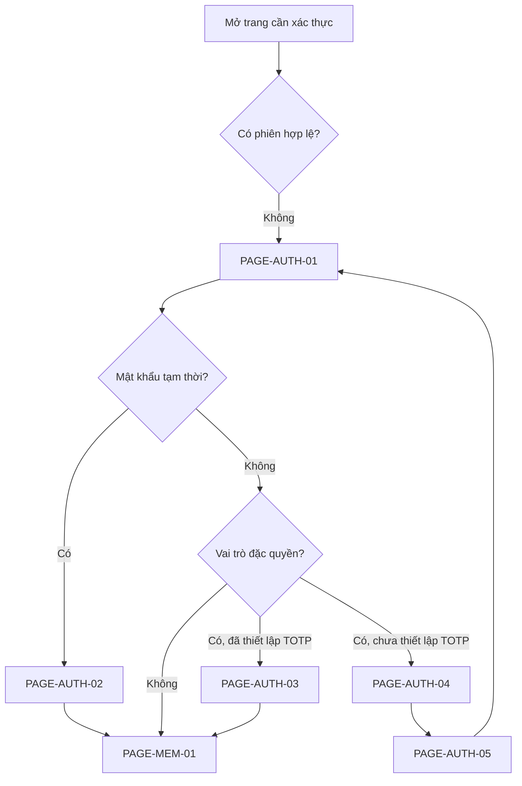
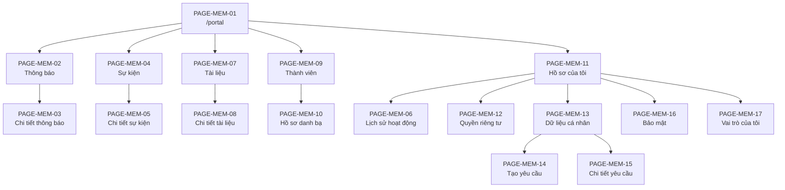
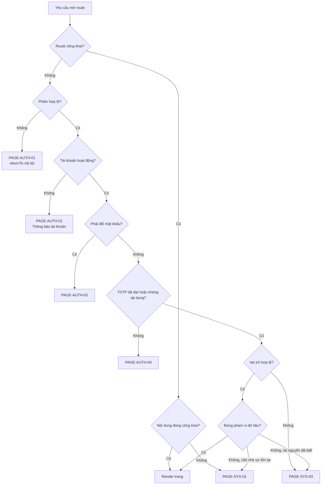

# APC Portal - Sitemap

| Thuộc tính | Giá trị |
| --- | --- |
| Phiên bản | 1.2 |
| Trạng thái | Bản thảo để APC rà soát |
| Ngày cập nhật | 05/09/2026 |
| Sản phẩm | APC Portal |
| Đơn vị sở hữu | Câu lạc bộ Lập trình ứng dụng (APC) |
| Tài liệu đầu vào | [PRD](./01-prd.md), [Roles and Permissions](./02-roles-permissions.md), [User Flows](./03-user-flows.md) |

### Lịch sử phiên bản

| Phiên bản | Nội dung chính |
| --- | --- |
| 1.0 | Baseline hoàn chỉnh về kiến trúc thông tin, 101 route tiếng Anh, điều hướng, route guard và truy vết `FLOW-01` đến `FLOW-29` |
| 1.1 | Ánh xạ bản thiết kế trang chủ vào `/`; các route còn lại chưa được khởi tạo |
| 1.2 | Bỏ trang Thành tích (PAGE-PUB-11/12, PAGE-MGT-PRT-05..08); nhãn header dùng "Gia nhập APC"; giữ segment URL cố định tiếng Anh |

> Chỉ route `/` có giao diện baseline trong mã nguồn tại thời điểm 27/08/2026. Danh mục route còn lại là kiến trúc thông tin dự kiến và cần được ưu tiên theo Feature Catalog.

## 1. Mục đích

Tài liệu này xác định kiến trúc thông tin và toàn bộ bề mặt màn hình của APC Portal trước khi thiết kế wireframe. Sitemap trả lời các câu hỏi:

1. Portal có những trang và nhóm trang nào.
2. Mỗi trang nằm ở đâu trong cấu trúc điều hướng.
3. URL chuẩn của từng trang là gì.
4. Vai trò nào được thấy và truy cập trang.
5. Trang phục vụ User Flow và yêu cầu nào.
6. Trạng thái nào được thể hiện ngay trong trang, modal hoặc bước của wizard thay vì tạo URL riêng.

Sitemap không quy định màu sắc, typography, bố cục chi tiết hoặc component. Các quyết định đó được thực hiện ở wireframe và UI design nhưng phải giữ nguyên mã trang, hành vi truy cập và quan hệ điều hướng trong tài liệu này.

## 2. Phạm vi và quyết định kiến trúc thông tin

### 2.1. Năm vùng của Portal

| Vùng | Namespace | Đối tượng | Mục đích |
| --- | --- | --- | --- |
| Công khai | `/` | `PUBLIC`, `APPLICANT` và người đã đăng nhập | Giới thiệu APC, nội dung, sự kiện, tuyển thành viên và tra cứu không cần tài khoản |
| Xác thực | `/account/*` và `/login` | Người được Ban Chủ nhiệm cấp tài khoản | Đăng nhập, kích hoạt tài khoản và xác thực hai bước |
| Thành viên | `/portal/*` | Mọi tài khoản có vai trò nền `MEMBER` | Thông tin cá nhân, thông báo, sự kiện, tài liệu và dữ liệu được cấp quyền |
| Quản trị nghiệp vụ | `/admin/*` | `DEPARTMENT_MANAGER`, `BOARD`; một số trang có bề mặt giới hạn cho `TECH_ADMIN` | Quản lý thông tin câu lạc bộ theo vai trò và phạm vi |
| Vận hành kỹ thuật | `/admin/system/*` và công cụ ngoài Portal | `TECH_ADMIN`; `BOARD` chỉ đọc một số trạng thái | Monitoring, cảnh báo, incident, phiên bản, backup và cấu hình kỹ thuật |

Tất cả tài khoản có vai trò đặc quyền vẫn có vai trò nền `MEMBER`. Vì vậy `DEPARTMENT_MANAGER`, `BOARD` và `TECH_ADMIN` đều sử dụng được khu vực `/portal/*` cho dữ liệu của chính mình.

### 2.2. Ranh giới sản phẩm

- Portal quản lý thông tin, không có trang task, giao việc, deadline, tiến độ, sprint, Kanban hoặc quản lý source code.
- Dự án và sản phẩm chỉ có trang hồ sơ giới thiệu.
- Incident là nhật ký vận hành hệ thống, không phải công cụ giao việc.
- GitHub Actions, container registry, console VPS và hệ thống monitoring chuyên dụng là bề mặt vận hành liên kết ngoài, không được mô phỏng thành chức năng triển khai giả bên trong Portal.
- Người dùng không tự đăng ký tài khoản thành viên và không có trang Đăng ký tài khoản hoặc Quên mật khẩu tự phục vụ.
- Tài khoản nội bộ do Ban Chủ nhiệm cấp, không sử dụng tài khoản UMT để đăng nhập.

### 2.3. Sitemap kiến trúc thông tin và `sitemap.xml`

Tài liệu này là sitemap phục vụ thiết kế sản phẩm. `sitemap.xml` tại `PAGE-SYS-05` là tệp kỹ thuật dành cho công cụ tìm kiếm theo `SEO-02`. Hai khái niệm có liên quan nhưng không thay thế nhau.

## 3. Quy ước

### 3.1. Mã trang

| Tiền tố | Nhóm |
| --- | --- |
| `PAGE-PUB-*` | Trang công khai |
| `PAGE-AUTH-*` | Trang xác thực và kích hoạt |
| `PAGE-MEM-*` | Trang thành viên |
| `PAGE-MGT-*` | Trang quản trị nghiệp vụ |
| `PAGE-OPS-*` | Trang vận hành kỹ thuật |
| `PAGE-SYS-*` | Trang hoặc endpoint trạng thái hệ thống |
| `STATE-*` | Trạng thái, modal hoặc bước không có URL độc lập |
| `LINK-EXT-*` | Liên kết sang hệ thống ngoài APC Portal |

Mỗi mã trang là định danh ổn định để dùng trong wireframe, prototype, issue, Pull Request và test case. Đổi nhãn menu hoặc URL không làm đổi mã trang nếu mục đích nghiệp vụ của trang không đổi.

### 3.2. Ký hiệu route

| Ký hiệu | Ý nghĩa |
| --- | --- |
| `[slug]` | Chuỗi dễ đọc, duy nhất và ổn định cho nội dung công khai |
| `[id]` | Định danh nội bộ không tuần tự, không chứa dữ liệu cá nhân |
| `[applicationId]` | Định danh nội bộ của hồ sơ ứng tuyển, không phải mã tra cứu công khai |
| `?q=` | Từ khóa tìm kiếm |
| `?page=` | Trang phân trang, bắt đầu từ `1` |
| `?sort=` | Cách sắp xếp thuộc danh sách cho phép |
| `?filter=` | Đại diện cho các query filter có tên rõ ràng trong API contract |
| `#section` | Neo trong cùng trang, không phải màn hình độc lập |

Email, mã số sinh viên, mã hồ sơ, mã đăng ký, token, secret và dữ liệu nhạy cảm không xuất hiện trong path hoặc query string.

Các segment cố định của URL sử dụng tiếng Anh. Nhãn menu, tiêu đề và nội dung giao diện vẫn sử dụng tiếng Việt. `[slug]` được sinh từ tiêu đề nội dung, bỏ dấu và chuẩn hóa bằng dấu gạch nối; ví dụ bài viết “Cuộc thi lập trình 2026” có thể dùng `/news/cuoc-thi-lap-trinh-2026`.

### 3.3. Ký hiệu quyền

| Ký hiệu | Ý nghĩa |
| --- | --- |
| `PUBLIC` | Không cần đăng nhập |
| `OWN` | Chỉ dữ liệu của chính người dùng |
| `SCOPE` | Chỉ dữ liệu thuộc Ban chuyên môn được cấp |
| `ALL` | Toàn bộ dữ liệu nghiệp vụ câu lạc bộ |
| `RO` | Chỉ xem trạng thái được phép |
| `DUAL` | Cần hai vai trò có thẩm quyền theo tài liệu phân quyền |
| `INCIDENT` | Chỉ truy cập khi xử lý sự cố đã ghi nhận |
| `-` | Không được truy cập |

## 4. Cấu trúc tổng thể

```mermaid
flowchart TB
    Root["APC Portal"]
    Public["Khu vực công khai<br/>/"]
    Auth["Xác thực<br/>/login và /account/*"]
    Member["Khu vực thành viên<br/>/portal/*"]
    Management["Quản trị nghiệp vụ<br/>/admin/*"]
    Operations["Vận hành kỹ thuật<br/>/admin/system/*"]
    External["Hệ thống ngoài Portal"]

    Root --> Public
    Root --> Auth
    Root --> Member
    Root --> Management
    Root --> Operations
    Root --> External

    Public --> P1["Giới thiệu và nội dung"]
    Public --> P2["Sự kiện"]
    Public --> P3["Tuyển thành viên"]
    Auth --> A1["Đăng nhập và kích hoạt"]
    Auth --> A2["TOTP và mã khôi phục"]
    Member --> M1["Dashboard và hồ sơ"]
    Member --> M2["Thông báo, sự kiện, tài liệu"]
    Member --> M3["Quyền riêng tư và dữ liệu cá nhân"]
    Management --> G1["Tuyển thành viên và thành viên"]
    Management --> G2["Sự kiện, nội dung và tài liệu"]
    Management --> G3["Tổ chức, tài khoản, audit và dữ liệu"]
    Operations --> O1["Monitoring, cảnh báo và incident"]
    Operations --> O2["Phiên bản, backup và email"]
    External --> E1["UMTOJ"]
    External --> E2["GitHub Actions và registry"]
    External --> E3["VPS, kho backup và monitoring"]
```

### 4.1. Layout cấp cao

| Layout | Phạm vi | Điều hướng chính |
| --- | --- | --- |
| Public layout | `PAGE-PUB-*` | Header công khai, tìm kiếm, chân trang |
| Auth layout | `PAGE-AUTH-*` | Logo APC, hỗ trợ tài khoản, quay về trang chủ; không có menu quản trị |
| Member layout | `PAGE-MEM-*` | Điều hướng thành viên, menu tài khoản và lối vào quản trị nếu có quyền |
| Management layout | `PAGE-MGT-*` | Sidebar theo vai trò/phạm vi, breadcrumb, menu tài khoản |
| Operations layout | `PAGE-OPS-*` | Sidebar vận hành, chỉ báo môi trường, phiên bản và trạng thái hệ thống |
| System layout | `PAGE-SYS-01` đến `PAGE-SYS-04` | Thông báo trạng thái và lối quay lại an toàn |

## 5. Khu vực công khai

### 5.1. Điều hướng công khai

**Header desktop**

1. Trang chủ.
2. Giới thiệu.
3. Tin tức.
4. Sự kiện.
5. Dự án.
6. Gia nhập APC (nghiệp vụ nội bộ gọi là tuyển thành viên).
7. UMTOJ, được đánh dấu là liên kết ngoài.
8. Tìm kiếm bằng nút biểu tượng.
9. Đăng nhập.

**Header mobile**

- Giữ logo, nút tìm kiếm và nút mở menu ở hàng đầu.
- Các mục còn lại nằm trong menu điều hướng có thể dùng hoàn toàn bằng bàn phím.
- Không thay thứ tự thông tin giữa desktop và mobile.

**Footer**

- Giới thiệu APC, Ban chuyên môn và liên hệ.
- Tin tức, sự kiện, dự án và tuyển thành viên.
- Tra cứu hồ sơ ứng tuyển và tra cứu đăng ký sự kiện.
- Chính sách quyền riêng tư.
- UMTOJ và các liên kết chính thức đã được Ban Chủ nhiệm cấu hình.

### 5.2. Danh mục trang công khai

| Mã trang | Tên trang | Route chuẩn | Điểm vào chính | Truy vết |
| --- | --- | --- | --- | --- |
| `PAGE-PUB-01` | Trang chủ | `/` | Domain Portal | `FLOW-01`, `PUB-01`, `ORG-04` |
| `PAGE-PUB-02` | Giới thiệu APC | `/about` | Header, footer, trang chủ | `FLOW-01`, `PUB-02`, `ORG-01`, `ORG-02` |
| `PAGE-PUB-03` | Danh sách tin tức | `/news` | Header, trang chủ, tìm kiếm | `FLOW-01`, `FLOW-02`, `PUB-03`, `PUB-07` |
| `PAGE-PUB-04` | Chi tiết tin tức | `/news/[slug]` | Danh sách, trang chủ, kết quả tìm kiếm | `FLOW-02`, `CMS-04`, `SEO-01`, `SEO-03` |
| `PAGE-PUB-05` | Danh sách và lịch sự kiện công khai | `/events` | Header, trang chủ, tìm kiếm | `FLOW-01`, `FLOW-02`, `PUB-04`, `PUB-07` |
| `PAGE-PUB-06` | Chi tiết sự kiện công khai | `/events/[slug]` | Danh sách, trang chủ, tìm kiếm | `FLOW-02`, `FLOW-14`, `EVT-02` đến `EVT-04` |
| `PAGE-PUB-07` | Đăng ký sự kiện công khai | `/events/[slug]/register` | Chi tiết sự kiện | `FLOW-14`, `EVT-10`, `EVT-14`, `DATA-07` |
| `PAGE-PUB-08` | Tra cứu hoặc hủy đăng ký sự kiện | `/events/registration-lookup` | Footer, email xác nhận, chi tiết sự kiện | `FLOW-14`, `EVT-11`, `SEC-05`, `SEC-08` |
| `PAGE-PUB-09` | Danh sách dự án và sản phẩm | `/projects` | Header, trang chủ, tìm kiếm | `FLOW-01`, `FLOW-02`, `PUB-05`, `PUB-07` |
| `PAGE-PUB-10` | Chi tiết dự án hoặc sản phẩm | `/projects/[slug]` | Danh sách, trang chủ, tìm kiếm | `FLOW-02`, `FLOW-18`, `PRT-01`, `PRT-03`, `PRT-04` |
| `PAGE-PUB-13` | Tuyển thành viên | `/recruitment` | Header, trang chủ, footer | `FLOW-03`, `PUB-06`, `REC-01`, `REC-02` |
| `PAGE-PUB-14` | Chi tiết đợt tuyển | `/recruitment/[slug]` | Trang tuyển thành viên | `FLOW-03`, `REC-02`, `REC-16` |
| `PAGE-PUB-15` | Biểu mẫu ứng tuyển | `/recruitment/[slug]/apply` | Chi tiết đợt tuyển | `FLOW-04`, `REC-03` đến `REC-06`, `REC-14`, `DATA-01`, `DATA-07` |
| `PAGE-PUB-16` | Tra cứu hoặc rút hồ sơ | `/recruitment/application-lookup` | Header tuyển thành viên, footer, email xác nhận | `FLOW-05`, `REC-07`, `REC-08`, `REC-13` |
| `PAGE-PUB-17` | Tìm kiếm công khai | `/search` | Nút tìm kiếm trong header; từ khóa ở `?q=` | `FLOW-02`, `PUB-07` |
| `PAGE-PUB-18` | Chính sách quyền riêng tư | `/privacy` | Footer và mọi điểm xin đồng ý | `DATA-01`, `DATA-05` đến `DATA-08` |

### 5.3. Cây trang công khai

### 5.4. Hành vi đặc biệt

- `PAGE-PUB-07` và `PAGE-PUB-15` hiển thị kết quả thành công trong cùng wizard; mã đăng ký hoặc mã hồ sơ chỉ hiển thị một lần trong `STATE-01` hoặc `STATE-02`.
- `PAGE-PUB-08` và `PAGE-PUB-16` luôn dùng thông báo lỗi chung, rate limit và không tiết lộ email hoặc mã nào sai.
- Thành viên đã đăng nhập vẫn xem được thông tin đợt tuyển nhưng không thể nộp đơn ở `PAGE-PUB-15`; backend từ chối thao tác theo ma trận quyền.
- Một đợt tuyển chưa mở hoặc đã đóng vẫn có thể có trang thông tin, nhưng nút ứng tuyển bị thay bằng trạng thái và thời điểm phù hợp.
- Nội dung đã bị gỡ, lưu trữ hoặc không còn công khai trả về `PAGE-SYS-01`, không render dữ liệu cũ từ cache.

## 6. Xác thực và kích hoạt tài khoản

### 6.1. Danh mục trang

| Mã trang | Tên trang | Route chuẩn | Quyền | Truy vết |
| --- | --- | --- | --- | --- |
| `PAGE-AUTH-01` | Đăng nhập | `/login` | Người chưa có phiên | `FLOW-09`, `FLOW-10`, `AUTH-04`, `SEC-05`, `SEC-08` |
| `PAGE-AUTH-02` | Kích hoạt tài khoản và đổi mật khẩu tạm thời | `/account/activate` | Tài khoản Chờ kích hoạt đã xác thực bước đầu | `FLOW-09`, `AUTH-03`, `AUTH-10`, `SEC-11` |
| `PAGE-AUTH-03` | Xác thực hai bước khi đăng nhập | `/account/two-factor` | `BOARD` hoặc `TECH_ADMIN` đã qua mật khẩu | `FLOW-10`, `FLOW-27`, `AUTH-11`, `SEC-12` |
| `PAGE-AUTH-04` | Thiết lập xác thực hai bước | `/account/setup-two-factor` | Vai trò đặc quyền Chờ kích hoạt | `FLOW-27`, `AUTH-11`, `RP-13` đến `RP-15` |
| `PAGE-AUTH-05` | Mã khôi phục hiển thị một lần | `/account/recovery-codes` | Người vừa thiết lập hoặc tạo lại TOTP | `FLOW-27`, `SEC-12` |

### 6.2. Quy tắc điều hướng xác thực

1. Người đã đăng nhập mở `PAGE-AUTH-01` được đưa về URL nội bộ hợp lệ gần nhất hoặc `PAGE-MEM-01`.
2. Tài khoản Chờ kích hoạt chỉ truy cập `PAGE-AUTH-02` và Đăng xuất.
3. Tài khoản có vai trò đặc quyền Chờ kích hoạt chỉ truy cập `PAGE-AUTH-04`, `PAGE-AUTH-05` khi được cấp phiên hiển thị một lần, và Đăng xuất.
4. `PAGE-AUTH-05` không thể tải lại để xem secret hoặc toàn bộ mã lần thứ hai.
5. Không có route tự đăng ký hoặc tự đặt lại mật khẩu. `PAGE-AUTH-01` hướng dẫn thành viên liên hệ Ban Chủ nhiệm.
6. Sau khi hoàn tất TOTP, hệ thống thu hồi phiên cũ và yêu cầu đăng nhập lại qua `PAGE-AUTH-01` rồi `PAGE-AUTH-03`.
7. `PAGE-AUTH-03` cho phép chuyển sang nhập một mã khôi phục dùng một lần; sau khi dùng, người dùng được đưa đến `PAGE-MEM-16` để tạo lại bộ mã và xác nhận qua `PAGE-AUTH-05`.

## 7. Khu vực thành viên

### 7.1. Điều hướng thành viên

**Điều hướng chính**

1. Tổng quan.
2. Thông báo.
3. Sự kiện.
4. Tài liệu.
5. Thành viên.

**Menu tài khoản**

1. Hồ sơ của tôi.
2. Lịch sử hoạt động.
3. Quyền riêng tư.
4. Dữ liệu cá nhân.
5. Vai trò và phạm vi của tôi.
6. Bảo mật tài khoản.
7. Đăng xuất.

Người có vai trò quản lý thấy thêm lối vào **Quản trị**. `TECH_ADMIN` thấy lối vào **Vận hành hệ thống**. Các lối vào này không xuất hiện với `MEMBER` thông thường.

### 7.2. Danh mục trang thành viên

| Mã trang | Tên trang | Route chuẩn | Phạm vi | Truy vết |
| --- | --- | --- | --- | --- |
| `PAGE-MEM-01` | Dashboard thành viên | `/portal` | `OWN` | `FLOW-10`, `FLOW-12`, `MEM-01` |
| `PAGE-MEM-02` | Danh sách thông báo nội bộ | `/portal/announcements` | Theo vai trò hoặc ban được chọn | `FLOW-12`, `FLOW-17`, `CMS-05` |
| `PAGE-MEM-03` | Chi tiết thông báo nội bộ | `/portal/announcements/[id]` | Theo vai trò hoặc ban được chọn | `FLOW-12`, `FLOW-17`, `CMS-05` |
| `PAGE-MEM-04` | Danh sách và lịch sự kiện | `/portal/events` | Sự kiện công khai và nội bộ được cấp quyền | `FLOW-12`, `FLOW-14`, `PUB-04`, `EVT-03` |
| `PAGE-MEM-05` | Chi tiết và đăng ký sự kiện | `/portal/events/[id]` | Theo đối tượng sự kiện | `FLOW-14`, `EVT-04`, `EVT-05` |
| `PAGE-MEM-06` | Lịch sử hoạt động của tôi | `/portal/activity-history` | `OWN` | `FLOW-12`, `FLOW-16`, `MEM-05`, `EVT-08` |
| `PAGE-MEM-07` | Thư viện tài liệu | `/portal/documents` | Tài liệu được cấp quyền | `FLOW-12`, `FLOW-19`, `DOC-03`, `DOC-04` |
| `PAGE-MEM-08` | Chi tiết tài liệu | `/portal/documents/[id]` | Tài liệu được cấp quyền tại thời điểm đọc/tải | `FLOW-19`, `DOC-02` đến `DOC-04`, `DOC-08` |
| `PAGE-MEM-09` | Danh bạ thành viên | `/portal/members` | Thông tin nội bộ cơ bản | `FLOW-12`, `MEM-06`, `MEM-10` |
| `PAGE-MEM-10` | Hồ sơ danh bạ thành viên | `/portal/members/[id]` | Các trường được phép trong danh bạ | `MEM-06`, `MEM-10`, `DATA-02` |
| `PAGE-MEM-11` | Hồ sơ của tôi | `/portal/profile` | `OWN` | `FLOW-12`, `MEM-02`, `MEM-03` |
| `PAGE-MEM-12` | Quyền riêng tư và đồng ý công khai | `/portal/privacy` | `OWN` | `FLOW-12`, `FLOW-28`, `MEM-12`, `DATA-07` |
| `PAGE-MEM-13` | Yêu cầu dữ liệu cá nhân | `/portal/data-requests` | `OWN` | `FLOW-28`, `DATA-06`, `DATA-10` |
| `PAGE-MEM-14` | Tạo yêu cầu dữ liệu cá nhân | `/portal/data-requests/new` | `OWN` | `FLOW-28`, `DATA-06`, `DATA-09` |
| `PAGE-MEM-15` | Chi tiết yêu cầu dữ liệu | `/portal/data-requests/[id]` | `OWN` | `FLOW-28`, `DATA-09`, `DATA-10` |
| `PAGE-MEM-16` | Bảo mật tài khoản | `/portal/account/security` | `OWN` | `FLOW-10`, `FLOW-27`, `AUTH-05`, `AUTH-11`, `AUTH-12` |
| `PAGE-MEM-17` | Vai trò và phạm vi của tôi | `/portal/account/roles` | `OWN` | `FLOW-12`, `FLOW-20`, `ADM-08`, `RP-02`, `RP-03` |

### 7.3. Cây trang thành viên

## 8. Khu vực quản trị nghiệp vụ

### 8.1. Dashboard quản trị

| Mã trang | Tên trang | Route chuẩn | Quyền | Nội dung |
| --- | --- | --- | --- | --- |
| `PAGE-MGT-01` | Dashboard quản trị | `/admin` | `DEPARTMENT_MANAGER`, `BOARD`, `TECH_ADMIN` | Khối thông tin và lối tắt theo đúng vai trò; không tổng hợp dữ liệu ngoài phạm vi |

`PAGE-MGT-01` không dùng một dashboard giống nhau cho mọi vai trò:

- `DEPARTMENT_MANAGER` thấy hồ sơ tuyển, sự kiện, nội dung, tài liệu và email trong ban.
- `BOARD` thấy số liệu toàn câu lạc bộ, cảnh báo nghiệp vụ, vai trò sắp hết hạn và yêu cầu cần quyết định.
- `TECH_ADMIN` thấy health, cảnh báo, backup, email worker, phiên bản và incident; không thấy số liệu nghiệp vụ nhạy cảm.

### 8.2. Tuyển thành viên

| Mã trang | Tên trang | Route chuẩn | `DEPARTMENT_MANAGER` | `BOARD` | Truy vết |
| --- | --- | --- | --- | --- | --- |
| `PAGE-MGT-REC-01` | Danh sách đợt tuyển | `/admin/recruitment` | `RO` đối với đợt có hồ sơ trong ban | `ALL` | `FLOW-06`, `FLOW-07`, `REC-01`, `REC-09` |
| `PAGE-MGT-REC-02` | Tạo đợt tuyển | `/admin/recruitment/new` | `-` | `ALL` | `FLOW-06`, `REC-01`, `REC-02`, `REC-14` |
| `PAGE-MGT-REC-03` | Tổng quan đợt tuyển | `/admin/recruitment/[id]` | `RO/SCOPE` | `ALL` | `FLOW-06`, `FLOW-07`, `REC-02`, `REC-16` |
| `PAGE-MGT-REC-04` | Chỉnh sửa đợt tuyển và câu hỏi | `/admin/recruitment/[id]/edit` | `-` | `ALL` | `FLOW-06`, `REC-01`, `REC-14`, `REC-15` |
| `PAGE-MGT-REC-05` | Xem trước đợt tuyển | `/admin/recruitment/[id]/preview` | `RO/SCOPE` | `ALL` | `FLOW-06`, `REC-02` đến `REC-04` |
| `PAGE-MGT-REC-06` | Danh sách hồ sơ ứng tuyển | `/admin/recruitment/[id]/applications` | `SCOPE` | `ALL` | `FLOW-07`, `REC-09`, `REC-11` |
| `PAGE-MGT-REC-07` | Chi tiết hồ sơ ứng tuyển | `/admin/recruitment/[id]/applications/[applicationId]` | `SCOPE` | `ALL` | `FLOW-07`, `FLOW-08`, `REC-08`, `REC-10`, `REC-12` |

Các hành động Mở, Đóng, Lưu trữ đợt tuyển; chuyển trạng thái hồ sơ; chốt kết quả; xuất CSV và chuyển thành thành viên nằm trong trang chi tiết liên quan hoặc modal xác nhận, không tạo route hành động riêng.

### 8.3. Thành viên, tài khoản và phân quyền

| Mã trang | Tên trang | Route chuẩn | `DEPARTMENT_MANAGER` | `BOARD` | `TECH_ADMIN` | Truy vết |
| --- | --- | --- | --- | --- | --- | --- |
| `PAGE-MGT-MEM-01` | Danh sách thành viên | `/admin/members` | `SCOPE` | `ALL` | `-` | `FLOW-13`, `MEM-06`, `MEM-07`, `MEM-09` |
| `PAGE-MGT-MEM-02` | Chi tiết quản lý thành viên | `/admin/members/[id]` | `SCOPE` | `ALL` | `-` | `FLOW-13`, `MEM-04`, `MEM-11` |
| `PAGE-MGT-MEM-03` | Nhập thành viên từ CSV | `/admin/members/import` | `-` | `ALL` | `-` | `FLOW-25`, `MEM-08`, `BR-18`, `RP-16` |
| `PAGE-MGT-MEM-04` | Danh sách tài khoản | `/admin/accounts` | `-` | `ALL` | Trạng thái kỹ thuật | `FLOW-11`, `AUTH-02`, `AUTH-06` đến `AUTH-08` |
| `PAGE-MGT-MEM-05` | Chi tiết tài khoản | `/admin/accounts/[id]` | `-` | `ALL` | `INCIDENT` và metadata kỹ thuật | `FLOW-11`, `AUTH-06`, `AUTH-08`, `ADM-02` |
| `PAGE-MGT-MEM-06` | Vai trò và phạm vi của tài khoản | `/admin/accounts/[id]/roles` | `-` | `ALL` | Phần `DUAL` của `TECH_ADMIN` | `FLOW-20`, `ADM-01`, `ADM-08`, `RP-01` đến `RP-19` |
| `PAGE-MGT-MEM-07` | Hàng đợi quyền đặc quyền | `/admin/access-control` | `-` | Quyết định và theo dõi | Thực hiện phần kỹ thuật | `FLOW-20`, `FLOW-27`, `AUTH-11`, `AUTH-12`, `ADM-08` |

`PAGE-MGT-MEM-02` tách dữ liệu thành các tab Hồ sơ quản lý, Ban và trạng thái, Lịch sử hoạt động. `PAGE-MGT-MEM-05` tách Trạng thái tài khoản, Phiên đăng nhập và Hành động bảo mật. `PAGE-MGT-MEM-06` chỉ chứa vai trò/phạm vi, ngày hiệu lực, ngày hết hạn, lý do và lịch sử thay đổi.

### 8.4. Sự kiện và điểm danh

| Mã trang | Tên trang | Route chuẩn | `DEPARTMENT_MANAGER` | `BOARD` | Truy vết |
| --- | --- | --- | --- | --- | --- |
| `PAGE-MGT-EVT-01` | Danh sách sự kiện | `/admin/events` | `SCOPE` | `ALL` | `FLOW-15`, `EVT-01`, `EVT-12` |
| `PAGE-MGT-EVT-02` | Tạo sự kiện | `/admin/events/new` | `SCOPE` | `ALL` | `FLOW-15`, `EVT-01` đến `EVT-03` |
| `PAGE-MGT-EVT-03` | Chi tiết và chỉnh sửa sự kiện | `/admin/events/[id]` | `SCOPE` | `ALL` | `FLOW-15`, `EVT-01` đến `EVT-03`, `EVT-09` |
| `PAGE-MGT-EVT-04` | Xem trước sự kiện | `/admin/events/[id]/preview` | `SCOPE` | `ALL` | `FLOW-15`, `EVT-02`, `EVT-03` |
| `PAGE-MGT-EVT-05` | Danh sách đăng ký | `/admin/events/[id]/registrations` | `SCOPE` | `ALL` | `FLOW-16`, `EVT-06`, `EVT-13` |
| `PAGE-MGT-EVT-06` | Điểm danh | `/admin/events/[id]/attendance` | `SCOPE` | `ALL` | `FLOW-16`, `EVT-07`, `EVT-08`, `EVT-13` |

`DEPARTMENT_MANAGER` chỉ công bố sự kiện nội bộ trong Ban chuyên môn; sự kiện toàn câu lạc bộ hoặc công khai chỉ có hành động công bố đối với `BOARD`.

### 8.5. Bài viết và thông báo

| Mã trang | Tên trang | Route chuẩn | `DEPARTMENT_MANAGER` | `BOARD` | Truy vết |
| --- | --- | --- | --- | --- | --- |
| `PAGE-MGT-CMS-01` | Danh sách bài viết và thông báo | `/admin/content/posts` | `SCOPE` | `ALL` | `FLOW-17`, `CMS-01`, `CMS-02`, `CMS-05` |
| `PAGE-MGT-CMS-02` | Tạo bài viết hoặc thông báo | `/admin/content/posts/new` | `SCOPE` | `ALL` | `FLOW-17`, `CMS-01`, `CMS-05` |
| `PAGE-MGT-CMS-03` | Chỉnh sửa bài viết hoặc thông báo | `/admin/content/posts/[id]` | `SCOPE` | `ALL` | `FLOW-17`, `CMS-01`, `CMS-02`, `CMS-06` |
| `PAGE-MGT-CMS-04` | Xem trước bài viết hoặc thông báo | `/admin/content/posts/[id]/preview` | `SCOPE` | `ALL` | `FLOW-17`, `CMS-03`, `DATA-03`, `BR-20` |

Phạm vi công bố quyết định bề mặt hiển thị: thông báo trong ban xuất hiện ở `PAGE-MEM-02`; nội dung công khai xuất hiện ở `PAGE-PUB-03`.

### 8.6. Dự án và sản phẩm

| Mã trang | Tên trang | Route chuẩn | `DEPARTMENT_MANAGER` | `BOARD` | Truy vết |
| --- | --- | --- | --- | --- | --- |
| `PAGE-MGT-PRT-01` | Danh sách dự án và sản phẩm | `/admin/content/projects` | `SCOPE` | `ALL` | `FLOW-18`, `PRT-01`, `PRT-03` |
| `PAGE-MGT-PRT-02` | Tạo dự án hoặc sản phẩm | `/admin/content/projects/new` | `SCOPE` | `ALL` | `FLOW-18`, `PRT-01`, `PRT-04` |
| `PAGE-MGT-PRT-03` | Chỉnh sửa dự án hoặc sản phẩm | `/admin/content/projects/[id]` | `SCOPE` | `ALL` | `FLOW-18`, `PRT-01`, `PRT-03`, `PRT-04` |
| `PAGE-MGT-PRT-04` | Xem trước dự án hoặc sản phẩm | `/admin/content/projects/[id]/preview` | `SCOPE` | `ALL` | `FLOW-18`, `PRT-01`, `PRT-04` |

`DEPARTMENT_MANAGER` tạo và chỉnh sửa hồ sơ Ẩn trong phạm vi Ban chuyên môn; chỉ `BOARD` có hành động công bố.

Không trang nào trong nhóm này có trường người nhận việc, deadline, trạng thái công việc hoặc phần trăm tiến độ.

### 8.7. Tài liệu nội bộ

| Mã trang | Tên trang | Route chuẩn | `DEPARTMENT_MANAGER` | `BOARD` | `TECH_ADMIN` | Truy vết |
| --- | --- | --- | --- | --- | --- | --- |
| `PAGE-MGT-DOC-01` | Danh sách tài liệu quản lý | `/admin/documents` | `SCOPE` | `ALL` | `-` | `FLOW-19`, `DOC-01`, `DOC-03`, `DOC-09` |
| `PAGE-MGT-DOC-02` | Tải tài liệu mới | `/admin/documents/upload` | `SCOPE` | `ALL` | `-` | `FLOW-19`, `DOC-01`, `DOC-02`, `DOC-05` đến `DOC-07` |
| `PAGE-MGT-DOC-03` | Chi tiết và chỉnh sửa tài liệu | `/admin/documents/[id]` | `SCOPE` | `ALL` | Metadata `INCIDENT` | `FLOW-19`, `DOC-01` đến `DOC-04`, `DOC-09` |
| `PAGE-MGT-DOC-04` | Lịch sử phiên bản tài liệu | `/admin/documents/[id]/versions` | `SCOPE` | `ALL` | `-` | `FLOW-19`, `DOC-08` |

Xóa vật lý không có nút một bước. Quyết định của `BOARD` và thao tác của `TECH_ADMIN` được thể hiện bằng `STATE-07`, xác thực lại và audit theo quyền `DUAL`.

### 8.8. Thông tin tổ chức

| Mã trang | Tên trang | Route chuẩn | Quyền | Truy vết |
| --- | --- | --- | --- | --- |
| `PAGE-MGT-ORG-01` | Thông tin APC | `/admin/organization/profile` | `BOARD` | `FLOW-24`, `ORG-01`, `ORG-05` |
| `PAGE-MGT-ORG-02` | Danh sách Ban chuyên môn | `/admin/organization/departments` | `BOARD` | `FLOW-24`, `ORG-02`, `ORG-03`, `ORG-06` |
| `PAGE-MGT-ORG-03` | Tạo Ban chuyên môn | `/admin/organization/departments/new` | `BOARD` | `FLOW-24`, `ORG-02`, `ORG-06` |
| `PAGE-MGT-ORG-04` | Chỉnh sửa Ban chuyên môn | `/admin/organization/departments/[id]` | `BOARD` | `FLOW-24`, `ORG-02`, `ORG-03`, `ORG-06` |
| `PAGE-MGT-ORG-05` | Nội dung nổi bật trang chủ | `/admin/organization/featured-content` | `BOARD` | `FLOW-24`, `ORG-04`, `ORG-05` |

Sau khi tạo Ban chuyên môn thành công ở `PAGE-MGT-ORG-03`, hệ thống chuyển đến `PAGE-MGT-ORG-04` với định danh do server cấp. Xem trước thông tin công khai mở trong chế độ preview của `PAGE-PUB-01` hoặc `PAGE-PUB-02`, không tạo bản sao trang riêng.

### 8.9. Email giao dịch

| Mã trang | Tên trang | Route chuẩn | `DEPARTMENT_MANAGER` | `BOARD` | `TECH_ADMIN` | Truy vết |
| --- | --- | --- | --- | --- | --- | --- |
| `PAGE-MGT-NTF-01` | Danh sách email giao dịch | `/admin/email-deliveries` | `SCOPE` | `ALL` | Metadata lỗi `INCIDENT` | `FLOW-26`, `NTF-02` đến `NTF-04` |
| `PAGE-MGT-NTF-02` | Chi tiết giao nhận email | `/admin/email-deliveries/[id]` | `SCOPE` | `ALL` | Metadata lỗi `INCIDENT` | `FLOW-26`, `NTF-03` đến `NTF-05`, `OPS-11` |

Giao diện chỉ hiển thị dữ liệu tối thiểu theo vai trò. `TECH_ADMIN` không đọc nội dung nghiệp vụ hoặc dữ liệu cá nhân không cần thiết để xử lý lỗi nhà cung cấp.

Chỉ `BOARD` được yêu cầu gửi lại email nghiệp vụ thất bại trong vận hành thông thường; `TECH_ADMIN` chỉ thực hiện khi có incident được ghi nhận.

### 8.10. Dữ liệu cá nhân và retention

| Mã trang | Tên trang | Route chuẩn | `BOARD` | `TECH_ADMIN` | Truy vết |
| --- | --- | --- | --- | --- | --- |
| `PAGE-MGT-DATA-01` | Danh sách yêu cầu dữ liệu | `/admin/data-requests` | `ALL` | `-` | `FLOW-28`, `DATA-06`, `DATA-10` |
| `PAGE-MGT-DATA-02` | Chi tiết xử lý yêu cầu dữ liệu | `/admin/data-requests/[id]` | `ALL` | `-` | `FLOW-28`, `DATA-06`, `DATA-09`, `DATA-10` |
| `PAGE-MGT-DATA-03` | Retention và dry-run | `/admin/data-retention` | Xem và xác nhận nghiệp vụ | Xem tác động và thực hiện phần kỹ thuật | `FLOW-28`, `DATA-05`, `DATA-08`, `BR-13`, `RP-17` |

Thực thi xóa hoặc ẩn danh theo lô là hành động `DUAL`, có dry-run, xác nhận ảnh hưởng, checkpoint và audit; không phải nút xóa trực tiếp trên danh sách.

### 8.11. Audit log

| Mã trang | Tên trang | Route chuẩn | `BOARD` | `TECH_ADMIN` | Truy vết |
| --- | --- | --- | --- | --- | --- |
| `PAGE-MGT-AUD-01` | Tra cứu audit log | `/admin/audit-logs` | Nghiệp vụ `ALL`; bảo mật/vận hành `INCIDENT` | Bảo mật/vận hành `ALL`; nghiệp vụ `INCIDENT` | `FLOW-21`, `ADM-05` đến `ADM-07`, `DATA-04` |
| `PAGE-MGT-AUD-02` | Chi tiết audit log | `/admin/audit-logs/[id]` | Nghiệp vụ `ALL`; bảo mật/vận hành `INCIDENT` | Bảo mật/vận hành `ALL`; nghiệp vụ `INCIDENT` | `FLOW-21`, `ADM-05`, `ADM-06`, `SEC-09` |

Hai trang audit chỉ đọc, không có hành động sửa hoặc xóa.

### 8.12. Cây điều hướng quản trị

```mermaid
flowchart TB
    Admin["PAGE-MGT-01<br/>/admin"]
    Recruitment["Tuyển thành viên"]
    Members["Thành viên và tài khoản"]
    Events["Sự kiện"]
    Content["Nội dung"]
    Documents["Tài liệu"]
    Governance["Tổ chức và kiểm soát"]
    System["Hệ thống"]

    Admin --> Recruitment
    Recruitment --> Campaigns["Đợt tuyển<br/>PAGE-MGT-REC-01 đến 05"]
    Recruitment --> Applications["Hồ sơ ứng tuyển<br/>PAGE-MGT-REC-06 đến 07"]

    Admin --> Members
    Members --> MemberRecords["Hồ sơ và import<br/>PAGE-MGT-MEM-01 đến 03"]
    Members --> Accounts["Tài khoản và quyền<br/>PAGE-MGT-MEM-04 đến 07"]

    Admin --> Events
    Events --> EventRecords["Nội dung sự kiện<br/>PAGE-MGT-EVT-01 đến 04"]
    Events --> Attendance["Đăng ký và điểm danh<br/>PAGE-MGT-EVT-05 đến 06"]

    Admin --> Content
    Content --> Posts["Bài viết và thông báo<br/>PAGE-MGT-CMS-01 đến 04"]
    Content --> Portfolio["Dự án và sản phẩm<br/>PAGE-MGT-PRT-01 đến 04"]

    Admin --> Documents
    Documents --> DocumentRecords["PAGE-MGT-DOC-01 đến 04"]

    Admin --> Governance
    Governance --> Organization["Tổ chức<br/>PAGE-MGT-ORG-01 đến 05"]
    Governance --> Notifications["Email<br/>PAGE-MGT-NTF-01 đến 02"]
    Governance --> PersonalData["Dữ liệu cá nhân<br/>PAGE-MGT-DATA-01 đến 03"]
    Governance --> Audit["Audit<br/>PAGE-MGT-AUD-01 đến 02"]

    Admin --> System
    System --> Operations["PAGE-OPS-01 đến 09"]
```

Cây trên thể hiện quan hệ thông tin, không cấp quyền theo quan hệ cha con. Mỗi người chỉ thấy các nhánh có ít nhất một trang hợp lệ theo mục 10.

## 9. Khu vực vận hành kỹ thuật

### 9.1. Danh mục trang trong Portal

| Mã trang | Tên trang | Route chuẩn | `BOARD` | `TECH_ADMIN` | Truy vết |
| --- | --- | --- | --- | --- | --- |
| `PAGE-OPS-01` | Tổng quan hệ thống | `/admin/system` | `RO` trạng thái tổng hợp | `ALL` | `FLOW-22`, `FLOW-23`, `FLOW-26`, `FLOW-29`, `OPS-01`, `OPS-06` |
| `PAGE-OPS-02` | Monitoring | `/admin/system/monitoring` | `RO` | `ALL` | `FLOW-29`, `PERF-06`, `OPS-06`, `OPS-09` |
| `PAGE-OPS-03` | Cảnh báo | `/admin/system/alerts` | Cảnh báo ảnh hưởng nghiệp vụ | `ALL` | `FLOW-29`, `OPS-09` |
| `PAGE-OPS-04` | Danh sách incident | `/admin/system/incidents` | `RO` incident ảnh hưởng nghiệp vụ | `ALL` | `FLOW-29`, `SEC-09`, `OPS-11` |
| `PAGE-OPS-05` | Chi tiết incident | `/admin/system/incidents/[id]` | `RO` phần được phép | `ALL` | `FLOW-29`, `SEC-09`, `OPS-11` |
| `PAGE-OPS-06` | Trạng thái backup và restore drill | `/admin/system/backups` | `RO` kết quả tổng hợp | `ALL` | `FLOW-23`, `OPS-02` đến `OPS-05`, `OPS-10` |
| `PAGE-OPS-07` | Phiên bản và lịch sử triển khai | `/admin/system/releases` | `RO` phiên bản production | `ALL` | `FLOW-22`, `OPS-07`, `SEC-10` |
| `PAGE-OPS-08` | Cấu hình và trạng thái email | `/admin/system/email` | `-` | `ALL` | `FLOW-26`, `NTF-02` đến `NTF-05`, `OPS-11` |
| `PAGE-OPS-09` | Thông báo trạng thái dịch vụ | `/admin/system/service-notices` | Quản lý nội dung thông báo | `RO` và cung cấp trạng thái kỹ thuật | `FLOW-29`, `PUB-08`, `OPS-01`, `OPS-09` |

`PAGE-OPS-06` và `PAGE-OPS-07` hiển thị trạng thái, bằng chứng và liên kết runbook. Restore, rollback, thay secrets hoặc deploy production vẫn được thực hiện qua quy trình kỹ thuật được kiểm soát, không qua một nút không có bước bảo vệ trong Portal.

`PAGE-OPS-09` cho phép `BOARD` soạn, công bố và kết thúc thông báo ảnh hưởng người dùng dựa trên trạng thái do `TECH_ADMIN` cung cấp. Bật maintenance mode vẫn là thao tác kỹ thuật theo runbook; nội dung công khai được hiển thị qua `PAGE-SYS-02`.

### 9.2. Bề mặt vận hành ngoài Portal

| Mã | Bề mặt | Điểm vào | Vai trò | Quan hệ với Portal |
| --- | --- | --- | --- | --- |
| `LINK-EXT-01` | UMTOJ | URL được cấu hình trong `ORG-01` | `PUBLIC` | Liên kết ngoài từ header/trang chủ; hạ tầng độc lập với Portal |
| `LINK-EXT-02` | GitHub repository và Pull Request | Liên kết nội bộ nhóm kỹ thuật | `TECH_ADMIN`, nhóm phát triển | Nguồn thay đổi và review trước CI |
| `LINK-EXT-03` | GitHub Actions hoặc CI chuyên dụng | Từ `PAGE-OPS-07` | `TECH_ADMIN` | Test, scan, build và phát hành image cố định |
| `LINK-EXT-04` | Container registry | Từ bản ghi phiên bản | `TECH_ADMIN` | Lưu image theo commit/release |
| `LINK-EXT-05` | Monitoring và log console | Từ `PAGE-OPS-02` hoặc `PAGE-OPS-05` | `TECH_ADMIN` | Metric, log, truy vấn kỹ thuật chi tiết |
| `LINK-EXT-06` | Kho backup ngoài VPS | Theo runbook | `TECH_ADMIN` | Lưu backup mã hóa và phục vụ restore |
| `LINK-EXT-07` | Console VPS riêng và runbook | Theo kênh quản trị bảo mật | `TECH_ADMIN` | Quản trị VPS, deploy, rollback, restore và xử lý sự cố Portal |

Liên kết ngoài chỉ xuất hiện khi người dùng có quyền và phải thể hiện rõ người dùng sắp rời Portal. Không đưa secret, token hoặc thông tin đăng nhập vào URL liên kết.

## 10. Menu quản trị theo vai trò

| Nhóm menu | `DEPARTMENT_MANAGER` | `BOARD` | `TECH_ADMIN` |
| --- | --- | --- | --- |
| Tổng quan quản trị | Theo `SCOPE` | `ALL` nghiệp vụ | Trạng thái kỹ thuật |
| Tuyển thành viên | Hồ sơ trong ban | Đợt tuyển và toàn bộ hồ sơ | - |
| Thành viên | Thành viên trong ban | Toàn bộ, import và export | - |
| Tài khoản | - | Quản lý nghiệp vụ | Trạng thái kỹ thuật/`INCIDENT` |
| Phân quyền | - | Quyết định nghiệp vụ | Thực hiện phần `DUAL` kỹ thuật |
| Sự kiện | `SCOPE` | `ALL` | - |
| Bài viết và thông báo | `SCOPE` | `ALL` | - |
| Dự án và sản phẩm | `SCOPE` | `ALL` | - |
| Tài liệu | `SCOPE` | `ALL` | Metadata `INCIDENT` |
| Tổ chức | - | `ALL` | - |
| Email giao dịch | `SCOPE` | `ALL` | Lỗi giao nhận `INCIDENT` |
| Dữ liệu cá nhân | - | Xử lý nghiệp vụ | Chỉ retention `DUAL` |
| Audit log | - | Log nghiệp vụ | Log bảo mật và vận hành |
| Hệ thống | - | `RO` trạng thái phù hợp; quản lý thông báo dịch vụ | `ALL` kỹ thuật; chỉ đọc nội dung thông báo |

Một menu chỉ xuất hiện khi người dùng có ít nhất một route con hợp lệ. Nếu quyền hoặc phạm vi hết hiệu lực trong lúc đang sử dụng, menu được cập nhật sau lần kiểm tra quyền tiếp theo và request hiện tại vẫn bị backend từ chối.

## 11. Route guard và điều hướng sau đăng nhập

### 11.1. Thứ tự kiểm tra

1. Chuẩn hóa host, HTTPS, path và locale.
2. Xác định route công khai hay cần phiên đăng nhập.
3. Kiểm tra phiên, trạng thái tài khoản và thời hạn không hoạt động.
4. Kiểm tra bắt buộc đổi mật khẩu tạm thời.
5. Kiểm tra TOTP đối với quyền đặc quyền.
6. Kiểm tra vai trò.
7. Kiểm tra phạm vi `OWN`, `SCOPE`, `ALL`, `DUAL` hoặc `INCIDENT`.
8. Kiểm tra trạng thái tài nguyên và bước chuyển trạng thái được phép.
9. Trả trang, chuyển hướng an toàn hoặc lỗi phù hợp.

### 11.2. Điều hướng sau đăng nhập

- Sau đăng nhập thành công, ưu tiên `returnTo` nếu đây là path nội bộ thuộc danh sách route hợp lệ và người dùng có quyền.
- Không có `returnTo` hợp lệ thì mở `PAGE-MEM-01`.
- Dashboard thành viên hiển thị lối tắt theo vai trò; không tự đưa `BOARD` hoặc `TECH_ADMIN` vào màn hình có tác động quản trị.
- `returnTo` không chấp nhận URL tuyệt đối, protocol-relative URL hoặc domain ngoài để tránh open redirect.
- Khi phiên hết hạn giữa biểu mẫu, hệ thống giữ draft không nhạy cảm ở client trong giới hạn cho phép, xác thực lại rồi khôi phục đúng route; dữ liệu bí mật không được lưu ở local storage.

### 11.3. Quy tắc lỗi quyền

- Chưa đăng nhập: chuyển đến `PAGE-AUTH-01`.
- Người dùng không được biết tài nguyên tồn tại hoặc truy cập ngoài `SCOPE`: dùng `PAGE-SYS-01`.
- Người dùng biết tài nguyên nhưng thiếu quyền thực hiện hành động: dùng `PAGE-SYS-03` hoặc thông báo `403` ngay trong trang.
- Tài khoản bị khóa/ngừng hoạt động: thu hồi phiên, về trang đăng nhập và hiển thị thông báo chung.
- Không dựa vào việc ẩn menu để bảo vệ route; mỗi request vẫn kiểm tra quyền ở server.

## 12. Trang và endpoint hệ thống

| Mã trang | Tên | Route/điểm kích hoạt | Index | Truy vết |
| --- | --- | --- | --- | --- |
| `PAGE-SYS-01` | Không tìm thấy | Fallback route, HTTP `404` | Không | `PUB-08`, `ERR-404` |
| `PAGE-SYS-02` | Bảo trì hoặc dịch vụ tạm không khả dụng | Maintenance mode, HTTP `503` | Không | `FLOW-01`, `FLOW-23`, `FLOW-29`, `PUB-08`, `ERR-503` |
| `PAGE-SYS-03` | Không có quyền truy cập | HTTP `403` khi được phép tiết lộ tài nguyên | Không | `ERR-403`, `ADM-01`, `ADM-04` |
| `PAGE-SYS-04` | Lỗi hệ thống | HTTP `500` với correlation ID | Không | `ERR-500`, `OPS-11` |
| `PAGE-SYS-05` | XML sitemap | `/sitemap.xml` | Endpoint máy đọc | `SEO-02` |
| `PAGE-SYS-06` | Robots | `/robots.txt` | Endpoint máy đọc | `SEO-02` |
| `PAGE-SYS-07` | Health check tối thiểu | `/health` | Không | `FLOW-22`, `FLOW-29`, `OPS-06` |

`PAGE-SYS-07` không công khai phiên bản dependency, cấu hình, stack trace, tài nguyên host hoặc trạng thái chi tiết của dịch vụ nội bộ.

## 13. Trạng thái và modal không có route riêng

| Mã | Trạng thái/bề mặt | Trang áp dụng | Quy tắc |
| --- | --- | --- | --- |
| `STATE-01` | Nộp đơn thành công và mã hồ sơ | `PAGE-PUB-15` | Mã hiển thị một lần; tải lại không làm tạo hồ sơ thứ hai |
| `STATE-02` | Đăng ký sự kiện thành công và mã đăng ký | `PAGE-PUB-07` | Mã hiển thị một lần; email lỗi không đảo ngược đăng ký |
| `STATE-03` | Mật khẩu tạm thời mới | `PAGE-MGT-REC-07`, `PAGE-MGT-MEM-05` | Chỉ hiển thị một lần cho `BOARD`, không gửi email, không ghi log dạng rõ |
| `STATE-04` | Dry-run import CSV | `PAGE-MGT-MEM-03` | Có tổng hợp, lỗi theo dòng/cột và chỉ bật Import khi toàn lô hợp lệ |
| `STATE-05` | Tệp đang cách ly hoặc quét mã độc | `PAGE-MEM-11`, `PAGE-MGT-DOC-02`, `PAGE-MGT-DOC-03` | Tệp chưa sạch không thể công bố hoặc tải xuống |
| `STATE-06` | File export đang tạo, sẵn sàng hoặc hết hạn | Trang danh sách/yêu cầu liên quan | Chỉ người tạo tải được; tự xóa sau 24 giờ với dữ liệu cá nhân |
| `STATE-07` | Xác nhận hành động nhạy cảm | Trang chi tiết liên quan | Nêu đối tượng, ảnh hưởng, lý do, điều kiện `DUAL` và khả năng hoàn tác |
| `STATE-08` | Thay đổi chưa lưu | Mọi form/editor | Cảnh báo trước khi rời trang; không chặn khi không có thay đổi |
| `STATE-09` | Xung đột phiên bản | Mọi form quản trị | Không ghi đè; hiển thị dữ liệu mới và lựa chọn tải lại |
| `STATE-10` | Phiên hết hạn | Mọi route cần đăng nhập | Không thực hiện mutation; xác thực lại và quay về route an toàn |
| `STATE-11` | Danh sách trống | Mọi trang danh sách | Phân biệt chưa có dữ liệu với không có kết quả do bộ lọc |
| `STATE-12` | Khối dữ liệu tải lỗi một phần | Dashboard và trang tổng hợp | Các khối còn lại vẫn hoạt động; có nút thử lại tại khối lỗi |
| `STATE-13` | Email Chờ gửi/Đang gửi/Chờ thử lại/Đã gửi/Gửi lỗi | `PAGE-MGT-NTF-*`, `PAGE-OPS-08` | Nhãn trạng thái dùng thống nhất với PRD và User Flow |
| `STATE-14` | Vai trò Chờ kích hoạt/Đang hiệu lực/Hết hạn/Đã thu hồi | `PAGE-MGT-MEM-06`, `PAGE-MGT-MEM-07` | Quyền đặc quyền chưa có hiệu lực trước khi đạt TOTP |

Mỗi modal có thể đóng bằng bàn phím, giữ focus hợp lý, nêu hành động chính/phụ rõ ràng và không dùng modal lồng modal.

## 14. Mẫu màn hình và trạng thái bắt buộc

### 14.1. Họ màn hình

| Mẫu | Áp dụng | Thành phần nghiệp vụ bắt buộc |
| --- | --- | --- |
| Public landing | Trang chủ, giới thiệu, tuyển thành viên | Điều hướng, nội dung nổi bật, CTA đúng trạng thái, footer |
| Public list/search | Tin tức, sự kiện, dự án, tìm kiếm | Từ khóa/bộ lọc, phân trang, rỗng, lỗi, liên kết chi tiết |
| Public detail | Tin tức, sự kiện, dự án, đợt tuyển | Breadcrumb, metadata, nội dung, CTA theo trạng thái |
| Public form/lookup | Ứng tuyển, đăng ký sự kiện, tra cứu | Đồng ý dữ liệu, validation, rate limit, đang gửi, thành công và lỗi chung |
| Authentication | Đăng nhập, kích hoạt, TOTP | Một nhiệm vụ chính, hỗ trợ tài khoản, không có điều hướng gây xao nhãng |
| Member dashboard | `/portal` | Thông báo, sự kiện, đăng ký và tài liệu đúng quyền; lỗi từng khối |
| Member list/detail | Thông báo, sự kiện, tài liệu, danh bạ, yêu cầu dữ liệu | Phạm vi, rỗng, loading, lỗi quyền và chi tiết |
| Management table | Hồ sơ, thành viên, sự kiện, nội dung, tài liệu, email, audit | Tìm kiếm, filter, sort cho phép, phân trang, bulk action được phép và export |
| Editor/form | Sự kiện, nội dung, dự án, tổ chức | Lưu nháp, validation, preview, xung đột và hành động theo trạng thái |
| Wizard | Ứng tuyển, import CSV, TOTP, retention | Bước hiện tại, điều kiện qua bước, quay lại an toàn và kết quả |
| Operations | Monitoring, backup, phiên bản, incident | Môi trường, thời gian cập nhật, severity, correlation ID và liên kết runbook |
| System state | 403, 404, 500, 503 | Thông báo tiếng Việt, mã tham chiếu khi có và lối quay lại an toàn |

### 14.2. Trạng thái chung cho từng họ màn hình

Mỗi wireframe phải thể hiện khi áp dụng:

1. Ban đầu hoặc loading.
2. Có dữ liệu.
3. Không có dữ liệu.
4. Không có kết quả theo bộ lọc.
5. Lỗi validation tại trường.
6. Đang gửi hoặc đang xử lý.
7. Thành công.
8. Lỗi hệ thống có correlation ID.
9. Thiếu quyền hoặc tài nguyên không còn tồn tại.
10. Xung đột dữ liệu do cập nhật đồng thời.

## 15. URL, tìm kiếm và lịch sử điều hướng

### 15.1. Quy tắc URL

1. Segment cố định dùng từ tiếng Anh viết thường và dấu gạch nối; slug động từ tiêu đề tiếng Việt được bỏ dấu và chuẩn hóa tương tự.
2. Slug công khai ổn định sau khi công bố; khi buộc phải đổi, route cũ chuyển hướng `301` đến route mới.
3. ID nội bộ là UUID hoặc định danh opaque, không dùng số tăng dần có thể dò quét.
4. Mutation không được kích hoạt bằng request `GET`.
5. Filter, sort và page được lưu trong URL để có thể tải lại hoặc chia sẻ nội bộ khi người nhận có quyền.
6. Tab quan trọng có thể deep-link bằng path con hoặc query được định nghĩa trong API contract; tab chỉ trình bày dùng state cục bộ.
7. Preview bản nháp cần phiên đăng nhập và quyền hiện tại; không dùng URL token công khai dài hạn.
8. Router luôn ưu tiên route tĩnh như `/new`, `/import`, `/data-retention` và `*-lookup` trước route động `[id]` hoặc `[slug]`.
9. `[id]` phải khớp định dạng UUID/opaque ID được hệ thống quy định; slug công khai không được dùng các từ khóa dành riêng như `registration-lookup` và `application-lookup`.

### 15.2. Breadcrumb

- Trang công khai chi tiết: Trang chủ > Nhóm nội dung > Tiêu đề.
- Trang thành viên: Portal > Nhóm > Đối tượng.
- Trang quản trị: Quản trị > Phân hệ > Danh sách > Đối tượng > Tab.
- Breadcrumb không chứa email, mã số sinh viên, mã hồ sơ hoặc tên tệp nhạy cảm.
- Mỗi cấp breadcrumb là liên kết khi người dùng có quyền truy cập cấp đó.

### 15.3. Quay lại và giữ ngữ cảnh

- Từ trang chi tiết về danh sách phải giữ từ khóa, bộ lọc, sort và page trong cùng phiên điều hướng.
- Sau khi tạo mới thành công, chuyển đến trang chi tiết bản ghi và hiển thị thông báo kết quả.
- Sau khi lưu trữ, hủy hoặc mất quyền, chuyển về danh sách gần nhất còn hợp lệ.
- Nút Back của trình duyệt không được gửi lại form mutation.

## 16. SEO và khả năng lập chỉ mục

| Nhóm | Chính sách |
| --- | --- |
| Trang chủ, giới thiệu, danh sách công khai | `index, follow`, canonical tự tham chiếu |
| Chi tiết tin tức, sự kiện, dự án công khai | `index, follow` khi đang công khai; có title, description và Open Graph |
| Đợt tuyển công khai | `index, follow` khi được Ban Chủ nhiệm công bố; trạng thái đóng được thể hiện rõ |
| Tìm kiếm công khai | `noindex, follow`; canonical không chứa từ khóa |
| Biểu mẫu ứng tuyển/đăng ký và trang tra cứu | `noindex, nofollow` |
| Đăng nhập, xác thực, thành viên và quản trị | `noindex, nofollow`; không đưa vào `sitemap.xml` |
| Preview, 403, 404, 500, 503 và health | Không index |

`PAGE-SYS-05` chỉ liệt kê canonical URL công khai đủ điều kiện. `PAGE-SYS-06` chặn crawler đối với `/login`, `/account`, `/portal`, `/admin`, preview, form và tra cứu. Robots không được xem là biện pháp bảo mật; backend vẫn kiểm tra quyền.

## 17. Responsive và accessibility trong điều hướng

1. Toàn bộ route và luồng chính hoạt động từ viewport rộng 360 px.
2. Header, sidebar, breadcrumb, tab và menu tài khoản dùng được bằng bàn phím, có focus rõ ràng và tên truy cập.
3. Sidebar quản trị thu gọn thành navigation drawer trên màn hình nhỏ nhưng không làm mất nhóm hoặc phạm vi hiện tại.
4. Bảng quản trị có phương án responsive giữ được nhãn trường và hành động; không ép người dùng đoán ý nghĩa cột chỉ từ màu.
5. Tiêu đề trang duy nhất là `h1`; thứ bậc heading không phụ thuộc kích thước chữ.
6. Khi điều hướng hoặc validation lỗi, focus được chuyển đến tiêu đề/trường lỗi phù hợp và có thông báo cho screen reader.
7. Trạng thái hiện tại không chỉ thể hiện bằng màu; icon và nhãn văn bản đi kèm.
8. Menu bị ẩn theo quyền không để lại khoảng trống hoặc mục không thể tương tác.
9. Nội dung ngày giờ hiển thị theo `Asia/Ho_Chi_Minh` và có nhãn rõ khi liên quan hạn nộp/đăng ký.
10. Mọi màn hình và trạng thái tuân thủ `UX-01` đến `UX-06` và WCAG 2.2 Level AA.

## 18. Ma trận truy vết User Flow

| User Flow | Trang/bề mặt chính | Kết quả điều hướng |
| --- | --- | --- |
| `FLOW-01` | `PAGE-PUB-01` đến `PAGE-PUB-03`, `PAGE-PUB-05`, `PAGE-PUB-09`, `PAGE-PUB-13`, `LINK-EXT-01` | Đến đúng nhóm nội dung hoặc UMTOJ |
| `FLOW-02` | `PAGE-PUB-03` đến `PAGE-PUB-10`, `PAGE-PUB-17` | Danh sách, kết quả và chi tiết công khai |
| `FLOW-03` | `PAGE-PUB-13`, `PAGE-PUB-14`, `PAGE-PUB-15` | Hiểu đợt tuyển và bắt đầu ứng tuyển |
| `FLOW-04` | `PAGE-PUB-15`, `STATE-01` | Hồ sơ được tạo và mã hiển thị một lần |
| `FLOW-05` | `PAGE-PUB-16`, `STATE-07` | Xem trạng thái hoặc rút hồ sơ |
| `FLOW-06` | `PAGE-MGT-REC-01` đến `PAGE-MGT-REC-05` | Đợt tuyển được cấu hình và chuyển trạng thái |
| `FLOW-07` | `PAGE-MGT-REC-06`, `PAGE-MGT-REC-07`, `STATE-06`, `STATE-09` | Hồ sơ được lọc, đánh giá và cập nhật |
| `FLOW-08` | `PAGE-MGT-REC-07`, `PAGE-MGT-MEM-02`, `PAGE-MGT-MEM-04`, `STATE-03` | Tạo hồ sơ thành viên và tài khoản |
| `FLOW-09` | `PAGE-AUTH-01`, `PAGE-AUTH-02`, `PAGE-MEM-01` | Kích hoạt tài khoản và mở dashboard |
| `FLOW-10` | `PAGE-AUTH-01`, `PAGE-AUTH-03`, `PAGE-MEM-16`, `PAGE-MEM-01` | Tạo, cập nhật hoặc kết thúc phiên an toàn |
| `FLOW-11` | `PAGE-MGT-MEM-04`, `PAGE-MGT-MEM-05`, `STATE-03`, `STATE-07` | Khóa, mở khóa, thu hồi phiên hoặc cấp mật khẩu tạm thời |
| `FLOW-12` | `PAGE-MEM-01`, `PAGE-MEM-06`, `PAGE-MEM-11`, `PAGE-MEM-12`, `PAGE-MEM-17`, `STATE-05`, `STATE-12` | Xem dashboard, vai trò hiện tại và cập nhật dữ liệu cá nhân |
| `FLOW-13` | `PAGE-MGT-MEM-01`, `PAGE-MGT-MEM-02`, `PAGE-MGT-MEM-06` | Quản lý hồ sơ, ban, vai trò và trạng thái |
| `FLOW-14` | `PAGE-PUB-06` đến `PAGE-PUB-08`, `PAGE-MEM-04`, `PAGE-MEM-05`, `STATE-02`, `STATE-07` | Đăng ký hoặc hủy đăng ký sự kiện |
| `FLOW-15` | `PAGE-MGT-EVT-01` đến `PAGE-MGT-EVT-04`, `STATE-07`, `STATE-09` | Tạo, chỉnh sửa, công bố, hủy hoặc lưu trữ sự kiện |
| `FLOW-16` | `PAGE-MGT-EVT-05`, `PAGE-MGT-EVT-06`, `PAGE-MEM-06`, `STATE-06` | Xuất danh sách và ghi lịch sử điểm danh |
| `FLOW-17` | `PAGE-MGT-CMS-01` đến `PAGE-MGT-CMS-04`, `PAGE-PUB-03`, `PAGE-PUB-04`, `PAGE-MEM-02`, `PAGE-MEM-03` | Nội dung xuất hiện đúng phạm vi |
| `FLOW-18` | `PAGE-MGT-PRT-01` đến `PAGE-MGT-PRT-04`, `PAGE-PUB-09`, `PAGE-PUB-10` | Hồ sơ giới thiệu được lưu hoặc công bố |
| `FLOW-19` | `PAGE-MEM-07`, `PAGE-MEM-08`, `PAGE-MGT-DOC-01` đến `PAGE-MGT-DOC-04`, `STATE-05`, `STATE-07` | Tài liệu được quản lý và tải đúng quyền |
| `FLOW-20` | `PAGE-MEM-17`, `PAGE-MGT-MEM-06`, `PAGE-MGT-MEM-07`, `STATE-07`, `STATE-14` | Vai trò/phạm vi được xem, gán hoặc thu hồi |
| `FLOW-21` | `PAGE-MGT-AUD-01`, `PAGE-MGT-AUD-02` | Audit log được tra cứu ở chế độ chỉ đọc |
| `FLOW-22` | `PAGE-OPS-01`, `PAGE-OPS-07`, `LINK-EXT-02` đến `LINK-EXT-04`, `LINK-EXT-07` | Release được kiểm tra, triển khai hoặc rollback |
| `FLOW-23` | `PAGE-OPS-01`, `PAGE-OPS-06`, `PAGE-SYS-02`, `LINK-EXT-06`, `LINK-EXT-07` | Backup được xác minh hoặc dịch vụ được khôi phục |
| `FLOW-24` | `PAGE-MGT-ORG-01` đến `PAGE-MGT-ORG-05`, `PAGE-PUB-01`, `PAGE-PUB-02` | Thông tin tổ chức được cập nhật đồng bộ |
| `FLOW-25` | `PAGE-MGT-MEM-03`, `PAGE-MGT-MEM-04`, `STATE-04`, `STATE-06`, `PAGE-AUTH-02` | Lô thành viên được kiểm tra, nhập và kích hoạt |
| `FLOW-26` | `PAGE-MGT-NTF-01`, `PAGE-MGT-NTF-02`, `PAGE-OPS-01`, `PAGE-OPS-08`, `STATE-13` | Email được gửi, retry hoặc truy vết |
| `FLOW-27` | `PAGE-AUTH-03` đến `PAGE-AUTH-05`, `PAGE-MEM-16`, `PAGE-MGT-MEM-06`, `PAGE-MGT-MEM-07`, `STATE-14` | TOTP được thiết lập và quyền đặc quyền có hiệu lực |
| `FLOW-28` | `PAGE-MEM-12` đến `PAGE-MEM-15`, `PAGE-MGT-DATA-01` đến `PAGE-MGT-DATA-03`, `PAGE-MGT-AUD-01`, `STATE-06`, `STATE-07` | Dữ liệu được xuất, sửa, ẩn danh hoặc xóa có kiểm soát |
| `FLOW-29` | `PAGE-OPS-01` đến `PAGE-OPS-05`, `PAGE-OPS-09`, `PAGE-SYS-02`, `LINK-EXT-05`, `LINK-EXT-07` | Cảnh báo được xử lý, người dùng được thông báo và incident được đóng |

Mỗi mã từ `FLOW-01` đến `FLOW-29` xuất hiện đúng một dòng trong ma trận này. Luồng nền có ít nhất một trang trạng thái hoặc bề mặt runbook tương ứng.

## 19. Bao phủ yêu cầu và quy tắc phân quyền

| Nhóm yêu cầu | Trang/bề mặt bao phủ |
| --- | --- |
| `KPI-01` đến `KPI-06` | Được đo trên các trang gắn với User Flow tương ứng trong mục 18 |
| `PUB-01` đến `PUB-08` | `PAGE-PUB-01` đến `PAGE-PUB-18`, `PAGE-SYS-01`, `PAGE-SYS-02` |
| `REC-01` đến `REC-16` | `PAGE-PUB-13` đến `PAGE-PUB-16`, `PAGE-MGT-REC-01` đến `PAGE-MGT-REC-07`, `STATE-01`, `STATE-06` |
| `AUTH-01` đến `AUTH-12` | `PAGE-AUTH-01` đến `PAGE-AUTH-05`, `PAGE-MEM-16`, `PAGE-MGT-MEM-04` đến `PAGE-MGT-MEM-07`, `STATE-03`, `STATE-14` |
| `MEM-01` đến `MEM-12` | `PAGE-MEM-01`, `PAGE-MEM-06`, `PAGE-MEM-09` đến `PAGE-MEM-12`, `PAGE-MEM-17`, `PAGE-MGT-MEM-01` đến `PAGE-MGT-MEM-03` |
| `EVT-01` đến `EVT-14` | `PAGE-PUB-05` đến `PAGE-PUB-08`, `PAGE-MEM-04` đến `PAGE-MEM-06`, `PAGE-MGT-EVT-01` đến `PAGE-MGT-EVT-06`, `STATE-02` |
| `CMS-01` đến `CMS-06` | `PAGE-PUB-03`, `PAGE-PUB-04`, `PAGE-MEM-02`, `PAGE-MEM-03`, `PAGE-MGT-CMS-01` đến `PAGE-MGT-CMS-04` |
| `PRT-01`, `PRT-03`, `PRT-04` | `PAGE-PUB-09`, `PAGE-PUB-10`, `PAGE-MGT-PRT-01` đến `PAGE-MGT-PRT-04` |
| `DOC-01` đến `DOC-09` | `PAGE-MEM-07`, `PAGE-MEM-08`, `PAGE-MGT-DOC-01` đến `PAGE-MGT-DOC-04`, `STATE-05` |
| `ADM-01` đến `ADM-08` | Toàn bộ `PAGE-MGT-*`, `PAGE-MGT-AUD-01`, `PAGE-MGT-AUD-02`, route guard mục 11 |
| `ORG-01` đến `ORG-06` | `PAGE-PUB-01`, `PAGE-PUB-02`, `PAGE-MGT-ORG-01` đến `PAGE-MGT-ORG-05` |
| `NTF-01` đến `NTF-05` | `PAGE-MGT-NTF-01`, `PAGE-MGT-NTF-02`, `PAGE-OPS-08`, `STATE-13` |
| `BR-01` đến `BR-21` | Route guard, quyền, trạng thái và hành động được mô tả trong mục 5 đến mục 13 |
| `SEC-01` đến `SEC-16` | Auth layout, route guard, trang hệ thống, upload state và bề mặt vận hành |
| `PERF-01` đến `PERF-06` | Public/member/management templates, phân trang và `PAGE-OPS-02` |
| `OPS-01` đến `OPS-11` | `PAGE-OPS-01` đến `PAGE-OPS-09`, `PAGE-SYS-02`, `PAGE-SYS-04`, `PAGE-SYS-07`, `LINK-EXT-02` đến `LINK-EXT-07` |
| `UX-01` đến `UX-06` | Mọi `PAGE-*` và `STATE-*`; quy tắc mục 14 và mục 17 |
| `DATA-01` đến `DATA-10` | `PAGE-PUB-18`, `PAGE-MEM-12` đến `PAGE-MEM-15`, `PAGE-MGT-DATA-01` đến `PAGE-MGT-DATA-03`, `STATE-06` |
| `SEO-01` đến `SEO-03` | `PAGE-PUB-*`, `PAGE-SYS-05`, `PAGE-SYS-06`, quy tắc mục 16 |
| `RP-01` đến `RP-19` | `PAGE-MEM-17`, `PAGE-MGT-MEM-04` đến `PAGE-MGT-MEM-07`, `PAGE-AUTH-04`, `PAGE-AUTH-05`, `STATE-03`, `STATE-07`, `STATE-14` |
| `ERR-401`, `ERR-403`, `ERR-404`, `ERR-409`, `ERR-422`, `ERR-429`, `ERR-500`, `ERR-503` | Route guard mục 11, `PAGE-SYS-01` đến `PAGE-SYS-04`, `STATE-09`, `STATE-10` và trạng thái form mục 14 |

## 20. Danh mục bàn giao sang wireframe

Wireframe phải dùng mã trang trong tài liệu này và bao phủ:

1. Tất cả `PAGE-PUB-*`, gồm form và tra cứu ở trạng thái hợp lệ, lỗi và thành công.
2. Tất cả `PAGE-AUTH-*`, đặc biệt lần đầu đăng nhập, TOTP và mã hiển thị một lần.
3. Tất cả `PAGE-MEM-*` với dữ liệu đúng quyền và ít nhất một trạng thái rỗng/lỗi.
4. Tất cả `PAGE-MGT-*` với biến thể `SCOPE`, `ALL`, chỉ đọc và thiếu quyền khi áp dụng.
5. Tất cả `PAGE-OPS-*` với trạng thái bình thường, cảnh báo và dữ liệu cũ/mất kết nối.
6. `PAGE-SYS-01` đến `PAGE-SYS-04`.
7. `STATE-01` đến `STATE-14` ở màn hình chủ quản.
8. Desktop và mobile 360 px cho mọi họ màn hình trong mục 14.
9. Một nhánh lỗi có ý nghĩa của từng `FLOW` có giao diện.
10. Nội dung xác nhận và hậu quả cho mọi hành động nhạy cảm hoặc không thể hoàn tác.

Một họ màn hình có thể dùng chung component và layout trong Figma, nhưng mỗi mã trang vẫn phải có frame hoặc mapping rõ đến frame/variant đại diện.

## 21. Checklist thống nhất Sitemap

- [ ] Năm vùng và namespace phản ánh đúng cách APC vận hành.
- [ ] Header, footer, sidebar và menu tài khoản có đúng nhãn/thứ tự.
- [ ] Không thiếu trang cần thiết cho `FLOW-01` đến `FLOW-29`.
- [ ] Không có trang quản lý task, giao việc, deadline, tiến độ hoặc source code.
- [ ] Segment URL cố định dùng tiếng Anh, route công khai dễ đọc và route nội bộ không lộ dữ liệu cá nhân.
- [ ] Quyền `OWN`, `SCOPE`, `ALL`, `DUAL` và `INCIDENT` khớp ma trận phân quyền.
- [ ] `DEPARTMENT_MANAGER` không thấy dữ liệu ngoài Ban chuyên môn.
- [ ] `TECH_ADMIN` không có thêm quyền nghiệp vụ chỉ vì có quyền kỹ thuật.
- [ ] Trạng thái một lần, modal, wizard và hành động nhạy cảm được đặt ở đúng trang chủ quản.
- [ ] Trang public được index và trang xác thực/nội bộ/quản trị được noindex đúng quy tắc.
- [ ] Bề mặt GitHub, VPS, backup và monitoring ngoài Portal được phân biệt rõ với route web.
- [ ] Tất cả sơ đồ Mermaid render thành công.
- [ ] Product Owner ghi nhận phiên bản Sitemap dùng làm đầu vào wireframe.

## 22. Quản lý thay đổi

1. Product Owner sở hữu cây trang công khai, thành viên và quản trị nghiệp vụ.
2. Tech Lead sở hữu route guard, vùng vận hành và bề mặt hệ thống.
3. Thay đổi PRD, ma trận quyền hoặc User Flow phải cập nhật mã trang và ma trận truy vết liên quan.
4. Trang mới phải có mã liên tục trong đúng nhóm, route, quyền, điểm vào và truy vết.
5. Không tái sử dụng mã trang đã bỏ cho một mục đích nghiệp vụ khác.
6. Đổi route công khai đã phát hành phải có redirect và cập nhật canonical, `sitemap.xml`, link nội bộ cùng test.
7. Thay đổi menu không được làm route hợp lệ mất khả năng truy cập hoặc tạo lối tắt vượt quyền.
8. Khi tài liệu được thống nhất, mọi wireframe và prototype phải ghi phiên bản Sitemap làm đầu vào.
