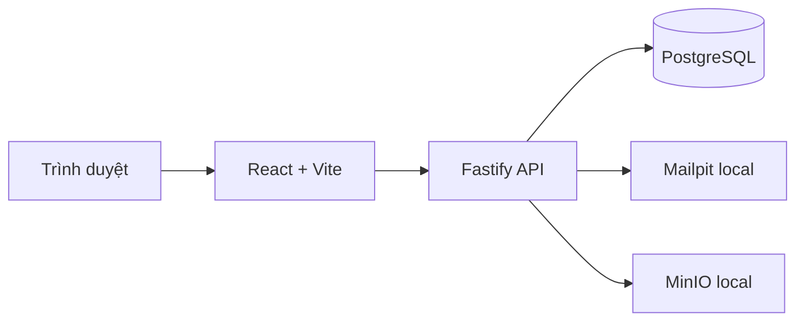

# APC Portal - Kiến trúc kỹ thuật

| Thuộc tính | Giá trị |
| --- | --- |
| Phiên bản | 1.0 |
| Trạng thái | Đã áp dụng cho môi trường local |
| Ngày cập nhật | 27/08/2026 |

> Cập nhật 27/08/2026: trang chủ đã tách từ HTML thô thành component React theo từng section (mục 3).

## 1. Quyết định hiện tại

APC Portal dùng một monorepo TypeScript. Giao diện là React/Vite; backend là Node.js/Fastify; dữ liệu dự kiến dùng PostgreSQL; email local đi vào Mailpit; tệp local dùng API tương thích S3 của MinIO.

Đây là modular monolith ở giai đoạn đầu. Chưa có bằng chứng cần microservice, Redis, queue hoặc Kubernetes.

ORM và công cụ migration: **Prisma** (chốt 05/09/2026 cho BE1). Schema + migration nằm trong `apps/api` (xem PR BE1); migration bằng `prisma migrate`.



## 2. Ranh giới mã nguồn

| Đường dẫn | Trách nhiệm |
| --- | --- |
| `apps/web` | Giao diện và điều hướng phía trình duyệt |
| `apps/api` | HTTP API, xác thực, phân quyền và nghiệp vụ phía máy chủ |
| `packages/*` | Kiểu dữ liệu hoặc component thật sự dùng chung; chưa tạo package suy đoán |
| `design-reference` | Nguồn thiết kế tham chiếu, không phải mã chạy production |
| `scripts/import-homepage.mjs` | Nhập phần giao diện và asset từ bản thiết kế vào web |
| `compose.yaml` | Hạ tầng dành riêng cho local |

## 3. Cấu trúc trang chủ

Route `/` do `apps/web/src/pages/home/HomePage.tsx` dựng, tách thành component theo từng section (không còn nhúng HTML thô).

```text
apps/web/src/pages/home/
├─ HomePage.tsx           # Bố cục: Navbar + main(các section) + SiteFooter
├─ home.css               # CSS cục bộ: chiều cao section, fade-up, slider nền
├─ hooks/
│  ├─ useScrolled.ts       # Đổ bóng nav khi cuộn
│  └─ useScrollReveal.ts   # Hiệu ứng fade-up (mặc định hiện, chỉ ẩn-để-animate khi có JS)
└─ sections/
   ├─ Navbar.tsx, HeroSection.tsx, ValuesSection.tsx, ActivitiesSection.tsx,
   ├─ ProjectsSection.tsx, EventsSection.tsx, NewsSection.tsx, PartnersSection.tsx,
   └─ HostSection.tsx, JoinSection.tsx, SiteFooter.tsx
```

Quy ước bắt buộc cho phần frontend về sau:

- Mỗi section là một component độc lập trong `sections/`, tự chứa nội dung mẫu và sẽ được thay bằng dữ liệu API.
- Logic tương tác (IntersectionObserver, sự kiện cuộn) nằm trong hook ở `hooks/`, không rải rác trong component.
- Dữ liệu lặp (link nav, card sự kiện, tin tức, cột footer) khai báo dạng mảng rồi `map`, không copy-paste JSX.
- Class Tailwind phải là chuỗi literal đầy đủ (không nội suy `text-${color}`) để JIT nhận diện.
- Hiệu ứng phải an toàn theo tiến trình: nội dung hiển thị được ngay cả khi JS lỗi và tôn trọng `prefers-reduced-motion`.

Nguồn thiết kế gốc `design-reference/homepage/index.html` chỉ được import một lần bằng `scripts/import-homepage.mjs` để lấy asset và markup tham chiếu; giao diện chạy thật là các component React ở trên. Khi nối dữ liệu, mỗi section nhận props/hook dữ liệu và có test riêng — cấu trúc hiện tại đã sẵn cho việc đó.

## 4. Cấu hình và bí mật

- `.env.example` chỉ chứa giá trị local mẫu.
- `.env` không được commit.
- Backend phải kiểm tra biến môi trường khi khởi động.
- Các cổng database và dịch vụ local chỉ bind vào `127.0.0.1`.
- Không dùng credential local cho staging hoặc production.

## 5. Quyết định còn mở

- Cơ chế session/token sau khi hoàn tất threat model đăng nhập.
- Nhà cung cấp email và object storage thật.
- Topology, VPS/cloud, reverse proxy, TLS, backup và monitoring production.

Không triển khai các quyết định còn mở bằng giả định âm thầm; chúng cần ADR hoặc cập nhật tài liệu này.
