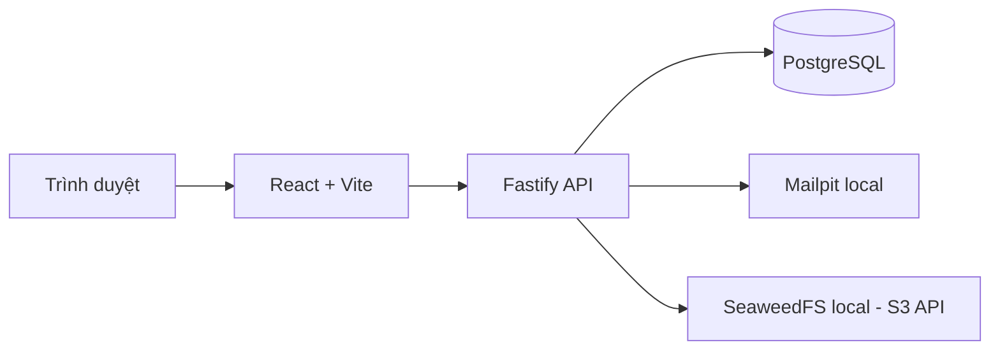

# APC Portal - Kiến trúc kỹ thuật

| Thuộc tính | Giá trị |
| --- | --- |
| Phiên bản | 1.2 |
| Trạng thái | Đã duyệt (27/09/2026) |
| Ngày cập nhật | 27/09/2026 |

> Cập nhật 27/09/2026: chốt các quyết định kỹ thuật (mục 5); lưu tệp local đổi từ MinIO sang SeaweedFS.
>
> Cập nhật 27/08/2026: trang chủ đã tách từ HTML thô thành component React theo từng section (mục 3).

## 1. Quyết định hiện tại

APC Portal dùng một monorepo TypeScript. Giao diện là React/Vite; backend là Node.js/Fastify; dữ liệu dùng PostgreSQL; email local đi vào Mailpit; tệp local dùng API tương thích S3 của SeaweedFS.

Đây là modular monolith ở giai đoạn đầu. Chưa có bằng chứng cần microservice, Redis, queue hoặc Kubernetes.

ORM và công cụ migration: **Prisma** (chốt 05/09/2026). Schema và migration nằm trong `apps/api/src/db` (PR #2); tạo migration bằng `prisma migrate`.

Quy ước viết mã cho API và web (nhóm route, định dạng lỗi, phân trang, cấu trúc thư mục) nằm trong [AGENTS.md](../AGENTS.md).


```mermaid
flowchart LR
    Browser[Trình duyệt] --> Web[React + Vite]
    Web --> API[Fastify API]
    API --> DB[(PostgreSQL)]
    API --> Mail[Mailpit local]
    API --> Files[SeaweedFS local - S3 API]
```

## 2. Ranh giới mã nguồn

| Đường dẫn | Trách nhiệm |
| --- | --- |
| `apps/web` | Giao diện và điều hướng phía trình duyệt |
| `apps/api` | HTTP API, xác thực, phân quyền và nghiệp vụ phía máy chủ |
| `packages/*` | Kiểu dữ liệu hoặc component thật sự dùng chung; chưa tạo package suy đoán |
| `design-reference` | Nguồn thiết kế tham chiếu, không phải mã chạy production |
| `scripts/import-homepage.mjs` | Nhập phần giao diện và asset từ bản thiết kế vào web |
| `compose.yaml` | Hạ tầng dành riêng cho local |

## 3. Cấu trúc trang chủ

Route `/` do `apps/web/src/pages/home/HomePage.tsx` dựng, tách thành component theo từng section (không còn nhúng HTML thô).

```text
apps/web/src/
├─ components/            # Dùng chung mọi trang: Button.tsx, Eyebrow.tsx
├─ layouts/               # RootLayout.tsx, Navbar.tsx, SiteFooter.tsx
├─ hooks/useScrolled.ts   # Đổ bóng nav khi cuộn
├─ lib/api.ts             # Gọi API (qua /api), lỗi thành ApiError
└─ pages/home/
   ├─ HomePage.tsx        # Các section của trang chủ
   ├─ home.css            # CSS cục bộ: chiều cao section, fade-up, slider nền
   ├─ hooks/useScrollReveal.ts
   └─ sections/           # HeroSection, ValuesSection, ActivitiesSection, ProjectsSection,
                          # EventsSection, NewsSection, PartnersSection, HostSection, JoinSection
```

Phía API, phần dùng chung nằm ở `apps/api/src/`: `db/client.ts` (Prisma client), `lib/errors.ts` (lỗi `{ error, message }`), `lib/password.ts` (Argon2id).

Quy ước bắt buộc cho phần frontend về sau:

- Mỗi section là một component độc lập trong `pages/home/sections/`, tự chứa nội dung mẫu và sẽ được thay bằng dữ liệu API.
- Logic tương tác (IntersectionObserver, sự kiện cuộn) nằm trong hook ở `hooks/`, không rải rác trong component.
- Dữ liệu lặp (link nav, card sự kiện, tin tức, cột footer) khai báo dạng mảng rồi `map`, không copy-paste JSX.
- Class Tailwind phải là chuỗi literal đầy đủ (không nội suy `text-${color}`) để JIT nhận diện.
- Hiệu ứng phải an toàn theo tiến trình: nội dung hiển thị được ngay cả khi JS lỗi và tôn trọng `prefers-reduced-motion`.

Nguồn thiết kế gốc `design-reference/homepage/index.html` chỉ được import một lần bằng `scripts/import-homepage.mjs` để lấy asset và markup tham chiếu; giao diện chạy thật là các component React ở trên. Khi nối dữ liệu, mỗi section nhận props/hook dữ liệu và có test riêng — cấu trúc hiện tại đã sẵn cho việc đó.

## 4. Cấu hình và bí mật

- `.env.example` chỉ chứa giá trị local mẫu.
- `.env` không được commit.
- Backend phải kiểm tra biến môi trường khi khởi động.
- Các cổng database và dịch vụ local chỉ bind vào `127.0.0.1`.
- Không dùng credential local cho staging hoặc production.

## 5. Quyết định đã chốt (27/09/2026)

Các quyết định dưới đây thay cho danh sách "quyết định còn mở" trước đây. Muốn đổi thì cập nhật mục này và ghi lý do.

| # | Chủ đề | Quyết định | Lý do |
| --- | --- | --- | --- |
| 1 | Phiên đăng nhập | Phiên lưu ở server trong bảng `sessions`. Cookie `apc_session` chứa token ngẫu nhiên 32 byte; database chỉ lưu SHA-256 của token. Cookie `HttpOnly`, `SameSite=Lax`, `Path=/`, thêm `Secure` ở production. Hết hạn sau 8 giờ không hoạt động; đăng xuất, đổi mật khẩu hoặc khóa tài khoản thì ghi `revokedAt`. Không dùng JWT. | Thu hồi phiên ngay lập tức (AUTH-08, SEC-06, BR-19) — JWT không làm được việc này. |
| 2 | Chống CSRF | `SameSite=Lax`; API chỉ nhận body JSON; request thay đổi dữ liệu phải có header `Origin` trùng `WEB_URL`. | Đủ cho ASVS L1 (SEC-04) mà không cần token CSRF riêng. |
| 3 | Vai trò | `MEMBER` là vai trò nền, không lưu. Vai trò quản lý và đặc quyền lưu trong bảng `user_roles` (phạm vi ban, trạng thái, ngày bắt đầu, ngày hết hạn). `request.user = { id, departmentId, roles }`, trong đó `roles` chỉ gồm các dòng `ACTIVE`. | Khớp [docs/02](./02-roles-permissions.md) mục 9 và ADM-08. |
| 4 | Email | Code gửi qua SMTP chuẩn. Local: Mailpit. Production: Brevo (gói miễn phí). Email lưu trong bảng `NotificationDelivery` và được worker chạy trong process API gửi đi. | Đổi nhà cung cấp chỉ cần sửa `SMTP_*` trong `.env`; chưa cần Redis hay queue riêng. |
| 5 | Lưu tệp | Code dùng S3 API. Local: SeaweedFS trong `compose.yaml`. Production: Cloudflare R2. Tệp nội bộ chỉ tải qua API có kiểm quyền. | MinIO đã gỡ image khỏi Docker Hub (09/2026). R2 không tính phí băng thông tải xuống và nằm ngoài VPS. |
| 6 | Máy chủ | 1 VPS Ubuntu 24.04 LTS, tối thiểu 2 vCPU / 2 GB RAM / SSD (PERF-06), đặt tại DigitalOcean và dùng credit của GitHub Student Developer Pack. Chạy bằng Docker Compose: `web` (file tĩnh), `api`, `postgres`. Staging dùng cùng VPS với Compose project riêng, chỉ bật khi kiểm thử bản phát hành. | Chi phí thấp cho CLB sinh viên; đủ yêu cầu tài nguyên của PRD. |
| 7 | Reverse proxy & TLS | Nginx trên VPS giữ cổng 80/443; chứng chỉ Let's Encrypt gia hạn tự động bằng certbot. Web và API cùng tên miền: `/api/*` chuyển tới API (bỏ tiền tố `/api`), còn lại là file tĩnh của web. Local làm y hệt bằng proxy trong `apps/web/vite.config.ts`. | Đúng Charter mục 10. |
| 8 | Build & triển khai | GitHub Actions build image, đẩy lên GitHub Container Registry (`ghcr.io`) với tag theo commit; VPS chỉ `pull` rồi chạy. Rollback là chạy lại tag trước. | Đúng PRD mục 11 (VPS không build source). |
| 9 | Backup | Hằng ngày: `pg_dump` mã hóa bằng `age` rồi đẩy lên bucket R2 riêng cho backup; `rclone` sao chép bucket tệp sang bucket backup. Giữ bản ngày 30 ngày, bản cuối tháng 12 tháng (OPS-10). Diễn tập restore trước lần phát hành đầu tiên. | Backup nằm ngoài VPS và được mã hóa (OPS-02, SEC-14). |
| 10 | Monitoring | UptimeRobot kiểm tra `/health` và hạn TLS từ bên ngoài; Netdata trên VPS theo dõi CPU, RAM, swap, disk, container và gửi cảnh báo qua email. | Có một nguồn cảnh báo độc lập với VPS (FLOW-29). |
| 11 | Tên miền | Xin APC/Khoa cấp subdomain của UMT cho production. Staging dùng tên miền miễn phí từ GitHub Student Developer Pack. | Tên miền chính thức cần đơn vị sở hữu đứng tên. |

### 5.1. Thư viện đã duyệt

Được cài khi làm đúng việc tương ứng, không cần hỏi thêm. Thư viện ngoài danh sách này phải hỏi trưởng dự án.

| Thư viện | Dùng cho | Việc |
| --- | --- | --- |
| `@node-rs/argon2` | Băm mật khẩu (đã cài, dùng qua `src/lib/password.ts`) | — |
| `@fastify/cookie` | Cookie phiên `apc_session` | A2 |
| `@fastify/rate-limit` | Giới hạn tần suất, trả 429 | A2, R3, R4, E3 |
| `otpauth`, `qrcode` | Mã xác thực 2 lớp (TOTP) và mã QR | B3 |
| `nodemailer` | Gửi email qua SMTP | O1 |
| `@aws-sdk/client-s3`, `@aws-sdk/s3-request-presigner` | Lưu và tải tệp qua S3 API | D2, D4 |
| `@fastify/multipart` | Nhận tệp upload | D2 |
| `file-type` | Kiểm tra loại tệp theo nội dung | D2 |
| `csv-parse`, `csv-stringify` | Nhập/xuất CSV | T6, R5, E6 |
| `@playwright/test` | Test giao diện tự động | Q2 |

Gói `@types/...` đi kèm các thư viện trên được cài luôn.
